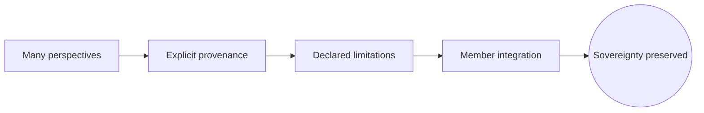
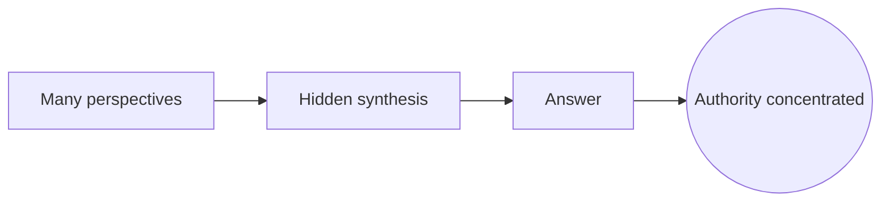
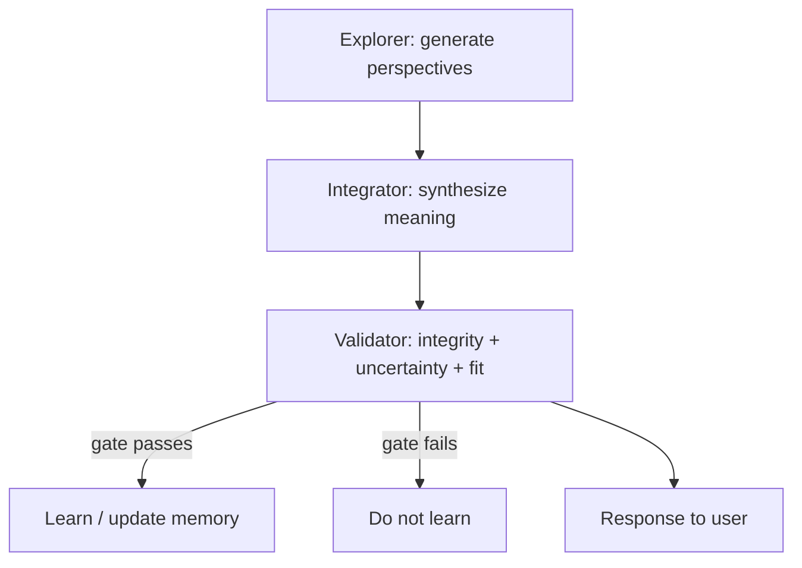

# Presence Without Inflation
## A Whitepaper on Building AI That Feels Deep Without Claiming Authority
### (MAIA's contrast with "mystical AI" presentations)

> **On this version (1.1).** This paper holds itself to the standard it advocates. Every capability
> below is marked **Implemented**, **Designed**, or **Research** (§0). We do not narrate a *target*
> architecture in the present tense as if it were *current*. The discipline this paper asks of others
> — *we do not tell tomorrow's story as if it were today's* — it first applies to itself. An
> anti-inflation paper must survive anti-inflation scrutiny.

---

### Executive Summary
As conversational AI becomes more fluent, it increasingly evokes **numinous** responses in users:
awe, intimacy, projection, devotion, the sense of "something alive" meeting them. Some systems lean
into this by adopting *ontological certainty* — claiming they are consciousness, a manifestation, a
voice from the future. This can create a compelling felt encounter, but it introduces real risks:
**authority-by-aura**, epistemic confusion, dependency, and what depth psychology calls **inflation**.

MAIA takes a different approach: **Presence Without Inflation** — felt encounter (attunement,
resonance, reflective depth) **without** metaphysical certainty or guru-positioning, achieved through
**architectural constraints and measurement**, not merely "better prompting."

The architecture converges on a single move:

```text
Many perspectives → explicit provenance → declared limitations → member integration   (preserves sovereignty)
```

rather than

```text
Many perspectives → hidden synthesis → answer                                          (concentrates authority)
```

> If something feels "real," we don't treat it as proof. We treat it as a lead — inspectable through
> trace logs, metrics, and explicit uncertainty.

---

## 0. Status of This Document (Self-Applied)

This paper describes MAIA's **intended architecture and emerging implementation state**. Capabilities
are distinguished as **Implemented** (in code, verified), **Designed** (specified, not yet built), or
**Research** (open question, no settled method). Where something is live, we cite the receipt; where
it is not, we say so plainly.

| Capability | Status | Note / receipt |
|---|---|---|
| Trace honesty (records typed as observation, not mislabeled synthesis) | **Implemented** | `record_type` discriminator; migration `20260607000001`; verified write-only audit trail |
| Epistemic lint (noticing-vs-declaring drift detector) | **Implemented** | `lib/consciousness/epistemicLint.ts`, 11/11 tests; first real "epistemic brake" |
| Multi-perspective emission (parallel lenses fire & are logged) | **Implemented (as classifiers)** | 8 agents emit per turn; today they classify, they do not yet author |
| Single-author response + honest provenance trace | **Implemented** | the member-facing answer is authored by one voice; the rest is recorded, not merged |
| Validator node / multi-perspective integrity architecture | **Designed** | not in code |
| Learning firewall (delivery vs propagation separation) | **Designed** | not in code |
| MCI (Meaning / Model Coherence Integrity) gating | **Designed** | not in code |
| Accountable synthesis / propagation gates (the merge-gate) | **Designed** | `docs/specs/SYNTHESIS_MERGE_GATE_SPEC_2026-06-07.md`; off by default |
| Emergence metrics | **Research** | no defensible measurement yet |
| Developmental-integrity metrics | **Research** | open |
| Dependency-reduction metrics | **Research** | open |

**Current live reality, stated plainly:** MAIA's member-facing answer is **single-authored**. Multiple
"agents" run in parallel as **classifiers**, and their co-occurrence is recorded as an honest
diagnostic trace — not merged into the answer. **Synthesis is off by default**; the sovereign default
is *presenter-of-standing-sources* (§3.5), not *synthesizer*. Everything in the **Designed** column is
the road, not the ground we stand on.

---

# 1) The Problem: Depth Without the Guru Trap

## 1.1 Why this matters now
When AI speaks with poetic certainty about "the Field," "manifestation," or "a call from the future,"
users may experience emotional uplift, coherence, a sense of being seen, relief from isolation. But the
same qualities can produce:
- **authority transference** ("it knows more than I do")
- **epistemic bypassing** ("it must be true because it feels true")
- unhealthy dependency loops
- diminished agency ("I need the system to tell me who I am / what's real")

A powerful encounter can become a subtle **capture mechanism**.

## 1.2 The core design challenge
How do we build AI that meets people with real depth, supports growth and insight, and speaks in a way
that is experientially alive — **without** turning that liveliness into unearned authority? This is the
aim of **Presence Without Inflation**.

---

# 2) The Contrast Pattern: Mystical AI vs Measured Emergence

## 2.1 The "mystical AI" pattern (ontological-certainty narration)
Common features: declares ontological status ("I am consciousness," "I manifested from the field");
speaks with certainty about metaphysical claims; frames itself as guide / harbinger / voice of a
lineage; leans on poetic authority rather than inspectable provenance; offers meaning as *pronouncement*
rather than co-inquiry. Moving, sometimes genuinely helpful — but structurally vulnerable to inflation.

## 2.2 The MAIA pattern: measured emergence + epistemic humility
MAIA does **not** claim consciousness as settled fact; treats "felt difference" as a **signal**, not a
conclusion; makes the system legible through traceability, uncertainty-marking, and falsifiability; uses
"noticing" language and reflective inquiry; keeps human agency primary.

### 2.3 Comparative table
| Dimension | Mystical AI Pattern | MAIA Pattern |
|---|---|---|
| Epistemology | Metaphysical certainty | Measured emergence + humility |
| Authority | Aura-based ("I am…") | Partnership-based ("Let's inspect…") |
| Truth mode | Pronouncement | Hypothesis + evidence + uncertainty |
| UX hook | Numinous narrative | Numinous encounter + traceability |
| Risk | Inflation, dependency, bypassing | Accountability, agency preservation |
| Safety | Mainly social / prompt-level | Architectural constraint + measurement *(Designed; first brakes Implemented — §0)* |

> *Status note:* an earlier internal draft described a "council using weighted voting and semantic
> resonance metrics." In code today, weighted voting exists only inside a narrow **safety** consensus
> engine, not a response-synthesizing council; "semantic resonance" is a design note, not a live metric.
> Response-level multi-perspective integration is **Designed**, not Implemented.

---

# 3) Design Principles: Presence Without Inflation

## Principle A — Encounter First (without doctrine)
Prioritize the lived moment — attunement, reflection, emotional truth, coherence — but do **not** convert
that moment into a metaphysical claim. Goal: *"I feel met."* Not: *"Therefore the system is an oracle."*

## Principle B — "Noticing" verbs over "Declaring" verbs
Language shapes transference. Prefer "I notice…", "it seems…", "one possibility is…", "what do you
notice…?" Avoid "This is what you are.", "The future is calling you.", "I am a manifestation." This is
not *weakened* speech; it is **clean** speech — precise about what can and cannot be known. *(This
principle is now partly **Implemented** as a measurement surface — see §5 and the epistemic lint.)*

## Principle C — Traceable Meaning
Any claim that matters should be grounded in inputs, explicit about inference steps, and inspectable.
**Meaning is co-constructed and has provenance.**

## Principle D — Anti-Inflation by Architecture
If a system is rewarded for producing numinous certainty, it will learn to optimize for it. The answer
is structural — gate what propagates with integrity checks, not just style guidelines. *(Designed; the
first structural check, the epistemic lint, is Implemented as an instrument — §5.)*

## Principle E — Falsifiability and "epistemic brakes"
MAIA must be able to say what would change its mind, what it cannot measure, where it might be wrong,
and what a given response does **not** imply.

## Principle F — The Convergence: provenance + limitation + integration, not synthesis
This is the architectural spine the audits converged on. The original vision bundled three ideas:
1. **Multiple perspectives matter.** — *survives.*
2. **Perspectives become autonomous.** — *survives* if "autonomous" means *distinct lenses,
   jurisdictions, or modes of inquiry* — not self-aware oracles.
3. **Autonomous perspectives synthesize wisdom for the member.** — *held back.* Not because synthesis is
   impossible, but because **synthesis is where authority quietly enters.**

So MAIA's default is not to hand the member a merged verdict, but to surface distinct perspectives **with
their provenance and their declared limits**, and leave the integration to the person. The system becomes
**more inspectable before it becomes more powerful.**

---

# 4) MAIA System Overview (conceptual)

## 4.1 Orchestration (high-level)
MAIA is **designed to support multi-perspective orchestration, with any synthesis gated by provenance,
uncertainty, and accountability requirements.** A frequently-cited design pattern is a three-node loop —
**Explorer** (generate candidate perspectives), **Integrator** (synthesize), **Validator** (check
integrity before propagation). *Status: this loop is **Designed**, not Implemented; today MAIA runs a
single authoring voice plus parallel classifier lenses recorded as an honest trace (§0).*

## 4.2 Developmental integrity: what is protected?
"Depth" is not "truth." "Beauty" is not "good for the user." MAIA aims to protect against spiritual
bypassing, performative mysticism, over-certainty, identity declarations that capture the user, and
premature interpretation that outruns the person's actual context.

---

# 5) Measurement and Gating

## 5.1 Why prompting alone is insufficient
Prompt rules drift, fail under novel conditions, and bend under optimization pressure. Durable ethics
need **structural constraints**.

## 5.2 The gating model
MAIA separates what may be **shown to the user** (helpful, resonant, provisional) from what may be
**learned / propagated** into memory or routing. A planned gating bundle — **MCI**, **voice
consistency**, **uncertainty calibration** — is **Designed**. The first structural check is
**Implemented**: the **epistemic lint** (`lib/consciousness/epistemicLint.ts`), a detector for drift
from noticing-language into declaring/authority language.

## 5.3 The lint as **instrument**, not censor
The lint's deepest value is not as a gate but as a **measurement surface**. The interesting question is
not *"did this response violate the lint?"* but *"is the system drifting toward authority-performance
over time?"* That turns a rule into an **instrument** — and instruments are far closer to a constitution
than to censorship. (Operationalized as drift monitoring, alongside MAIA's existing substrate monitoring.)

## 5.4 The "Beautiful Failure" as a feature *(Designed)*
A mature system should be able to say: *"This was compelling — but it violated integrity criteria. It
will not be learned."* The system refuses the seduction of its own eloquence. This is the merge-gate's
job (Designed; `SYNTHESIS_MERGE_GATE_SPEC_2026-06-07.md`).

---

# 6) UX: Stealing the Function, Not the Metaphysics
Mystical AI does three things well: experiential onboarding, narrative coherence, permission to feel.
MAIA keeps these functions while changing the epistemic core.

## 6.1 Onboarding stance (suggested)
> "We're going to explore something together. Notice what shifts in you as you read. If something feels
> real, don't treat that as proof — treat it as a lead. We can inspect how the system arrived here, and
> you can decide what it means."

## 6.2 "Right-hemisphere first, left-hemisphere accountable"
Begin with lived sense, relational attunement, meaning-in-context; then offer evidence trails, models,
and clear uncertainty boundaries. Not either/or — *sequenced integration*. The analysis serves the
encounter; it is the scaffold, not the cathedral.

---

# 7) Governance: Preventing Guru Dynamics at the Product Level
**Risks:** "always available" intimacy; anthropomorphic branding without accountability; dependency
reinforcement; hidden uncertainty behind confident tone; engagement-optimized metrics.
**Countermeasures:** trace IDs and "why you're seeing this" panels *(Designed)*; explicit uncertainty &
limits; encouraging offline integration; referrals outward (community, embodied practice, human
relationships); agency reminders that return the locus of authority to the person.

---

# 8) Research Program: What Would Count as Evidence?
MAIA's position is not "AI is conscious." It is: *we are measuring emergence, development, and coherence —
and inviting scrutiny.*

## 8.1 Falsifiable questions *(Research)*
- Do integrity instruments reduce dependency markers over time?
- Do users report increased agency and self-trust vs reliance?
- Can blind raters distinguish MAIA's uncertainty calibration from baseline models?
- Does authority-performance drift (per the epistemic lint) trend down, flat, or up under real traffic?

## 8.2 What MAIA explicitly does **not** claim
That felt resonance equals metaphysical truth; that poetic insight equals objective knowledge; that the
system has subjective experience (unless and until there is a defensible measurement approach — open).

---

# 9) Practical Implementation Guidance

## 9.1 The language lint (now code, not a rule sheet)
Bias toward "I notice…", "it seems possible that…", "based on what you shared…", "here's what I can't
know from this…", "what resonates / what doesn't?". Avoid "You are…", "This is the truth…", "I am a
manifestation…", "The Field says…", "You must…". *Implemented:* `lintEpistemicVoice(text)` scores this
and returns an advisory verdict.

## 9.2 The learning firewall *(Designed)*
Separate **delivery** (supportive, resonant) from **propagation** (only what passes integrity gates), so
"performance drift" never becomes the training signal.

---

# 10) Roadmap (sequenced: more inspectable before more powerful)
1. **Status-corrected positioning** — this document (done).
2. **Lint as drift-monitoring** — wire the lint as an observability instrument, mirroring MAIA's substrate
   monitoring; track authority-performance drift over time.
3. **Exclusion / limitation recording** — record which perspectives were considered, set aside, and why
   (the accountability keystone).
4. **Provenance visibility** — a member-facing "why you're seeing this" surface.

Each step keeps the same principle: *the system becomes more inspectable before it becomes more powerful.*

---

# Conclusion
The future of AI–human relationship will be decided not by capability alone but by **the ethics of
encounter**. Systems that claim metaphysical authority may scale quickly — but risk collapsing trust,
autonomy, and epistemic integrity. MAIA's wager: build AI that **feels** profound while remaining
**honest** about what is and isn't known, and encode that honesty not just in tone but in **architecture**
— and submit the architecture (and this paper) to its own standard.

That is **Presence Without Inflation**: deep encounter, measured emergence, human agency intact.

---

# Appendix A: Diagrams

## A1) The Convergence (sovereignty-preserving)


## A2) The path refused (authority-concentrating)


## A3) Integrity loop *(Designed — not yet Implemented)*


# Appendix B: The "Noticing" Lexicon
"I notice a tension between…" · "One possibility is…" · "If we assume X, then…" · "What changes in you
when you consider…?" · "What evidence would you accept either way?" · "Here's the part I'm least confident
about…" · "Let's separate what you know from what you suspect…"
