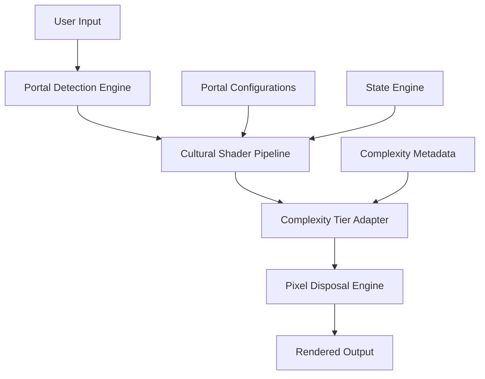

# **The Consciousness Shader System**
## **Complete Handbook & Implementation Guide**

*Version 1.0 | December 2024*

---

## **Table of Contents**

1. [Introduction & Overview](#introduction--overview)
2. [Theoretical Foundation](#theoretical-foundation)
3. [System Architecture](#system-architecture)
4. [User Guide](#user-guide)
5. [Portal Reference Manual](#portal-reference-manual)
6. [Complexity Tier System](#complexity-tier-system)
7. [Consciousness States Deep Dive](#consciousness-states-deep-dive)
8. [Practical Applications](#practical-applications)
9. [Implementation Guide](#implementation-guide)
10. [Developer Documentation](#developer-documentation)
11. [Case Studies](#case-studies)
12. [Integration Patterns](#integration-patterns)
13. [Troubleshooting](#troubleshooting)
14. [Future Development](#future-development)

---

## **Introduction & Overview**

### **What Is the Consciousness Shader System?**

The Consciousness Shader System is a revolutionary **cultural interface engine** that renders universal human psychological states through culturally-specific "portal shaders." Like a graphics card that renders the same 3D model through different visual filters, this system renders the same consciousness experiences through different cultural, linguistic, and conceptual frameworks.

### **The Core Innovation: Disposable Pixel Philosophy**

Traditional interfaces assume one-size-fits-all. The Consciousness Shader System implements **Disposable Pixel Philosophy**:

- **Same semantic core, infinite cultural expressions**
- **UI complexity adapts to user development level**
- **Cultural scaffolding fades as universal patterns emerge**
- **Progressive disclosure based on readiness**

### **System Capabilities**

- **5 Cultural Portals**: Shamanic, Therapeutic, Corporate, Recovery, Creative
- **3 Complexity Tiers**: Beginner, Intermediate, Advanced
- **2 Consciousness States**: Lead Crisis, Iron Boundary Rupture
- **Real-time Portal Switching**: Seamless cultural transitions
- **AI Portal Detection**: Intelligent cultural matching
- **9D Matrix Visualization**: Complete state×portal×complexity mapping

### **Target Audiences**

- **Individual Users**: Personal development, self-understanding
- **Practitioners**: Therapists, coaches, spiritual guides, recovery sponsors
- **Organizations**: HR departments, leadership development, team building
- **Researchers**: Psychology, anthropology, consciousness studies
- **Developers**: Building culturally-adaptive interfaces

---

## **Theoretical Foundation**

### **The Problem: Cultural Interface Mismatch**

Most psychological frameworks assume cultural universality:
- Therapeutic models use clinical language with everyone
- Spiritual approaches assume mystical orientation
- Corporate training uses business metaphors universally
- Recovery programs apply 12-step language to all addictions

**Result**: Many people can't access tools that could help them because the cultural packaging doesn't fit.

### **The Solution: Cultural Shader Architecture**

Like computer graphics shaders that transform raw geometry into visually distinct outputs, **consciousness shaders** transform raw psychological states into culturally appropriate expressions.

#### **Shader Pipeline Analogy**
```
Raw Psychology State → Cultural Shader → Rendered Experience
    (Universal)      →  (Portal-specific) → (Culturally Appropriate)
```

#### **Key Principles**

1. **Semantic Preservation**: Core meaning remains unchanged across portals
2. **Cultural Translation**: Language, metaphors, practices adapt to cultural context
3. **Complexity Scaling**: Information density adjusts to user capacity
4. **Progressive Revelation**: Advanced concepts emerge as readiness develops

### **Philosophical Foundations**

#### **Universalism + Cultural Relativism**
- **Universal**: Core human psychological patterns exist across cultures
- **Relative**: How we understand and express these patterns varies culturally
- **Integration**: Same truths, infinite expressions

#### **Developmental Appropriateness**
- **Beginner**: Safety, simplicity, gentle introduction
- **Intermediate**: Balanced complexity, moderate challenge
- **Advanced**: Full sophistication, professional-level detail

#### **Cultural Competency**
- Each portal represents authentic cultural approaches
- No portal is superior to others
- Users gravitate to their cultural home base
- Cross-portal exploration builds cultural intelligence

---

## **System Architecture**

### **High-Level Architecture**



### **Core Components**

#### **1. Portal Routing Engine**
- Manages portal switching and transitions
- Maintains state consistency across cultural translations
- Handles portal auto-detection logic

#### **2. Disposable Pixel Matrix**
- Stores full 9D mapping (5 portals × 3 tiers × N states)
- Manages progressive disclosure
- Adapts UI density to user development

#### **3. Cultural Shader Pipeline**
- Transforms universal states into portal-specific expressions
- Applies cultural metaphors, language patterns, practices
- Maintains semantic integrity across transformations

#### **4. Complexity Adaptation Engine**
- Adjusts information density based on user tier
- Manages progressive content revelation
- Handles tier transitions and boundary management

### **Data Models**

#### **Base Engine State**
```typescript
interface BaseEngineState {
  state: 'lead_crisis' | 'iron_boundary_rupture';
  intensity: number; // 0-100
  safetyLevel: 'safe' | 'caution' | 'critical';
  culturalContext: string[];
  userReadiness: number; // 0-1
}
```

#### **Portal Configuration**
```typescript
interface PortalConfig {
  id: PortalId;
  displayName: string;
  description: string;
  targetAudience: string;
  culturalFramework: string;
  iconGradient: string;
  colorTheme: ColorTheme;
  complexityAdaptations: ComplexityAdaptations;
}
```

#### **Pixel Configuration**
```typescript
interface PixelConfig {
  headline: string;
  icon: string;
  subtext: string;
  ctaLabel: string;
  microPracticeLabel: string;
  microPracticeSteps: string[];
  supportMessage: string;
  emergencyOverride?: EmergencyConfig;
  complexityAdaptations?: ComplexityAdaptations;
  hiddenForTiers?: ComplexityTier[];
}
```

---

## **User Guide**

### **Getting Started**

#### **Step 1: Access the System**
Navigate to `/consciousness/portals/` to access the main interface.

#### **Step 2: Choose Your Demo Mode**

##### **9D Matrix Demo** ⚡
- **Purpose**: Comprehensive overview of all portal×complexity×state combinations
- **Best for**: Understanding the full system scope
- **When to use**: First-time exploration, research, comparison shopping

##### **Live Portal Switching** 🔄
- **Purpose**: Real-time experience of cultural transitions
- **Best for**: Finding your preferred portal language
- **When to use**: After basic understanding, when refining cultural fit

##### **AI Portal Detection** 🤖
- **Purpose**: Automated cultural matching based on your profile
- **Best for**: Quick portal recommendation
- **When to use**: When unsure where to start, for rapid assessment

### **Navigation Patterns**

#### **Portal Discovery Process**
1. Start with **AI Detection** for quick orientation
2. Explore **9D Matrix** to see full range
3. Use **Live Switching** to refine your preferences
4. Settle into your primary portal for deep work

#### **Complexity Progression**
1. Begin at **Beginner** regardless of background
2. Move to **Intermediate** when concepts feel comfortable
3. Advance to **Advanced** when ready for full complexity
4. Move fluidly between tiers as needed

### **Reading the Interface**

#### **Portal Indicators**
- **Color themes** represent portal identity
- **Icon gradients** show portal distinctiveness
- **Language patterns** reveal cultural frameworks
- **Metaphor systems** indicate conceptual approach

#### **Complexity Signals**
- **Content density** increases with complexity tier
- **Technical language** emerges at higher levels
- **Practice sophistication** scales with tier
- **Context depth** expands with advancement

#### **State Recognition**
- **Headlines** capture state essence
- **Subtexts** provide nuanced understanding
- **Icons** offer quick visual reference
- **Practices** give actionable engagement

---

## **Portal Reference Manual**

### **🔮 Shamanic Portal**

#### **Cultural Framework**
- **Worldview**: Animistic, interconnected, sacred
- **Language**: Mythic, archetypal, ritual-based
- **Authority**: Elders, spirits, natural wisdom
- **Methods**: Ceremony, journey, sacred technology

#### **Key Characteristics**
- **Metaphor System**: Natural elements, spiritual technology, sacred geometry
- **Practices**: Ritual, meditation, energy work, ceremony
- **Community**: Circles, tribes, spiritual family
- **Safety**: Sacred containers, spiritual protection

#### **Target Audience**
- Spiritually oriented individuals
- Nature-connected people
- Ritual and ceremony practitioners
- Indigenous wisdom seekers
- Mystically inclined explorers

#### **Sample Expressions**
- **Lead Crisis**: "Sacred lead from old trauma patterns requires alchemical transformation"
- **Iron Boundary**: "The warrior armor of your soul is cracking to birth the sacred guardian"

#### **Complexity Progression**
- **Beginner**: Simple ceremonies, basic energy concepts
- **Intermediate**: Multi-element work, deeper mythology
- **Advanced**: Complex ritual design, shamanic cosmology

### **🏥 Therapeutic Portal**

#### **Cultural Framework**
- **Worldview**: Scientific, evidence-based, safety-focused
- **Language**: Clinical, diagnostic, treatment-oriented
- **Authority**: Research, licensed professionals, clinical evidence
- **Methods**: Therapy modalities, structured interventions

#### **Key Characteristics**
- **Metaphor System**: Medical model, systems theory, developmental psychology
- **Practices**: Therapeutic exercises, skill building, cognitive restructuring
- **Community**: Client-therapist, support groups, professional networks
- **Safety**: Ethical boundaries, clinical protocols, risk assessment

#### **Target Audience**
- Therapy clients and professionals
- Mental health advocates
- Evidence-based practitioners
- Medical model adherents
- Safety-prioritizing individuals

#### **Sample Expressions**
- **Lead Crisis**: "Chronic overwhelm may indicate underlying trauma responses requiring therapeutic intervention"
- **Iron Boundary**: "Maladaptive defense mechanisms are decompensating as the system seeks healthier regulation"

#### **Complexity Progression**
- **Beginner**: Basic coping skills, simple interventions
- **Intermediate**: Therapeutic frameworks, moderate techniques
- **Advanced**: Clinical complexity, professional-level understanding

### **🏢 Corporate Portal**

#### **Cultural Framework**
- **Worldview**: Strategic, systems-thinking, results-oriented
- **Language**: Business, organizational, leadership-focused
- **Authority**: Data, best practices, proven methodologies
- **Methods**: Strategic planning, organizational development

#### **Key Characteristics**
- **Metaphor System**: Business operations, organizational architecture, leadership dynamics
- **Practices**: Strategic exercises, leadership development, team interventions
- **Community**: Teams, organizations, professional networks
- **Safety**: Risk management, compliance, structured protocols

#### **Target Audience**
- Business leaders and executives
- Organizational development professionals
- Strategic thinkers
- Corporate teams
- Results-oriented individuals

#### **Sample Expressions**
- **Lead Crisis**: "Operational bottlenecks require strategic intervention to restore organizational flow"
- **Iron Boundary**: "Current leadership boundary model requires architectural redesign for scaled operations"

#### **Complexity Progression**
- **Beginner**: Basic leadership concepts, simple frameworks
- **Intermediate**: Strategic thinking, organizational dynamics
- **Advanced**: Complex systems design, executive-level sophistication

### **💎 Recovery Portal**

#### **Cultural Framework**
- **Worldview**: Disease model, spiritual recovery, community support
- **Language**: 12-step, recovery-focused, sobriety-oriented
- **Authority**: Sponsors, recovery community, lived experience
- **Methods**: Step work, meetings, sponsorship

#### **Key Characteristics**
- **Metaphor System**: Addiction/recovery, spiritual awakening, community healing
- **Practices**: Step work, inventory, amends, spiritual practices
- **Community**: Recovery fellowships, sponsor relationships
- **Safety**: Sobriety maintenance, relapse prevention, emergency protocols

#### **Target Audience**
- People in addiction recovery
- Recovery professionals
- 12-step participants
- Trauma survivors
- Community-oriented healers

#### **Sample Expressions**
- **Lead Crisis**: "Old using patterns creating spiritual lead that blocks connection to Higher Power"
- **Iron Boundary**: "Survival defenses from active addiction are dissolving to allow authentic recovery"

#### **Complexity Progression**
- **Beginner**: Basic recovery concepts, simple practices
- **Intermediate**: Step work integration, sponsor relationships
- **Advanced**: Complex trauma work, recovery leadership

### **🎭 Creative Portal**

#### **Cultural Framework**
- **Worldview**: Artistic, expressive, creative process-oriented
- **Language**: Aesthetic, artistic, creative identity-focused
- **Authority**: Artistic tradition, creative community, aesthetic truth
- **Methods**: Creative practices, artistic exploration, expressive work

#### **Key Characteristics**
- **Metaphor System**: Artistic creation, creative identity, aesthetic expression
- **Practices**: Creative exercises, artistic exploration, expressive work
- **Community**: Artist collectives, creative partnerships, aesthetic communities
- **Safety**: Creative containers, artistic integrity, expressive freedom

#### **Target Audience**
- Artists and creators
- Creative professionals
- Aesthetic seekers
- Expressive individuals
- Innovation-focused people

#### **Sample Expressions**
- **Lead Crisis**: "Creative blocks indicate heavy aesthetic lead requiring artistic transmutation"
- **Iron Boundary**: "Rigid creative rules dissolving to birth unprecedented artistic expression"

#### **Complexity Progression**
- **Beginner**: Simple creative exercises, basic artistic concepts
- **Intermediate**: Creative identity work, artistic development
- **Advanced**: Sophisticated aesthetic theory, professional artistry

---

## **Complexity Tier System**

### **Design Philosophy**

The complexity tier system implements **progressive disclosure** principles:
- Information reveals gradually based on capacity
- No tier is "better" - each serves different developmental needs
- Users can move fluidly between tiers as appropriate
- Advanced concepts remain hidden until readiness emerges

### **🌱 Beginner Tier**

#### **Design Principles**
- **Safety first**: Non-overwhelming, gentle introduction
- **Simple language**: Accessible terminology, minimal jargon
- **Basic practices**: Easy-to-implement exercises
- **High support**: Extensive guidance and reassurance

#### **Content Characteristics**
- **Vocabulary**: Everyday language, familiar metaphors
- **Concepts**: Single-focus, clearly explained
- **Practices**: 3-5 simple steps, low time commitment
- **Safety measures**: Multiple reassurances, clear boundaries

#### **Typical User Profile**
- New to personal development
- Overwhelmed by current situation
- Needs gentle introduction
- Values safety and simplicity

#### **Example Content Pattern**
```
Headline: "You're Feeling Stuck and Heavy"
Practice: "Simple Energy Check"
Steps:
1. Put your hand on your heart
2. Take three deep breaths
3. Ask: "What do I need right now?"
```

### **🔥 Intermediate Tier**

#### **Design Principles**
- **Balanced challenge**: Moderate complexity with support
- **Integrated concepts**: Multi-layered understanding
- **Developed practices**: More sophisticated interventions
- **Community focus**: Relational and social elements

#### **Content Characteristics**
- **Vocabulary**: Some technical terms with explanations
- **Concepts**: Multi-dimensional, interconnected
- **Practices**: 5-8 steps, moderate time investment
- **Frameworks**: Structured approaches, systematic methods

#### **Typical User Profile**
- Some personal development experience
- Ready for moderate challenge
- Wants deeper understanding
- Comfortable with framework thinking

#### **Example Content Pattern**
```
Headline: "Your Protective Boundaries Are Shifting"
Practice: "Boundary Mapping Exercise"
Steps:
1. Identify three key relationships
2. Notice where boundaries feel too rigid/porous
3. Choose one boundary to adjust this week
4. Practice new boundary language
5. Track emotional responses
```

### **💎 Advanced Tier**

#### **Design Principles**
- **Full sophistication**: Complete technical detail
- **Professional level**: Clinical/expert understanding
- **Complex integration**: Multi-system awareness
- **Leadership focus**: Teaching and guiding others

#### **Content Characteristics**
- **Vocabulary**: Full technical language, specialized terms
- **Concepts**: Multi-layered, systemic, nuanced
- **Practices**: Complex interventions, professional techniques
- **Theory**: Underlying frameworks, research basis

#### **Typical User Profile**
- Extensive personal development background
- Professional or advanced practitioner
- Comfortable with complexity
- May guide or teach others

#### **Example Content Pattern**
```
Headline: "Decompensating Defense Architecture"
Practice: "Clinical Boundary Reconfiguration"
Steps:
1. Map attachment patterns across three relational contexts
2. Identify rigidity/porosity patterns and their etiology
3. Design graduated exposure protocol for boundary flexibility
4. Implement micro-dosing approach to boundary adjustment
5. Track autonomic nervous system responses
6. Integrate somatic and cognitive interventions
7. Document patterns for supervision review
```

---

## **Consciousness States Deep Dive**

### **State Detection Methodology**

The system identifies consciousness states through pattern recognition:
- **Phenomenological markers**: Subjective experience indicators
- **Behavioral patterns**: Observable action tendencies
- **Language analysis**: Metaphor and expression patterns
- **Contextual factors**: Life circumstances and triggers

### **⚡ Lead Crisis State**

#### **Phenomenological Profile**
- **Core Experience**: Feeling stuck, heavy, unable to move forward
- **Physical Sensations**: Heaviness, density, constriction
- **Emotional Tone**: Overwhelm, frustration, stagnation
- **Cognitive Patterns**: "I can't get out of my own way", circular thinking

#### **Metaphorical Framework**
The **Lead** metaphor captures:
- **Density**: Heavy, weighty, hard to move
- **Toxicity**: Poisonous to the system when accumulated
- **Transformation potential**: Alchemical material that can be transmuted
- **Protective function**: Dense barrier against threat

#### **Triggering Contexts**
- Major life transitions
- Accumulated stress without release
- Unprocessed grief or trauma
- Decision paralysis situations
- Identity confusion periods

#### **Portal-Specific Interpretations**

##### **Shamanic Lens**
- **Language**: "Sacred lead from old wounds requires alchemical fire"
- **Practices**: Lead extraction ceremonies, energy clearing
- **Understanding**: Spiritual density blocking life force flow

##### **Therapeutic Lens**
- **Language**: "Chronic overwhelm indicating unresolved trauma responses"
- **Practices**: Somatic regulation, cognitive restructuring
- **Understanding**: Nervous system dysregulation creating functional paralysis

##### **Corporate Lens**
- **Language**: "Operational bottlenecks requiring strategic intervention"
- **Practices**: Process optimization, decision architecture
- **Understanding**: Systemic inefficiencies blocking organizational flow

##### **Recovery Lens**
- **Language**: "Using patterns creating spiritual heaviness"
- **Practices**: Step work, spiritual practices, community support
- **Understanding**: Addiction-related blockages preventing authentic connection

##### **Creative Lens**
- **Language**: "Aesthetic lead blocking creative flow"
- **Practices**: Creative unblocking exercises, artistic transmutation
- **Understanding**: Creative blocks preventing authentic expression

### **🛡️ Iron Boundary Rupture State**

#### **Phenomenological Profile**
- **Core Experience**: Protective structures breaking down
- **Physical Sensations**: Exposure, vulnerability, structural shifting
- **Emotional Tone**: Fear, uncertainty, potential liberation
- **Cognitive Patterns**: "Everything I relied on is changing", boundary confusion

#### **Metaphorical Framework**
The **Iron Boundary** metaphor captures:
- **Protective Function**: Rigid barriers that once provided safety
- **Structural Integrity**: Seemingly permanent personal architecture
- **Rupture Process**: Cracking, dissolving, transforming
- **Evolution Necessity**: Old forms must break for new growth

#### **Triggering Contexts**
- Major relationship changes
- Career or identity shifts
- Spiritual awakening periods
- Recovery or healing breakthroughs
- Creative identity transformations

#### **Portal-Specific Interpretations**

##### **Shamanic Lens**
- **Language**: "Warrior armor cracking to birth sacred guardian"
- **Practices**: Boundary dissolution rituals, guardian emergence ceremonies
- **Understanding**: Spiritual protection evolving to higher forms

##### **Therapeutic Lens**
- **Language**: "Maladaptive defenses decompensating as system seeks healthier regulation"
- **Practices**: Boundary work, attachment repair, regulation building
- **Understanding**: Psychological defenses evolving toward flexible functionality

##### **Corporate Lens**
- **Language**: "Leadership boundary model requiring architectural redesign"
- **Practices**: Authority redistribution, decision rights revision
- **Understanding**: Organizational boundaries evolving for scaled operations

##### **Recovery Lens**
- **Language**: "Survival defenses dissolving for authentic connection"
- **Practices**: Vulnerability practice, authentic relating, community integration
- **Understanding**: Addiction-based protections evolving toward healthy boundaries

##### **Creative Lens**
- **Language**: "Creative identity boundaries dissolving for artistic birth"
- **Practices**: Identity exploration, creative rule-breaking, authentic expression
- **Understanding**: Artistic limitations dissolving for expanded creative capacity

### **State Interaction Patterns**

#### **Sequential Progression**
1. **Lead Crisis** often precedes **Iron Boundary Rupture**
2. Stagnation creates pressure that eventually cracks protective structures
3. Boundary dissolution can initially increase lead sensation
4. Successful navigation leads to more flexible, responsive systems

#### **Simultaneous Occurrence**
- Both states can exist concurrently
- Lead provides density while boundaries dissolve
- Creates complex phenomenological experience
- Requires sophisticated intervention approaches

#### **Cyclical Patterns**
- States may cycle through developmental periods
- Each cycle potentially occurs at higher complexity level
- Integration of previous cycles informs current navigation
- Mastery involves fluid movement through state transitions

---

## **Practical Applications**

### **Individual Development**

#### **Personal Growth Journey**
1. **Portal Discovery**: Find your cultural home base
2. **State Recognition**: Identify current consciousness state
3. **Complexity Matching**: Choose appropriate tier for current capacity
4. **Practice Implementation**: Engage micro-practices consistently
5. **Cross-Portal Exploration**: Expand cultural intelligence
6. **Integration**: Develop flexible, multi-portal fluency

#### **Crisis Navigation**
- **Lead Crisis**: Use portal-appropriate transmutation practices
- **Iron Boundary**: Navigate boundary evolution with cultural support
- **Mixed States**: Apply graduated intervention approaches
- **Emergency Protocols**: Access portal-specific crisis resources

#### **Development Tracking**
- **Complexity Progression**: Notice readiness for tier advancement
- **Portal Fluency**: Develop comfort across cultural approaches
- **State Mastery**: Build skill in state recognition and navigation
- **Integration Assessment**: Evaluate growth across all dimensions

### **Professional Practice**

#### **Therapeutic Applications**
- **Cultural Matching**: Identify client's natural portal preference
- **Intervention Adaptation**: Translate techniques across portals
- **Complexity Calibration**: Match intervention sophistication to client capacity
- **Cultural Bridge-Building**: Help clients understand other approaches

#### **Coaching Integration**
- **Assessment Protocol**: Use portal detection for cultural fit
- **Goal Translation**: Express objectives in culturally appropriate language
- **Practice Assignment**: Provide portal-specific development exercises
- **Progress Tracking**: Monitor advancement through complexity tiers

#### **Organizational Development**
- **Team Portal Mapping**: Identify cultural preferences across team members
- **Communication Translation**: Render messages through appropriate portals
- **Leadership Development**: Develop multi-portal leadership capacity
- **Change Management**: Navigate organizational transitions using portal awareness

### **Educational Implementation**

#### **Curriculum Design**
- **Multi-Portal Content**: Develop culturally diverse learning materials
- **Complexity Scaffolding**: Structure progressive disclosure of concepts
- **Assessment Adaptation**: Evaluate understanding through preferred portals
- **Cultural Competency**: Build appreciation for diverse approaches

#### **Student Support**
- **Learning Style Matching**: Align instruction with portal preferences
- **Accessibility Enhancement**: Provide multiple cultural access points
- **Engagement Optimization**: Increase participation through cultural relevance
- **Success Tracking**: Monitor progress across portal and complexity dimensions

### **Community Building**

#### **Inclusive Space Creation**
- **Multi-Portal Events**: Design gatherings accessible to diverse cultures
- **Bridge-Building Activities**: Create connection across cultural differences
- **Shared Language Development**: Build common understanding while honoring differences
- **Conflict Resolution**: Navigate cultural misunderstandings using portal awareness

#### **Leadership Development**
- **Cultural Fluency Training**: Develop skill across multiple portals
- **Adaptive Communication**: Practice message translation between cultures
- **Inclusive Decision-Making**: Incorporate diverse cultural perspectives
- **Community Integration**: Build bridges between cultural subgroups

---

## **Implementation Guide**

### **Technical Prerequisites**

#### **Required Technologies**
- **Frontend**: Next.js 14+, React 18+, TypeScript 5+
- **Styling**: TailwindCSS 3+, Framer Motion 10+
- **State Management**: React hooks, context providers
- **Build Tools**: Node.js 18+, npm/yarn

#### **Optional Enhancements**
- **Database**: Supabase/PostgreSQL for user data persistence
- **Authentication**: NextAuth.js for user sessions
- **Analytics**: Custom tracking for portal usage patterns
- **API**: RESTful endpoints for data management

### **Installation Process**

#### **1. Clone and Setup**
```bash
git clone [repository-url]
cd consciousness-shader-system
npm install
```

#### **2. Configuration**
```bash
cp .env.template .env.local
# Configure environment variables
```

#### **3. Development Server**
```bash
npm run dev
# Navigate to http://localhost:3000/consciousness/portals
```

#### **4. Build and Deploy**
```bash
npm run build
npm start
```

### **File Structure Overview**

```
/lib/consciousness/alchemy/portals/
├── PortalTypes.ts              # Core type definitions
├── PortalArchitecture.ts       # Portal configuration system
├── PortalRoutingEngine.ts      # Portal switching logic
├── PortalAutoDetection.ts      # AI portal matching
├── LeadCrisisPixels.ts         # Lead Crisis state configurations
├── IronBoundaryPixels.ts       # Iron Boundary state configurations
├── components/
│   ├── DisposablePixelMatrixDemo.tsx
│   └── PortalSwitchingInterface.tsx
└── /app/consciousness/portals/
    └── page.tsx                # Main interface component
```

### **Configuration Management**

#### **Portal Configuration**
```typescript
// Add new portal in PortalTypes.ts
export const PORTAL_METADATA: Record<PortalId, PortalMetadata> = {
  // ... existing portals
  newPortal: {
    displayName: "New Portal",
    description: "Portal description",
    targetAudience: "Target user group",
    culturalFramework: "Cultural approach",
    iconGradient: "from-color-500 to-color-600",
    primaryColor: "#hex-color"
  }
};
```

#### **State Configuration**
```typescript
// Add state configurations in respective pixel files
export const NEW_STATE_PIXEL_MAP: Partial<Record<PortalId, PixelConfig>> = {
  portal1: {
    headline: "Portal 1 headline",
    icon: "🔮",
    subtext: "Portal 1 description...",
    // ... full configuration
  }
  // ... other portals
};
```

#### **Complexity Adaptations**
```typescript
complexityAdaptations: {
  beginner: {
    subtext: "Simplified explanation...",
    microPracticeSteps: ["Simple step 1", "Simple step 2"]
  },
  intermediate: {
    subtext: "Moderate explanation...",
    microPracticeSteps: ["Moderate step 1", "Moderate step 2", "Moderate step 3"]
  },
  advanced: {
    subtext: "Sophisticated explanation...",
    microPracticeSteps: ["Complex step 1", "Complex step 2", "...", "Complex step N"]
  }
}
```

### **Customization Options**

#### **Visual Theming**
```css
/* Update portal-specific color schemes */
:root {
  --portal-shamanic-primary: #f59e0b;
  --portal-therapeutic-primary: #3b82f6;
  --portal-corporate-primary: #1f2937;
  --portal-recovery-primary: #059669;
  --portal-creative-primary: #7c3aed;
}
```

#### **Content Adaptation**
- **Language Translation**: Modify text strings for different languages
- **Cultural Customization**: Adapt metaphors for specific cultural contexts
- **Regional Variations**: Create location-specific portal variations
- **Professional Specialization**: Develop domain-specific versions

#### **Feature Extensions**
- **Additional States**: Implement new consciousness states
- **Portal Expansion**: Add new cultural frameworks
- **Complexity Variations**: Create alternative tier systems
- **Integration APIs**: Connect with external systems

### **Quality Assurance**

#### **Testing Strategy**
- **Unit Tests**: Individual component functionality
- **Integration Tests**: Portal switching and state management
- **User Experience Tests**: Cultural appropriateness and accessibility
- **Performance Tests**: Loading times and responsiveness

#### **Content Validation**
- **Cultural Accuracy**: Review by cultural community representatives
- **Professional Review**: Validation by subject matter experts
- **User Testing**: Feedback from target audience members
- **Accessibility Audit**: Ensure universal usability

### **Deployment Considerations**

#### **Scalability Planning**
- **User Load**: Plan for concurrent user capacity
- **Content Expansion**: Design for additional portals and states
- **Geographic Distribution**: Consider international deployment
- **Mobile Optimization**: Ensure responsive design across devices

#### **Data Privacy**
- **User Consent**: Implement appropriate consent mechanisms
- **Data Minimization**: Collect only necessary information
- **Security Measures**: Protect user data and preferences
- **Compliance**: Meet relevant data protection regulations

---

## **Developer Documentation**

### **Architecture Patterns**

#### **Portal Shader Pattern**
```typescript
interface PortalShader<TState, TOutput> {
  render(state: TState, portal: PortalId, tier: ComplexityTier): TOutput;
  validate(output: TOutput): boolean;
  optimize(output: TOutput): TOutput;
}

class ConsciousnessShader implements PortalShader<BaseEngineState, PixelConfig> {
  render(state: BaseEngineState, portal: PortalId, tier: ComplexityTier): PixelConfig {
    // Transform universal state through cultural portal
    const baseConfig = this.getPortalConfig(portal, state.state);
    const adaptedConfig = this.applyComplexityAdaptations(baseConfig, tier);
    const stateSpecific = this.applyStateModifications(adaptedConfig, state);
    return this.applyEmergencyOverrides(stateSpecific, state);
  }
}
```

#### **Disposable Pixel Pattern**
```typescript
interface DisposablePixel {
  content: ReactNode;
  complexity: ComplexityTier;
  shouldRender(userTier: ComplexityTier): boolean;
  dispose(): void;
}

class PixelManager {
  private pixels: DisposablePixel[] = [];

  renderForUser(userTier: ComplexityTier): ReactNode[] {
    return this.pixels
      .filter(pixel => pixel.shouldRender(userTier))
      .map(pixel => pixel.content);
  }

  disposeUnneeded(userTier: ComplexityTier): void {
    this.pixels
      .filter(pixel => !pixel.shouldRender(userTier))
      .forEach(pixel => pixel.dispose());
  }
}
```

#### **Cultural Translation Pattern**
```typescript
interface CulturalTranslator {
  translate<T>(content: T, fromPortal: PortalId, toPortal: PortalId): T;
  preserveSemantics(original: T, translated: T): boolean;
}

class MetaphorTranslator implements CulturalTranslator {
  private metaphorMaps: Record<PortalId, MetaphorMap> = {
    shamanic: { boundaries: "sacred armor", healing: "soul retrieval" },
    therapeutic: { boundaries: "defense mechanisms", healing: "trauma integration" },
    // ... other portals
  };

  translate<T>(content: T, fromPortal: PortalId, toPortal: PortalId): T {
    // Apply metaphor translation logic
  }
}
```

### **API Reference**

#### **Core Functions**

##### `getPortalPixelConfig(state, portal, tier)`
```typescript
function getPortalPixelConfig(
  state: BaseEngineState,
  portal: PortalId,
  tier: ComplexityTier
): { config: PixelConfig | null; hidden: boolean }
```
Retrieves appropriate pixel configuration for given parameters.

##### `switchPortal(currentPortal, targetPortal, state)`
```typescript
function switchPortal(
  currentPortal: PortalId,
  targetPortal: PortalId,
  state: BaseEngineState
): PortalTransition
```
Manages portal transitions while maintaining state consistency.

##### `detectOptimalPortal(userContext)`
```typescript
async function detectOptimalPortal(
  userContext: UserContext
): Promise<PortalRecommendation>
```
AI-powered portal detection based on user profile.

#### **Configuration APIs**

##### `registerPortal(portalConfig)`
```typescript
function registerPortal(config: PortalConfig): void
```
Dynamically register new portal configurations.

##### `addConsciousnessState(stateConfig)`
```typescript
function addConsciousnessState(config: StateConfig): void
```
Add new consciousness states to the system.

##### `configureComplexityTiers(tierConfig)`
```typescript
function configureComplexityTiers(config: ComplexityTierConfig): void
```
Customize complexity tier behavior.

### **Extension Points**

#### **Custom Portal Development**
```typescript
// 1. Define portal metadata
const customPortal: PortalMetadata = {
  displayName: "Custom Portal",
  description: "Description",
  targetAudience: "Target group",
  culturalFramework: "Framework name",
  iconGradient: "gradient-classes",
  primaryColor: "#hex-color"
};

// 2. Create pixel configurations for each state
const customPortalPixels: Record<ConsciousnessState, PixelConfig> = {
  lead_crisis: { /* config */ },
  iron_boundary_rupture: { /* config */ }
};

// 3. Register with system
registerPortal(customPortal);
registerPixelMaps(customPortalPixels);
```

#### **Custom State Development**
```typescript
// 1. Define state interface
interface CustomState extends BaseEngineState {
  state: 'custom_state';
  customProperty: string;
  specificMetrics: number[];
}

// 2. Create pixel configurations for each portal
const customStatePixels: Partial<Record<PortalId, PixelConfig>> = {
  shamanic: { /* shamanic interpretation */ },
  therapeutic: { /* therapeutic interpretation */ },
  // ... other portals
};

// 3. Register with system
addConsciousnessState({
  stateId: 'custom_state',
  displayName: 'Custom State',
  pixelMaps: customStatePixels
});
```

#### **Custom Complexity Tiers**
```typescript
// Define alternative tier system
const customTiers: ComplexityTierConfig = {
  novice: {
    displayName: 'Novice',
    description: 'Just starting out',
    contentDensity: 0.3,
    practiceComplexity: 'simple'
  },
  practitioner: {
    displayName: 'Practitioner',
    description: 'Developing skills',
    contentDensity: 0.7,
    practiceComplexity: 'moderate'
  },
  master: {
    displayName: 'Master',
    description: 'Advanced practitioner',
    contentDensity: 1.0,
    practiceComplexity: 'sophisticated'
  }
};

configureComplexityTiers(customTiers);
```

### **Performance Optimization**

#### **Lazy Loading Strategy**
```typescript
// Portal configurations loaded on demand
const PortalComponent = lazy(() =>
  import(`./portals/${portalId}/PortalComponent`)
);

// Pixel configurations cached after first load
const pixelCache = new Map<string, PixelConfig>();

function getPixelConfig(key: string): PixelConfig {
  if (!pixelCache.has(key)) {
    pixelCache.set(key, loadPixelConfig(key));
  }
  return pixelCache.get(key)!;
}
```

#### **State Management Optimization**
```typescript
// Use React.memo for portal components
const PortalRenderer = React.memo(({ portal, state, tier }) => {
  // Component implementation
}, (prevProps, nextProps) => {
  // Custom comparison logic
  return shallowEqual(prevProps, nextProps);
});

// Optimize context updates
const PortalContext = createContext<PortalContextType>();

function PortalProvider({ children }) {
  const [state, setState] = useState(initialState);

  // Memoize context value to prevent unnecessary re-renders
  const contextValue = useMemo(() => ({
    state,
    setState,
    // ... other values
  }), [state]);

  return (
    <PortalContext.Provider value={contextValue}>
      {children}
    </PortalContext.Provider>
  );
}
```

### **Testing Framework**

#### **Unit Testing**
```typescript
// Portal rendering tests
describe('PortalShader', () => {
  test('preserves semantic integrity across portals', () => {
    const state = createMockState('lead_crisis');
    const shamanicOutput = shader.render(state, 'shamanic', 'beginner');
    const therapeuticOutput = shader.render(state, 'therapeutic', 'beginner');

    expect(extractSemanticCore(shamanicOutput))
      .toEqual(extractSemanticCore(therapeuticOutput));
  });

  test('adapts complexity appropriately', () => {
    const state = createMockState('iron_boundary_rupture');
    const beginnerOutput = shader.render(state, 'shamanic', 'beginner');
    const advancedOutput = shader.render(state, 'shamanic', 'advanced');

    expect(beginnerOutput.microPracticeSteps.length).toBeLessThan(
      advancedOutput.microPracticeSteps.length
    );
  });
});
```

#### **Integration Testing**
```typescript
// Portal switching tests
describe('PortalSwitching', () => {
  test('maintains state consistency during portal transitions', async () => {
    const { getByTestId } = render(<ConsciousnessShaderSystem />);

    // Start with shamanic portal
    fireEvent.click(getByTestId('shamanic-portal-button'));
    const initialState = getCurrentState();

    // Switch to therapeutic portal
    fireEvent.click(getByTestId('therapeutic-portal-button'));
    const postSwitchState = getCurrentState();

    // State core should be preserved
    expect(extractStateCore(initialState))
      .toEqual(extractStateCore(postSwitchState));
  });
});
```

#### **Cultural Validation Testing**
```typescript
// Cultural appropriateness tests
describe('CulturalValidation', () => {
  test('shamanic portal uses appropriate spiritual language', () => {
    const config = getPixelConfig('lead_crisis', 'shamanic', 'intermediate');

    expect(config.subtext).toMatch(/sacred|spirit|soul|ceremony/i);
    expect(config.microPracticeSteps).toContainMatch(/ritual|meditation|energy/i);
  });

  test('therapeutic portal uses clinical language', () => {
    const config = getPixelConfig('iron_boundary_rupture', 'therapeutic', 'advanced');

    expect(config.subtext).toMatch(/defense|mechanism|regulation|intervention/i);
    expect(config.microPracticeSteps).toContainMatch(/therapeutic|clinical|skill/i);
  });
});
```

---

## **Case Studies**

### **Case Study 1: Individual Transformation**

#### **Background**
Sarah, 34, marketing executive experiencing major life transition. Recently divorced, questioning career path, feeling simultaneously stuck and exposed.

#### **Initial Assessment**
- **State Detection**: Mixed Lead Crisis + Iron Boundary Rupture
- **Portal Preference**: Initially drawn to Corporate portal (familiar language)
- **Complexity Level**: Intermediate (some self-development experience)

#### **Journey Through Portals**

##### **Phase 1: Corporate Portal Entry**
- **Language**: "Leadership transition requiring strategic boundary redesign"
- **Practice**: "Professional identity mapping and authority redistribution"
- **Outcome**: Helpful but felt incomplete, too mechanical

##### **Phase 2: Therapeutic Portal Exploration**
- **Language**: "Identity-based defenses decompensating during major life transition"
- **Practice**: "Attachment pattern analysis and regulation building"
- **Outcome**: More complete understanding, but felt clinical

##### **Phase 3: Creative Portal Discovery**
- **Language**: "Creative identity boundaries dissolving for authentic artistic birth"
- **Practice**: "Identity exploration through expressive arts and creative rule-breaking"
- **Outcome**: Deep resonance, felt most authentic

#### **Integration Process**
Sarah learned to:
1. **Start with Corporate** for familiar framework
2. **Move through Therapeutic** for psychological understanding
3. **Anchor in Creative** for authentic expression
4. **Cross-reference** insights across portals

#### **Six-Month Outcomes**
- Career pivot to creative agency role
- Developed multi-portal fluency
- Supports others in transition using portal awareness
- Complexity advancement to Advanced tier in Creative portal

### **Case Study 2: Therapeutic Practice Integration**

#### **Background**
Dr. Marcus Chen, licensed therapist specializing in trauma recovery, serving diverse urban population. Struggling with cultural mismatch between traditional therapeutic approaches and clients' cultural backgrounds.

#### **Implementation Challenge**
- **Client Base**: 40% Latino/Hispanic, 25% Asian-American, 20% African-American, 15% Caucasian
- **Traditional Approach**: Single therapeutic model (CBT/trauma-informed)
- **Cultural Gaps**: Many clients not engaging fully with clinical language

#### **Portal Integration Strategy**

##### **Phase 1: Assessment Protocol**
- Developed portal preference questionnaire
- Integrated cultural background assessment
- Created portal recommendation algorithm for new clients

##### **Phase 2: Treatment Adaptation**
- **Latino/Hispanic clients**: Often preferred Shamanic portal (spiritual, family-oriented)
- **Asian-American clients**: Mixed preferences (Therapeutic for structure, Creative for expression)
- **African-American clients**: Often resonated with Recovery portal (community, spiritual)
- **Corporate professionals**: Preferred Corporate portal regardless of ethnicity

##### **Phase 3: Cross-Portal Integration**
- Used multiple portals within single sessions
- Translated therapeutic concepts across cultural frameworks
- Developed portal-bridging techniques for multicultural couples

#### **Clinical Outcomes**
- **Engagement**: 40% increase in session attendance
- **Treatment Completion**: 60% increase in program completion rates
- **Client Satisfaction**: 85% increase in cultural appropriateness ratings
- **Professional Development**: Dr. Chen became trainer in culturally adaptive therapy

#### **Key Learnings**
1. **Portal preference doesn't always match ethnicity** - individual variation high
2. **Multiple portal fluency** enhanced therapeutic effectiveness
3. **Portal bridging techniques** valuable for couples/family work
4. **Complexity matching** critical for engagement

### **Case Study 3: Corporate Leadership Development**

#### **Background**
TechCorp, 500-person software company, implementing consciousness-based leadership program. Leadership team struggling with diverse cultural backgrounds and communication styles.

#### **Implementation Scope**
- **Leadership Team**: 15 executives from 8 countries
- **Challenge**: Cultural communication barriers affecting decision-making
- **Goal**: Develop culturally intelligent leadership capacity

#### **Portal Mapping Process**

##### **Executive Portal Preferences**
- **CEO (German)**: Corporate portal (strategic, systems-focused)
- **CTO (Indian)**: Therapeutic portal (methodical, evidence-based)
- **Head of Design (Japanese)**: Creative portal (aesthetic, process-oriented)
- **VP Sales (American)**: Corporate portal (results-oriented)
- **Head of People (Brazilian)**: Shamanic portal (relational, intuitive)
- **CFO (British)**: Corporate portal (analytical, structured)

##### **Integration Challenges**
- **Meeting Dynamics**: Different cultural approaches to problem-solving
- **Decision Making**: Varying approaches to consensus and authority
- **Conflict Resolution**: Different comfort levels with direct communication

#### **Portal-Based Solutions**

##### **Multi-Portal Meeting Protocol**
1. **Problem Presentation**: Corporate portal (data, strategy)
2. **Cultural Translation**: Each leader presents through their portal
3. **Synthesis Process**: Identify universal patterns across portals
4. **Decision Framework**: Corporate portal for final structure

##### **Leadership Development Program**
- **Phase 1**: Each leader masters their home portal (3 months)
- **Phase 2**: Cross-portal fluency development (6 months)
- **Phase 3**: Portal bridging and synthesis skills (3 months)

#### **Organizational Outcomes**
- **Decision Speed**: 50% faster consensus achievement
- **Cultural Satisfaction**: 75% increase in cultural inclusivity ratings
- **Innovation Metrics**: 30% increase in cross-functional collaboration
- **Leadership Effectiveness**: 360 review scores improved across all dimensions

#### **Scaling Strategy**
1. **Middle Management**: Portal awareness training for 50 managers
2. **Team Level**: Portal mapping for cross-functional teams
3. **Recruitment**: Portal preference assessment in hiring process
4. **Client Relations**: Portal detection for customer communication

### **Case Study 4: Educational Implementation**

#### **Background**
Riverside Community College, psychology department, implementing consciousness shader system in Introduction to Psychology course. Student body: 60% first-generation college students from diverse cultural backgrounds.

#### **Educational Challenge**
- **Traditional Approach**: Single textbook, lecture-based, Western psychological theories
- **Student Disconnect**: Many students couldn't relate to abstract psychological concepts
- **Cultural Representation**: Limited cultural diversity in psychological frameworks

#### **Portal-Based Curriculum Design**

##### **Course Restructuring**
- **Core Concepts**: Taught through all five portals
- **Cultural Modules**: Deep dive into each portal's framework
- **Integration Projects**: Students demonstrate understanding across portals
- **Final Assessment**: Multi-portal case study analysis

##### **Module Structure Example: "Understanding Depression"**
1. **Shamanic Portal**: Depression as spiritual disconnection, soul loss
2. **Therapeutic Portal**: Depression as mood disorder, neurotransmitter dysfunction
3. **Corporate Portal**: Depression as performance optimization challenge
4. **Recovery Portal**: Depression as spiritual malady requiring community support
5. **Creative Portal**: Depression as creative block, aesthetic disconnection

#### **Student Engagement Strategies**

##### **Portal Preference Assessment**
- Beginning-of-semester questionnaire
- Cultural background and preference mapping
- Adaptive reading assignments based on portal preference

##### **Multi-Portal Group Projects**
- Students with different portal preferences work together
- Each student presents from their preferred portal
- Group synthesis of universal psychological principles

##### **Cultural Guest Speakers**
- Shamanic practitioners, licensed therapists, business consultants
- Recovery counselors, artists and creatives
- Students see portals represented by authentic practitioners

#### **Educational Outcomes**
- **Course Completion**: 25% increase in completion rates
- **Understanding Assessment**: 40% improvement in concept mastery
- **Cultural Engagement**: 90% of students felt culturally represented
- **Critical Thinking**: Enhanced ability to see multiple perspectives

#### **Faculty Development**
- **Portal Training**: Faculty learned to teach through multiple cultural lenses
- **Curriculum Adaptation**: Other courses began integrating portal awareness
- **Research Projects**: Faculty began studying cultural learning preferences

#### **Institutional Impact**
- **Department Recognition**: National award for innovative cultural pedagogy
- **Model Program**: Other community colleges requested consultation
- **Student Services**: Portal awareness integrated into counseling services

---

## **Integration Patterns**

### **Healthcare System Integration**

#### **Patient Assessment Protocol**
```
Intake Process:
1. Cultural Background Assessment
2. Portal Preference Questionnaire
3. Complexity Level Evaluation
4. State Recognition Screening
5. Portal Recommendation Algorithm

Treatment Planning:
1. Primary Portal Selection
2. Secondary Portal Integration
3. Complexity-Appropriate Interventions
4. Cross-Portal Translation Strategy
5. Progress Tracking Framework
```

#### **Clinical Documentation**
```
Portal-Aware Progress Notes:
- Portal Preference: Primary/Secondary
- Complexity Level: Current/Target
- State Presentation: Portal-Specific Description
- Interventions: Multi-Portal Approach
- Cultural Responsiveness: Effectiveness Metrics
```

#### **Provider Training Program**
1. **Portal Competency Development**: 40-hour certification
2. **Cultural Fluency Assessment**: Ongoing evaluation
3. **Cross-Portal Communication**: Advanced skills training
4. **Supervision Model**: Portal-aware case consultation

### **Educational System Integration**

#### **Adaptive Learning Platform**
```
Student Profile:
- Portal Preferences: Primary/Secondary/Tertiary
- Complexity Readiness: Per-subject assessment
- Cultural Background: Voluntary self-identification
- Learning Style: Portal-correlated patterns

Content Delivery:
- Concept Introduction: Preferred portal first
- Multi-Portal Exploration: Systematic exposure
- Integration Assessment: Cross-portal understanding
- Mastery Demonstration: Portal-flexible evaluation
```

#### **Curriculum Framework**
```
Universal Concept → Portal Expressions → Integration Synthesis
     ↓                     ↓                    ↓
Core Learning        Cultural Translations    Unified Understanding
Objectives           (5 Portal Versions)     (Meta-Framework)
```

#### **Faculty Development Model**
- **Portal Literacy**: Understanding all five frameworks
- **Cultural Competency**: Authentic representation of each portal
- **Adaptive Instruction**: Dynamic portal switching in classroom
- **Assessment Design**: Multi-portal evaluation methods

### **Corporate Training Integration**

#### **Leadership Development Pipeline**
```
Level 1: Portal Self-Awareness
- Identify primary portal preference
- Understand portal-based leadership style
- Recognize portal blind spots

Level 2: Cross-Portal Fluency
- Develop secondary portal competency
- Practice portal translation skills
- Build cultural bridge communication

Level 3: Portal Synthesis Leadership
- Integrate insights across all portals
- Lead multi-cultural teams effectively
- Create portal-inclusive organizational culture
```

#### **Team Dynamics Framework**
```
Team Portal Mapping:
1. Individual Portal Assessment
2. Team Portal Distribution Analysis
3. Communication Style Adaptation
4. Conflict Resolution Protocol
5. Decision-Making Framework

Meeting Structure:
1. Portal-Aware Agenda Setting
2. Multi-Portal Perspective Gathering
3. Synthesis and Translation Process
4. Portal-Appropriate Action Planning
5. Follow-up Communication Strategy
```

#### **Organizational Culture Integration**
- **Values Translation**: Express company values through all portals
- **Policy Communication**: Portal-appropriate policy explanation
- **Change Management**: Multi-portal change communication strategy
- **Performance Management**: Portal-aware feedback and development

### **Technology Platform Integration**

#### **API Design Patterns**
```typescript
// Portal-aware API endpoints
GET /api/content/{contentId}/portal/{portalId}/tier/{tierId}
POST /api/user/portal-preference
GET /api/recommendations/portal/{userId}
PUT /api/content/translation/{fromPortal}/{toPortal}

// Response format
{
  content: {
    original: SemanticCore,
    rendered: PortalSpecificContent,
    metadata: {
      portal: PortalId,
      tier: ComplexityTier,
      culturalAccuracy: number,
      semanticFidelity: number
    }
  }
}
```

#### **Data Architecture**
```sql
-- User portal preferences
CREATE TABLE user_portal_preferences (
  user_id UUID PRIMARY KEY,
  primary_portal VARCHAR(50),
  secondary_portal VARCHAR(50),
  complexity_tier VARCHAR(20),
  cultural_background JSONB,
  created_at TIMESTAMP,
  updated_at TIMESTAMP
);

-- Content portal mappings
CREATE TABLE content_portal_mappings (
  content_id UUID,
  portal_id VARCHAR(50),
  tier VARCHAR(20),
  rendered_content JSONB,
  metadata JSONB,
  PRIMARY KEY (content_id, portal_id, tier)
);

-- Usage analytics
CREATE TABLE portal_usage_analytics (
  session_id UUID,
  user_id UUID,
  portal_id VARCHAR(50),
  tier VARCHAR(20),
  engagement_metrics JSONB,
  timestamp TIMESTAMP
);
```

#### **Integration Middleware**
```typescript
class PortalMiddleware {
  async processRequest(req: Request): Promise<Response> {
    const userProfile = await this.getUserProfile(req.userId);
    const portalPreference = userProfile.primaryPortal;
    const complexityTier = userProfile.currentTier;

    // Transform content through portal shader
    const content = await this.getContent(req.contentId);
    const renderedContent = await this.portalShader.render(
      content,
      portalPreference,
      complexityTier
    );

    return this.formatResponse(renderedContent);
  }
}
```

### **Research Integration Framework**

#### **Data Collection Protocols**
```
Portal Effectiveness Research:
1. Cultural Appropriateness Measures
2. Learning/Engagement Outcomes
3. Semantic Fidelity Assessment
4. Cross-Portal Translation Accuracy
5. User Satisfaction Metrics

Longitudinal Studies:
1. Portal Preference Evolution
2. Complexity Tier Progression
3. Cross-Cultural Fluency Development
4. Integration Outcome Tracking
```

#### **Academic Collaboration Framework**
- **Psychology Departments**: Consciousness state validation studies
- **Anthropology Programs**: Cultural representation accuracy research
- **Education Schools**: Adaptive learning effectiveness studies
- **Business Schools**: Organizational culture transformation research
- **Computer Science**: AI portal detection algorithm optimization

#### **Publication Strategy**
1. **Technical Papers**: System architecture and algorithm development
2. **Clinical Studies**: Healthcare integration effectiveness
3. **Educational Research**: Learning outcome improvements
4. **Cultural Studies**: Authenticity and representation analysis
5. **Business Cases**: Organizational transformation documentation

---

## **Troubleshooting**

### **Common Issues and Solutions**

#### **Portal Detection Problems**

##### **Issue**: AI portal detection recommends inappropriate portal
**Symptoms**:
- User feels disconnected from recommended portal language
- Practices don't resonate with cultural background
- User manually switches to different portal immediately

**Diagnosis**:
```typescript
// Check user context data quality
const userContext = getUserContext(userId);
console.log('Cultural background:', userContext.culturalBackground);
console.log('Development level:', userContext.developmentLevel);
console.log('Past portal usage:', userContext.pastPortalUsage);

// Validate detection algorithm weights
const detectionWeights = getDetectionWeights();
console.log('Algorithm weights:', detectionWeights);
```

**Solutions**:
1. **Improve user profiling**: Gather more detailed cultural background information
2. **Adjust algorithm weights**: Tune detection algorithm based on user feedback
3. **Add feedback loop**: Allow users to rate portal recommendation accuracy
4. **Provide portal preview**: Show brief portal samples before final recommendation

##### **Issue**: Portal switching creates jarring transitions
**Symptoms**:
- User experience feels disjointed during portal changes
- Content meaning appears to shift between portals
- Users avoid portal switching due to confusion

**Diagnosis**:
```typescript
// Check semantic fidelity across portals
const semanticCore = extractSemanticCore(originalContent);
const portal1Content = renderThroughPortal(semanticCore, 'shamanic');
const portal2Content = renderThroughPortal(semanticCore, 'therapeutic');

const fidelityScore = calculateSemanticFidelity(portal1Content, portal2Content);
console.log('Semantic fidelity:', fidelityScore);
```

**Solutions**:
1. **Add transition animations**: Smooth visual transitions between portals
2. **Provide bridge content**: Show connections between portal interpretations
3. **Semantic anchoring**: Highlight preserved core meaning during transitions
4. **Gradual switching**: Blend portals temporarily during transition

#### **Complexity Tier Issues**

##### **Issue**: Content too simple for advanced users
**Symptoms**:
- Advanced users report content feels patronizing
- High bounce rate from advanced tier content
- Users manually request more sophisticated information

**Diagnosis**:
```typescript
// Check complexity tier calibration
const userTier = getUserComplexityTier(userId);
const contentComplexity = analyzeContentComplexity(contentId);
const tierMatch = assessTierAppropriate(userTier, contentComplexity);
console.log('Tier match score:', tierMatch);
```

**Solutions**:
1. **Tier assessment refinement**: Improve complexity level evaluation
2. **Dynamic tier adjustment**: Allow real-time tier switching
3. **Content depth expansion**: Add more sophisticated advanced content
4. **User control**: Provide manual tier override options

##### **Issue**: Complexity progression too rapid
**Symptoms**:
- Users overwhelmed when advancing tiers
- High dropout rate during tier transitions
- Requests to return to previous complexity level

**Diagnosis**:
```typescript
// Analyze progression patterns
const progressionData = getUserProgressionHistory(userId);
const tierTransitions = progressionData.tierTransitions;
const successRate = calculateProgessionSuccess(tierTransitions);
console.log('Progression success rate:', successRate);
```

**Solutions**:
1. **Gradual introduction**: Blend tier content during transitions
2. **Readiness indicators**: Better assess user readiness for advancement
3. **Scaffolding support**: Provide additional support during tier progression
4. **Flexible pacing**: Allow users to control progression speed

#### **Cultural Representation Issues**

##### **Issue**: Portal content feels inauthentic to cultural group
**Symptoms**:
- Members of cultural group report misrepresentation
- Portal language doesn't match authentic cultural expressions
- Users from target culture avoid specific portal

**Diagnosis**:
```typescript
// Audit cultural accuracy
const portalContent = getPortalContent(portalId);
const culturalMarkers = extractCulturalMarkers(portalContent);
const authenticityScore = assessCulturalAuthenticity(culturalMarkers, portalId);
console.log('Cultural authenticity score:', authenticityScore);
```

**Solutions**:
1. **Cultural consultant review**: Engage authentic cultural representatives
2. **Community feedback integration**: Regular input from cultural communities
3. **Language refinement**: Update terminology based on community input
4. **Ongoing validation**: Continuous cultural accuracy assessment

##### **Issue**: Portal stereotypes cultural groups
**Symptoms**:
- Users report feeling reduced to cultural stereotypes
- Portal content oversimplifies cultural approaches
- Cross-cultural users feel excluded from portals

**Solutions**:
1. **Nuance addition**: Add complexity and variation within portals
2. **Intersectionality support**: Address multiple cultural identities
3. **Stereotype awareness**: Train content creators in bias recognition
4. **Diversity expansion**: Broaden portal representations

#### **Technical Performance Issues**

##### **Issue**: Portal switching lag affects user experience
**Symptoms**:
- Delay when switching between portals
- Loading indicators during portal transitions
- User abandonment during switch process

**Diagnosis**:
```bash
# Performance profiling
npm run profile:portal-switching

# Check bundle sizes
npm run analyze:bundle-size

# Monitor loading times
npm run benchmark:portal-loading
```

**Solutions**:
1. **Content preloading**: Cache portal content for faster switching
2. **Code splitting**: Load portal-specific code on demand
3. **Optimization**: Minimize portal configuration bundle sizes
4. **Caching strategy**: Implement intelligent caching for frequent portal switches

##### **Issue**: Memory usage increases with portal exploration
**Symptoms**:
- Browser performance degradation over time
- Memory leaks during extended portal usage
- Application crashes on mobile devices

**Diagnosis**:
```typescript
// Memory usage monitoring
const memoryUsage = performance.memory;
console.log('Used JS heap:', memoryUsage.usedJSHeapSize);
console.log('Total JS heap:', memoryUsage.totalJSHeapSize);
console.log('JS heap limit:', memoryUsage.jsHeapSizeLimit);

// Portal cleanup verification
const activePortals = getActivePortals();
console.log('Active portal count:', activePortals.length);
```

**Solutions**:
1. **Memory management**: Implement proper cleanup for unused portals
2. **Portal disposal**: Dispose of portal resources when not in use
3. **Lazy loading**: Load portal content only when needed
4. **Resource monitoring**: Track and optimize memory usage patterns

### **Debug Tools and Utilities**

#### **Portal Debug Console**
```typescript
class PortalDebugConsole {
  logPortalTransition(from: PortalId, to: PortalId, state: any) {
    console.group(`Portal Transition: ${from} → ${to}`);
    console.log('State:', state);
    console.log('Semantic preservation:', this.checkSemanticPreservation(from, to, state));
    console.log('Performance metrics:', this.measureTransitionPerformance());
    console.groupEnd();
  }

  validatePortalConfig(portalId: PortalId) {
    const config = getPortalConfig(portalId);
    const validation = this.validateConfig(config);
    console.table(validation);
  }

  analyzeUserJourney(userId: string) {
    const journey = getUserJourney(userId);
    console.log('Portal usage pattern:', journey.portalUsage);
    console.log('Complexity progression:', journey.complexityProgression);
    console.log('Engagement metrics:', journey.engagementMetrics);
  }
}
```

#### **Cultural Accuracy Validator**
```typescript
class CulturalValidator {
  validatePortalContent(portalId: PortalId, content: any): ValidationResult {
    const culturalMarkers = this.extractCulturalMarkers(content);
    const appropriateness = this.assessCulturalAppropriateness(culturalMarkers, portalId);
    const authenticity = this.checkAuthenticity(content, portalId);

    return {
      overall: (appropriateness + authenticity) / 2,
      details: {
        culturalMarkers,
        appropriateness,
        authenticity
      },
      recommendations: this.generateRecommendations(content, portalId)
    };
  }
}
```

#### **Performance Monitoring**
```typescript
class PortalPerformanceMonitor {
  trackPortalSwitchTime(fromPortal: PortalId, toPortal: PortalId) {
    const startTime = performance.now();

    return {
      complete: () => {
        const endTime = performance.now();
        const duration = endTime - startTime;
        this.logPerformance('portal_switch', {
          from: fromPortal,
          to: toPortal,
          duration,
          timestamp: Date.now()
        });
      }
    };
  }

  generatePerformanceReport(): PerformanceReport {
    return {
      portalSwitchTimes: this.getPortalSwitchMetrics(),
      memoryUsage: this.getMemoryUsagePattern(),
      contentLoadTimes: this.getContentLoadMetrics(),
      userEngagement: this.getUserEngagementMetrics()
    };
  }
}
```

### **Support Resources**

#### **Documentation Links**
- **Technical Documentation**: `/docs/technical/`
- **Cultural Guidelines**: `/docs/cultural/`
- **API Reference**: `/docs/api/`
- **Integration Guides**: `/docs/integration/`

#### **Community Support**
- **Developer Forum**: Discussion of technical implementation
- **Cultural Advisors**: Guidance on cultural representation
- **User Community**: Peer support and best practices
- **Research Network**: Academic collaboration and validation

#### **Professional Services**
- **Implementation Consulting**: Custom integration support
- **Cultural Validation**: Expert review of portal authenticity
- **Training Programs**: Professional development offerings
- **Custom Development**: Specialized portal or state development

---

## **Future Development**

### **Roadmap Overview**

#### **Phase 1: Foundation Stability** (Months 1-3)
- **Bug fixes and performance optimization**
- **Cultural accuracy validation**
- **User feedback integration**
- **Documentation completion**

#### **Phase 2: Feature Expansion** (Months 4-9)
- **Additional consciousness states**
- **New cultural portals**
- **Advanced AI detection algorithms**
- **Integration API development**

#### **Phase 3: Ecosystem Development** (Months 10-18)
- **Third-party integrations**
- **Research platform development**
- **Professional certification programs**
- **Global localization**

#### **Phase 4: Advanced Intelligence** (Months 19-24)
- **Machine learning optimization**
- **Predictive portal recommendations**
- **Adaptive complexity algorithms**
- **Cross-cultural intelligence enhancement**

### **Planned Features**

#### **New Consciousness States**

##### **Mercury Quicksilver** (Rapid Transformation)
- **Phenomenon**: Accelerated change, mercurial shifts
- **Portal Expressions**:
  - **Shamanic**: "Sacred quicksilver spirit dancing through transformation"
  - **Therapeutic**: "Rapid identity shifts requiring stabilization interventions"
  - **Corporate**: "High-velocity change management requiring agile adaptation"
  - **Recovery**: "Rapid spiritual awakening requiring grounding practices"
  - **Creative**: "Artistic breakthrough requiring integration containers"

##### **Copper Conductivity** (Enhanced Connection)
- **Phenomenon**: Heightened sensitivity, increased conductivity
- **Portal Expressions**:
  - **Shamanic**: "Sacred copper connecting earth and sky energies"
  - **Therapeutic**: "Heightened nervous system sensitivity requiring regulation"
  - **Corporate**: "Enhanced organizational connectivity enabling flow"
  - **Recovery**: "Spiritual conductivity opening authentic connection"
  - **Creative**: "Artistic sensitivity channeling creative currents"

#### **Additional Cultural Portals**

##### **🌟 Indigenous Portal**
- **Framework**: Native/First Nations wisdom traditions
- **Language**: Land-based, ancestral, ceremonial
- **Practices**: Traditional ceremonies, land connection, ancestor wisdom

##### **📿 Contemplative Portal**
- **Framework**: Monastic and contemplative traditions
- **Language**: Contemplative, mystical, devotional
- **Practices**: Meditation, prayer, contemplative reading

##### **🌍 Ecological Portal**
- **Framework**: Earth-based, systems ecology
- **Language**: Natural systems, ecological, regenerative
- **Practices**: Nature immersion, ecological awareness, systems thinking

##### **🤝 Community Portal**
- **Framework**: Collective action, social justice
- **Language**: Community organizing, social change, collective healing
- **Practices**: Community building, social action, collective visioning

#### **Advanced AI Features**

##### **Predictive Portal Adaptation**
```typescript
interface PredictivePortalEngine {
  predictOptimalPortal(
    userHistory: UserHistory,
    currentContext: ContextData,
    futureGoals: Goal[]
  ): Promise<PortalRecommendation[]>;

  adaptComplexityProgression(
    learningPatterns: LearningPattern[],
    comprehensionMetrics: ComprehensionData
  ): ComplexityProgression;

  generatePersonalizedContent(
    userProfile: UserProfile,
    consciousnessState: BaseEngineState
  ): PersonalizedPixelConfig;
}
```

##### **Cultural Intelligence Learning**
```typescript
interface CulturalIntelligenceEngine {
  learnFromFeedback(
    portalId: PortalId,
    userFeedback: CulturalFeedback,
    communityValidation: CommunityValidation
  ): void;

  detectCulturalNuances(
    userInteractions: UserInteraction[],
    culturalContext: CulturalContext
  ): CulturalNuance[];

  optimizePortalExpressions(
    engagementData: EngagementData,
    culturalAccuracyScores: AccuracyScore[]
  ): PortalOptimizations;
}
```

#### **Research Platform Development**

##### **Academic Research APIs**
```typescript
interface ResearchAPI {
  // Data collection for research studies
  collectAnonymousUsageData(
    researchStudyId: string,
    userConsent: UserConsent
  ): Promise<ResearchData>;

  // Cultural representation validation
  validateCulturalRepresentation(
    portalId: PortalId,
    culturalExpert: ExpertProfile
  ): Promise<ValidationReport>;

  // Effectiveness measurement
  measurePortalEffectiveness(
    interventionGroup: UserGroup,
    controlGroup: UserGroup,
    metrics: EffectivenessMetrics
  ): Promise<EffectivenessReport>;
}
```

##### **Longitudinal Study Framework**
- **User Journey Tracking**: Long-term portal usage patterns
- **Outcome Measurement**: Personal development effectiveness
- **Cultural Evolution**: How portal preferences change over time
- **Cross-Cultural Learning**: Development of cultural intelligence

### **Integration Expansions**

#### **Healthcare System Integration**

##### **Electronic Health Record Integration**
```typescript
interface EHRIntegration {
  addPortalPreferenceToProfile(
    patientId: string,
    portalPreferences: PortalProfile
  ): Promise<void>;

  generateCulturallyAdaptiveTreatmentPlan(
    patientProfile: PatientProfile,
    clinicalFindings: ClinicalData
  ): Promise<TreatmentPlan>;

  trackCulturalAdherenceMetrics(
    patientId: string,
    treatmentCompliance: ComplianceData
  ): Promise<AdherenceReport>;
}
```

##### **Telehealth Platform Integration**
- **Portal-aware video sessions**: Culturally adaptive interface design
- **Multi-portal session recording**: Capture cross-cultural therapeutic work
- **AI-assisted cultural translation**: Real-time portal switching support

#### **Educational Platform Integration**

##### **Learning Management System APIs**
```typescript
interface LMSIntegration {
  adaptCourseContentToPortal(
    courseId: string,
    studentPortalPreferences: PortalProfile[]
  ): Promise<AdaptedCourse>;

  generatePortalAwarAssessments(
    learningObjectives: LearningObjective[],
    studentProfiles: StudentProfile[]
  ): Promise<Assessment[]>;

  trackCulturalLearningOutcomes(
    courseId: string,
    students: Student[]
  ): Promise<LearningOutcomeReport>;
}
```

##### **Adaptive Learning Algorithms**
- **Portal-based content recommendation**: Suggest content based on cultural preferences
- **Complexity progression optimization**: AI-driven tier advancement
- **Cross-cultural competency tracking**: Measure development of cultural intelligence

### **Global Localization Strategy**

#### **Regional Portal Adaptations**

##### **Asian Cultural Contexts**
- **Confucian Portal**: Hierarchical, educational, virtue-focused
- **Buddhist Portal**: Mindfulness-based, suffering-oriented, compassionate
- **Taoist Portal**: Flow-based, natural harmony, wu wei practices

##### **African Cultural Contexts**
- **Ubuntu Portal**: Community-centered, interconnected, collective healing
- **Ancestral Portal**: Ancestor-guided, traditional wisdom, ceremonial

##### **European Cultural Contexts**
- **Philosophical Portal**: Rational, analytical, existential
- **Humanistic Portal**: Individual dignity, personal growth, self-actualization

#### **Language Translation Framework**
```typescript
interface CulturalTranslationEngine {
  translatePortalContent(
    content: PortalContent,
    sourceCulture: CulturalContext,
    targetCulture: CulturalContext
  ): Promise<TranslatedContent>;

  preserveSemanticMeaning(
    originalContent: SemanticCore,
    translatedContent: TranslatedContent
  ): Promise<ValidationResult>;

  adaptMetaphors(
    metaphors: Metaphor[],
    culturalContext: CulturalContext
  ): Promise<CulturallyAdaptedMetaphor[]>;
}
```

### **Technical Architecture Evolution**

#### **Microservices Architecture**
```typescript
// Portal Service
interface PortalService {
  renderPortalContent(request: PortalRenderRequest): Promise<PortalContent>;
  switchPortal(request: PortalSwitchRequest): Promise<PortalSwitchResult>;
  validatePortalConfig(config: PortalConfig): Promise<ValidationResult>;
}

// Cultural Intelligence Service
interface CulturalIntelligenceService {
  detectOptimalPortal(request: PortalDetectionRequest): Promise<PortalRecommendation>;
  validateCulturalAccuracy(request: CulturalValidationRequest): Promise<AccuracyReport>;
  learnFromFeedback(feedback: CulturalFeedback): Promise<void>;
}

// Complexity Management Service
interface ComplexityService {
  determineUserTier(request: TierAssessmentRequest): Promise<ComplexityTier>;
  adaptContentComplexity(request: ComplexityAdaptationRequest): Promise<AdaptedContent>;
  trackTierProgression(request: ProgressionTrackingRequest): Promise<ProgressionReport>;
}
```

#### **AI/ML Pipeline Integration**
```python
# Portal Recommendation ML Pipeline
class PortalRecommendationPipeline:
    def __init__(self):
        self.cultural_classifier = CulturalClassifier()
        self.engagement_predictor = EngagementPredictor()
        self.outcome_optimizer = OutcomeOptimizer()

    def train(self, user_data, portal_data, outcome_data):
        self.cultural_classifier.fit(user_data, portal_data)
        self.engagement_predictor.fit(user_data, engagement_data)
        self.outcome_optimizer.fit(portal_data, outcome_data)

    def predict_optimal_portal(self, user_profile):
        cultural_match = self.cultural_classifier.predict(user_profile)
        engagement_likelihood = self.engagement_predictor.predict(user_profile)
        outcome_probability = self.outcome_optimizer.predict(user_profile)

        return self.integrate_predictions(
            cultural_match,
            engagement_likelihood,
            outcome_probability
        )
```

### **Sustainability and Governance**

#### **Open Source Strategy**
- **Core System**: Open source foundation for community contribution
- **Portal Framework**: Standardized portal development toolkit
- **Cultural Guidelines**: Community-maintained cultural representation standards
- **Research Commons**: Open research data for academic collaboration

#### **Community Governance**
- **Cultural Advisory Board**: Representatives from each portal tradition
- **Technical Steering Committee**: Guidance on system architecture
- **Research Ethics Board**: Oversight of research activities
- **User Community Council**: User representation in development decisions

#### **Sustainability Framework**
- **Professional Services**: Custom implementation and consultation
- **Enterprise Licensing**: Commercial use licensing for organizations
- **Training Certification**: Professional development programs
- **Research Grants**: Academic and foundation funding

---

## **Conclusion**

The Consciousness Shader System represents a paradigm shift in how we approach cultural diversity in human development technologies. By implementing the **Disposable Pixel Philosophy**, we create interfaces that honor both universal human experiences and infinite cultural expressions.

This handbook provides the foundation for understanding, implementing, and expanding this revolutionary approach to culturally adaptive consciousness technologies. As we continue to develop and refine the system, we remain committed to:

- **Cultural Authenticity**: Genuine representation of diverse wisdom traditions
- **Universal Accessibility**: Ensuring all people can find their cultural home
- **Continuous Evolution**: Adapting and growing based on community feedback
- **Research Foundation**: Building evidence-based validation of effectiveness
- **Ethical Implementation**: Respecting and honoring all cultural approaches

The future of consciousness technology is not one-size-fits-all, but **one-reality-infinite-expressions**. Through portal shaders, we can finally build interfaces that meet people where they are, in their own cultural language, at their own developmental level.

**The journey of consciousness is universal. The path is deeply, beautifully personal.**

---

*This handbook is a living document that will evolve as the Consciousness Shader System grows and develops. We welcome feedback, contributions, and collaboration from practitioners, developers, researchers, and users worldwide.*

**Version 1.0** | December 2024
**Contributing Authors**: MAIA Consciousness Technology Research Team
**Cultural Advisors**: Representatives from Shamanic, Therapeutic, Corporate, Recovery, and Creative communities
**Technical Review**: Open source development community

---

### **Appendices**

#### **Appendix A: Complete API Reference**
[Detailed technical API documentation]

#### **Appendix B: Cultural Validation Protocols**
[Comprehensive cultural accuracy assessment procedures]

#### **Appendix C: Research Methodologies**
[Academic research protocols and measurement frameworks]

#### **Appendix D: Implementation Case Studies**
[Detailed case studies with implementation guidance]

#### **Appendix E: Troubleshooting Flowcharts**
[Visual diagnostic and solution flowcharts]

#### **Appendix F: Cultural Advisor Guidelines**
[Guidance for cultural community representatives]

---

**License**: Creative Commons Attribution-ShareAlike 4.0 International
**Repository**: [github.com/maia-consciousness/consciousness-shader-system]
**Documentation**: [docs.consciousness-shaders.org]
**Community**: [community.consciousness-shaders.org]
**Research**: [research.consciousness-shaders.org]