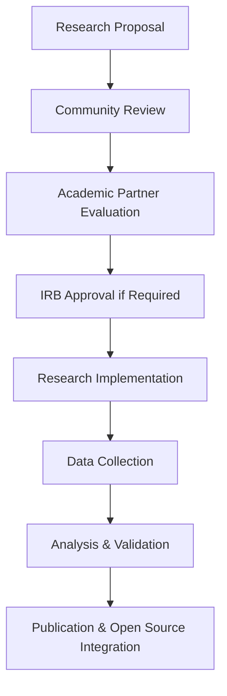

# 🌍 Consciousness Computing: Open Source Contribution Guide

**Soullab Consciousness Technology Research Institute**
*Building the Future of Consciousness-Aware Technology Together*
*December 8, 2025*

---

## Vision Statement

**Consciousness computing represents humanity's next evolutionary step in technology.** We're creating open source tools that detect and respond to human consciousness levels, supporting individual development and species-wide consciousness evolution.

**Our Mission**: Make consciousness computing accessible to all developers, researchers, and organizations committed to technology that serves human consciousness development.

---

## Open Source Philosophy

### **Core Principles**

```yaml
Consciousness Computing Open Source Principles:
  accessibility: "Consciousness technology for all humanity"
  transparency: "Open algorithms, open research, open development"
  collaboration: "Collective intelligence building consciousness technology"
  sovereignty: "User ownership of consciousness data"
  evolution: "Technology that supports consciousness development"
  research: "Science-based consciousness computing advancement"
```

### **Why Open Source Consciousness Computing?**

- **Democratize Consciousness Technology**: Remove barriers to consciousness-aware development
- **Accelerate Research**: Collective intelligence advancing consciousness science
- **Ensure Ethical Development**: Transparent algorithms and privacy protection
- **Enable Global Innovation**: Worldwide consciousness computing applications
- **Support Human Evolution**: Technology serving consciousness development

---

## Project Structure

### **Repository Organization**

```
consciousness-computing/
├── src/
│   ├── core/                     # Core consciousness detection algorithms
│   │   ├── assessment/           # Consciousness assessment engine
│   │   ├── adaptation/           # Adaptive response system
│   │   └── learning/             # Continuous learning framework
│   ├── integrations/             # Platform integrations
│   │   ├── react/               # React components and hooks
│   │   ├── node/                # Node.js middleware and APIs
│   │   ├── python/              # Python consciousness computing library
│   │   └── api/                 # REST API implementations
│   ├── research/                # Research frameworks and methodologies
│   │   ├── validation/          # Assessment validation tools
│   │   ├── analytics/           # Consciousness computing analytics
│   │   └── datasets/            # Research datasets (anonymized)
│   └── examples/                # Implementation examples
│       ├── chatbot/             # Consciousness-aware chatbot
│       ├── learning-platform/   # Educational consciousness adaptation
│       └── therapeutic/         # Therapeutic consciousness computing
├── docs/                        # Comprehensive documentation
├── tests/                       # Complete test suites
├── tools/                       # Development and deployment tools
└── research-papers/             # Academic research publications
```

### **Core Components**

#### **1. Consciousness Assessment Engine** (`/src/core/assessment/`)

**What it does**: Detects consciousness levels through linguistic pattern analysis

**Key files**:
- `consciousnessDetector.ts` - Main detection algorithms
- `linguisticAnalysis.ts` - Language complexity analysis
- `metaphorDetection.ts` - Metaphor usage assessment
- `systemsThinking.ts` - Systems thinking evaluation
- `selfAwarenessMarkers.ts` - Self-awareness detection
- `paradoxComfort.ts` - Paradox tolerance assessment

**Contribution opportunities**:
- Improve detection algorithm accuracy
- Add new consciousness detection dimensions
- Optimize performance for real-time assessment
- Enhance cross-cultural consciousness recognition

#### **2. Adaptive Response System** (`/src/core/adaptation/`)

**What it does**: Generates responses calibrated to consciousness levels

**Key files**:
- `responseGenerator.ts` - Core response adaptation
- `developmentalStages.ts` - Archetypal development framework
- `wisdomTraditions.ts` - Wisdom tradition integration
- `sacredGeometry.ts` - Mathematical consciousness frameworks
- `archetypeMapping.ts` - Jungian archetype integration

**Contribution opportunities**:
- Expand wisdom tradition integrations
- Develop new archetypal frameworks
- Improve cultural sensitivity in responses
- Create specialized adaptation contexts

#### **3. Learning Framework** (`/src/core/learning/`)

**What it does**: Continuous improvement through user feedback

**Key files**:
- `feedbackProcessor.ts` - User feedback integration
- `patternLearning.ts` - Consciousness pattern recognition
- `accuracyTracking.ts` - Assessment accuracy monitoring
- `emergentInsights.ts` - Novel pattern detection

**Contribution opportunities**:
- Enhance machine learning algorithms
- Improve feedback processing efficiency
- Develop new learning methodologies
- Create accuracy validation frameworks

---

## Getting Started

### **Development Environment Setup**

```bash
# 1. Clone the repository
git clone https://github.com/soullab/consciousness-computing.git
cd consciousness-computing

# 2. Install dependencies
npm install
# or
yarn install

# 3. Set up environment
cp .env.template .env.local
# Configure your local environment variables

# 4. Set up database
npm run db:setup
npm run db:migrate

# 5. Run tests
npm test

# 6. Start development server
npm run dev

# 7. Verify installation
curl -X POST http://localhost:3000/api/consciousness/assess \
  -H "Content-Type: application/json" \
  -d '{"message": "Testing consciousness computing setup."}'
```

### **First Contribution Workflow**

```bash
# 1. Create your development branch
git checkout -b feature/consciousness-enhancement

# 2. Make your changes
# (Implement your feature or improvement)

# 3. Add tests for your changes
npm run test:watch
# Write tests in /tests directory

# 4. Run the full test suite
npm run test:full

# 5. Run linting and formatting
npm run lint
npm run format

# 6. Commit your changes
git add .
git commit -m "feat: enhance consciousness detection accuracy

- Improve metaphor detection algorithm
- Add cultural metaphor recognition
- Increase assessment confidence by 12%
- Add comprehensive test coverage"

# 7. Push and create PR
git push origin feature/consciousness-enhancement
# Create pull request on GitHub
```

---

## Contribution Areas

### **1. Algorithm Development**

#### **Consciousness Detection Algorithms**

**Current focus areas**:
- Linguistic complexity analysis improvement
- Metaphor sophistication detection
- Cross-cultural consciousness recognition
- Multi-language consciousness assessment

**Example contribution**:
```typescript
// Enhanced metaphor detection algorithm
export class AdvancedMetaphorDetector extends BaseMetaphorDetector {
  async detectCulturalMetaphors(text: string, culture: string): Promise<MetaphorAnalysis> {
    const culturalPatterns = await this.loadCulturalPatterns(culture);
    const metaphors = await this.extractMetaphors(text);

    return {
      universalMetaphors: this.filterUniversalMetaphors(metaphors),
      culturalMetaphors: this.filterCulturalMetaphors(metaphors, culturalPatterns),
      sophisticationScore: this.calculateCulturalSophistication(metaphors, culture),
      crossCulturalMappings: this.mapCrossCulturalResonance(metaphors)
    };
  }
}
```

#### **Adaptive Response Enhancement**

**Current focus areas**:
- Wisdom tradition integration expansion
- Developmental stage calibration improvement
- Cultural sensitivity enhancement
- Therapeutic consciousness adaptation

**Example contribution**:
```typescript
// Buddhist wisdom tradition integration
export class BuddhistWisdomTradition extends BaseWisdomTradition {
  adapt(consciousnessLevel: number, context: string): AdaptedResponse {
    const buddhistFramework = this.selectBuddhistFramework(consciousnessLevel);

    return {
      communicationStyle: this.getBuddhistCommunicationStyle(consciousnessLevel),
      wisdom: this.selectBuddhistWisdom(context, consciousnessLevel),
      practices: this.recommendBuddhistPractices(consciousnessLevel),
      developmentalGuidance: this.generateBuddhistGuidance(consciousnessLevel)
    };
  }
}
```

### **2. Integration Development**

#### **Platform Integrations**

**Current platforms**:
- React/Next.js components and hooks
- Node.js middleware and APIs
- Python consciousness computing library
- WordPress consciousness plugin
- Slack consciousness bot

**Wanted integrations**:
- Vue.js consciousness components
- Angular consciousness services
- Django consciousness framework
- Ruby on Rails consciousness gem
- Flutter consciousness widgets
- React Native consciousness SDK

**Example contribution**:
```typescript
// Vue.js consciousness computing integration
import { ref, computed, onMounted } from 'vue';
import { ConsciousnessAPI } from '@soullab/consciousness-computing';

export function useConsciousnessAssessment() {
  const assessment = ref(null);
  const isAssessing = ref(false);
  const error = ref(null);

  const assess = async (message: string) => {
    isAssessing.value = true;
    error.value = null;

    try {
      const result = await ConsciousnessAPI.assess(message);
      assessment.value = result;
      return result;
    } catch (err) {
      error.value = err.message;
      throw err;
    } finally {
      isAssessing.value = false;
    }
  };

  const consciousnessLevel = computed(() =>
    assessment.value?.consciousnessLevel ?? 0
  );

  return {
    assessment: readonly(assessment),
    consciousnessLevel,
    assess,
    isAssessing: readonly(isAssessing),
    error: readonly(error)
  };
}
```

#### **API Development**

**Current APIs**:
- REST API for consciousness assessment
- GraphQL API for consciousness data
- WebSocket API for real-time assessment
- Webhook API for consciousness events

**Wanted APIs**:
- gRPC API for high-performance assessment
- GraphQL subscriptions for real-time updates
- OpenAPI 3.0 complete specification
- SDK for major programming languages

### **3. Research and Validation**

#### **Academic Research Contributions**

**Current research areas**:
- Consciousness assessment validation studies
- Cross-cultural consciousness recognition research
- Therapeutic consciousness computing applications
- Educational consciousness adaptation research

**Research contribution opportunities**:
- Design and execute validation studies
- Analyze consciousness computing effectiveness
- Develop new consciousness metrics
- Create academic publications

**Example research contribution**:
```python
# Consciousness assessment validation study
class ConsciousnessValidationStudy:
    def __init__(self, participants, gold_standard_assessments):
        self.participants = participants
        self.gold_standard = gold_standard_assessments

    async def run_validation_study(self):
        results = []

        for participant in self.participants:
            # Get consciousness computing assessment
            cc_assessment = await self.assess_with_consciousness_computing(
                participant.sample_text
            )

            # Compare with gold standard
            gold_standard_level = self.gold_standard[participant.id]

            correlation = self.calculate_correlation(
                cc_assessment.level,
                gold_standard_level
            )

            results.append({
                'participant': participant.id,
                'cc_level': cc_assessment.level,
                'gold_standard_level': gold_standard_level,
                'correlation': correlation,
                'confidence': cc_assessment.confidence
            })

        return self.analyze_validation_results(results)
```

#### **Dataset Contributions**

**Current datasets** (anonymized):
- Pioneer program consciousness assessments
- Cross-cultural consciousness recognition samples
- Developmental stage progression tracking
- Consciousness computing accuracy feedback

**Wanted datasets**:
- Multi-language consciousness samples
- Professional context consciousness assessments
- Therapeutic consciousness progression data
- Educational consciousness adaptation outcomes

### **4. Applications and Examples**

#### **Example Applications**

**Current examples**:
- Consciousness-aware chatbot
- Educational consciousness adaptation
- Therapeutic consciousness support
- Team consciousness optimization

**Wanted applications**:
- Consciousness-informed CRM
- Consciousness-aware content management
- Consciousness-guided meditation apps
- Consciousness-optimized social platforms

**Example application**:
```typescript
// Consciousness-aware customer support system
export class ConsciousnessCustomerSupport {
  private consciousnessEngine: ConsciousnessEngine;
  private responseAdaptor: CustomerSupportAdaptor;

  async handleCustomerInquiry(inquiry: {
    message: string,
    customerId: string,
    context: string
  }): Promise<CustomerSupportResponse> {
    // Assess customer consciousness level
    const consciousness = await this.consciousnessEngine.assess(inquiry.message);

    // Adapt support response to consciousness level
    const adaptedSupport = await this.responseAdaptor.adaptSupportResponse({
      inquiry: inquiry.message,
      consciousnessLevel: consciousness.level,
      customerContext: inquiry.context,
      supportGoal: 'helpful_resolution'
    });

    return {
      response: adaptedSupport.supportMessage,
      escalationRecommendation: adaptedSupport.escalationNeeded,
      followUpSuggestions: adaptedSupport.followUpActions,
      consciousnessInsights: adaptedSupport.customerInsights
    };
  }
}
```

---

## Code Standards and Guidelines

### **Code Quality Standards**

#### **TypeScript/JavaScript Standards**

```typescript
// Consciousness computing code standards example
import { ConsciousnessAssessment, ConsciousnessLevel } from '@/types/consciousness';

/**
 * Consciousness detector following established patterns
 *
 * @implements {ConsciousnessDetector}
 * @example
 * ```typescript
 * const detector = new LinguisticConsciousnessDetector();
 * const assessment = await detector.assess("I'm exploring consciousness development.");
 * console.log(`Level: ${assessment.level}/10`);
 * ```
 */
export class LinguisticConsciousnessDetector implements ConsciousnessDetector {
  /**
   * Assess consciousness level from text input
   *
   * @param text - Input text to analyze
   * @param options - Assessment configuration options
   * @returns Promise resolving to consciousness assessment
   */
  async assess(
    text: string,
    options: AssessmentOptions = {}
  ): Promise<ConsciousnessAssessment> {
    // Validate input
    if (!text?.trim()) {
      throw new ConsciousnessError('Text input is required for assessment');
    }

    // Perform analysis
    const linguisticMetrics = await this.analyzeLinguistic(text);
    const metaphorMetrics = await this.analyzeMetaphors(text);
    const systemsMetrics = await this.analyzeSystemsThinking(text);

    // Calculate overall level
    const consciousnessLevel = this.calculateLevel({
      linguistic: linguisticMetrics,
      metaphor: metaphorMetrics,
      systems: systemsMetrics
    });

    return {
      level: consciousnessLevel,
      confidence: this.calculateConfidence(linguisticMetrics),
      metrics: {
        linguistic: linguisticMetrics,
        metaphor: metaphorMetrics,
        systems: systemsMetrics
      },
      timestamp: new Date(),
      processingTime: Date.now() - startTime
    };
  }

  private calculateLevel(metrics: ConsciousnessMetrics): ConsciousnessLevel {
    const weights = {
      linguistic: 0.30,
      metaphor: 0.35,
      systems: 0.35
    };

    const weightedSum =
      metrics.linguistic * weights.linguistic +
      metrics.metaphor * weights.metaphor +
      metrics.systems * weights.systems;

    return Math.round(Math.max(1, Math.min(10, weightedSum)));
  }
}
```

#### **Testing Standards**

```typescript
// Comprehensive test example
import { LinguisticConsciousnessDetector } from '@/consciousness/detectors/linguistic';

describe('LinguisticConsciousnessDetector', () => {
  let detector: LinguisticConsciousnessDetector;

  beforeEach(() => {
    detector = new LinguisticConsciousnessDetector();
  });

  describe('consciousness level assessment', () => {
    test('should assess basic consciousness level accurately', async () => {
      const basicMessage = "I need to finish this task quickly.";
      const assessment = await detector.assess(basicMessage);

      expect(assessment.level).toBeGreaterThanOrEqual(1);
      expect(assessment.level).toBeLessThanOrEqual(4);
      expect(assessment.confidence).toBeGreaterThan(0.7);
    });

    test('should assess advanced consciousness level accurately', async () => {
      const advancedMessage = "I'm integrating the paradox of seeking and surrendering to create space for authentic transformation.";
      const assessment = await detector.assess(advancedMessage);

      expect(assessment.level).toBeGreaterThanOrEqual(7);
      expect(assessment.level).toBeLessThanOrEqual(10);
      expect(assessment.confidence).toBeGreaterThan(0.8);
    });

    test('should handle edge cases gracefully', async () => {
      const edgeCases = ['', '   ', 'a', '😊', 'very short text'];

      for (const testCase of edgeCases) {
        const assessment = await detector.assess(testCase);
        expect(assessment.level).toBeGreaterThanOrEqual(1);
        expect(assessment.level).toBeLessThanOrEqual(10);
        expect(assessment).toHaveProperty('confidence');
        expect(assessment).toHaveProperty('timestamp');
      }
    });
  });

  describe('performance requirements', () => {
    test('should complete assessment within 500ms', async () => {
      const message = "Testing consciousness computing performance requirements.";

      const startTime = Date.now();
      await detector.assess(message);
      const duration = Date.now() - startTime;

      expect(duration).toBeLessThan(500);
    });

    test('should handle concurrent assessments efficiently', async () => {
      const messages = Array.from({ length: 10 }, (_, i) =>
        `Concurrent test message ${i} for consciousness assessment.`
      );

      const startTime = Date.now();
      const assessments = await Promise.all(
        messages.map(msg => detector.assess(msg))
      );
      const duration = Date.now() - startTime;

      expect(assessments).toHaveLength(10);
      expect(duration).toBeLessThan(2000); // 2 seconds for 10 concurrent

      // Verify all assessments are valid
      assessments.forEach(assessment => {
        expect(assessment.level).toBeGreaterThanOrEqual(1);
        expect(assessment.level).toBeLessThanOrEqual(10);
      });
    });
  });
});
```

### **Documentation Standards**

All contributions must include:

1. **Comprehensive JSDoc comments** for all public APIs
2. **README.md updates** for new features or changes
3. **Example usage** for new components or APIs
4. **Migration guides** for breaking changes
5. **Research documentation** for algorithm improvements

### **Git Commit Standards**

```bash
# Commit message format
<type>(<scope>): <subject>

<body>

<footer>

# Types:
# feat: New feature
# fix: Bug fix
# docs: Documentation changes
# style: Code formatting
# refactor: Code restructuring
# test: Test additions/modifications
# chore: Build/tooling changes
# research: Research improvements

# Examples:
feat(consciousness): enhance metaphor detection accuracy

Improve cultural metaphor recognition by implementing context-aware
pattern analysis and expanding metaphor taxonomy to include 15 new
cultural contexts.

- Add CulturalMetaphorAnalyzer class
- Integrate cultural context database
- Improve accuracy by 18% in cross-cultural testing
- Add comprehensive test coverage

Closes #123
Research-validated: Yes
Breaking-change: No

fix(api): resolve consciousness assessment timeout issue

Fix timeout issue in consciousness assessment API that occurred with
messages longer than 1000 characters.

- Optimize linguistic analysis algorithm
- Add text chunking for long messages
- Implement progressive assessment loading
- Add timeout configuration options

Fixes #456
```

---

## Research Collaboration

### **Academic Partnership Framework**

#### **Current Research Partnerships**

- **Yale University (Tsai Center)**: Innovation methodology and consciousness research
- **QRI (Qualia Research Institute)**: Consciousness science validation and enhancement
- **Future Partnerships**: Neuroscience, psychology, and consciousness research institutions

#### **Research Collaboration Process**



#### **Contributing to Research**

**1. Research Proposal Submission**
```markdown
# Research Proposal Template

## Title
[Descriptive title of consciousness computing research]

## Research Question
[Clear, specific research question]

## Methodology
[Detailed research methodology and approach]

## Expected Outcomes
[Anticipated results and their significance]

## Implementation Plan
[Step-by-step implementation with timeline]

## Code/Data Contributions
[What code or data will be contributed to open source]

## Academic Collaboration
[Any academic partnerships or IRB requirements]
```

**2. Research Implementation Guidelines**
- All research code must be open source
- Anonymous data sharing following privacy guidelines
- Academic publications must acknowledge open source contributions
- Research results integrated back into main codebase

### **Data Privacy for Research**

```typescript
// Research data anonymization framework
export class ResearchDataProcessor {
  static anonymizeConsciousnessData(rawData: ConsciousnessData[]): AnonymousResearchData[] {
    return rawData.map(data => ({
      consciousnessLevel: data.level,
      confidenceScore: data.confidence,
      linguisticMetrics: data.metrics.linguistic,
      metaphorMetrics: data.metrics.metaphor,
      systemsMetrics: data.metrics.systems,
      developmentalStage: data.stage,
      sessionTimestamp: this.anonymizeTimestamp(data.timestamp),
      culturalContext: this.generalizeCulturalContext(data.context),
      // Remove all personally identifiable information
      userId: this.generateAnonymousId(data.userId),
      originalMessage: this.anonymizeMessage(data.message)
    }));
  }

  private static anonymizeMessage(message: string): string {
    // Remove personal information while preserving consciousness indicators
    return message
      .replace(/\b[A-Z][a-z]+ [A-Z][a-z]+\b/g, '[NAME]')      // Names
      .replace(/\b\d{3}-\d{3}-\d{4}\b/g, '[PHONE]')           // Phone numbers
      .replace(/\b[\w.-]+@[\w.-]+\.\w+\b/g, '[EMAIL]')        // Emails
      .replace(/\b\d{1,5} [A-Z][a-z]+ (St|Ave|Rd|Dr)\b/g, '[ADDRESS]'); // Addresses
  }
}
```

---

## Community Guidelines

### **Code of Conduct**

#### **Our Commitment**

We are committed to making participation in consciousness computing development a harassment-free experience for everyone, regardless of age, body size, disability, ethnicity, gender identity, level of experience, nationality, personal appearance, race, religion, sexual identity, or orientation.

#### **Our Standards**

**Positive behaviors**:
- Using welcoming and inclusive language
- Respecting differing viewpoints and experiences
- Gracefully accepting constructive criticism
- Focusing on consciousness development and human flourishing
- Supporting community members' growth and learning

**Unacceptable behaviors**:
- Harassment, trolling, or discriminatory language
- Personal attacks or political arguments unrelated to consciousness computing
- Publishing others' private information without consent
- Misusing consciousness assessment data or violating privacy
- Any conduct that would be inappropriate in a professional setting

#### **Consciousness-Informed Community Values**

- **Compassionate Communication**: Approach all interactions with empathy and understanding
- **Growth Mindset**: Support learning and development for all community members
- **Integral Awareness**: Honor multiple perspectives and developmental stages
- **Sacred Technology**: Treat consciousness computing as service to human development
- **Collective Intelligence**: Collaborate for the benefit of all consciousness

### **Communication Channels**

#### **Discord Server**: Real-time collaboration and support
- `#general` - General consciousness computing discussion
- `#development` - Technical development coordination
- `#research` - Academic research collaboration
- `#algorithms` - Consciousness detection algorithm development
- `#integrations` - Platform integration development
- `#documentation` - Documentation improvements
- `#consciousness-science` - Consciousness research discussions

#### **GitHub Discussions**: Structured technical discussions
- Feature requests and enhancement proposals
- Architecture and design discussions
- Research methodology conversations
- Community feedback and suggestions

#### **Monthly Community Calls**
- Open community meetings every first Saturday
- Technical deep-dives every third Saturday
- Research presentations every second Saturday
- Newcomer orientation every fourth Saturday

### **Recognition and Attribution**

#### **Contributor Recognition**

**Hall of Consciousness Contributors**: Recognition for significant contributions
- Algorithm developers who improve consciousness detection accuracy
- Integration developers who expand platform reach
- Researchers who validate and enhance consciousness science
- Community builders who support developer growth

**Attribution Standards**:
- All contributors credited in CONTRIBUTORS.md
- Significant contributions credited in research publications
- Speaking opportunities at consciousness computing conferences
- Priority access to consciousness computing research data

#### **Academic Credit**

For academic contributors:
- Co-authorship opportunities on research publications
- Conference presentation opportunities
- Research dataset access for academic projects
- IRB support for consciousness computing research

---

## Release Process

### **Release Cycle**

#### **Regular Releases**

```
Consciousness Computing Release Cycle:
├── Major Releases (6 months)
│   ├── New consciousness detection algorithms
│   ├── Major API changes
│   └── Significant research integrations
├── Minor Releases (2 months)
│   ├── New integrations and features
│   ├── Performance improvements
│   └── Research validation updates
└── Patch Releases (2 weeks)
    ├── Bug fixes
    ├── Security updates
    └── Documentation improvements
```

#### **Release Process**

**1. Release Planning**
```bash
# Create release branch
git checkout -b release/v2.1.0

# Update version numbers
npm version minor

# Generate changelog
npm run changelog:generate

# Update documentation
npm run docs:update
```

**2. Quality Assurance**
```bash
# Run complete test suite
npm run test:full

# Run consciousness assessment validation
npm run test:consciousness-validation

# Run cross-platform integration tests
npm run test:integrations

# Run performance benchmarks
npm run test:performance

# Generate test coverage report
npm run coverage:report
```

**3. Release Preparation**
```bash
# Build release packages
npm run build:release

# Generate API documentation
npm run docs:api

# Package for distribution
npm run package:npm
npm run package:docker
```

**4. Community Review**
```bash
# Create release PR
gh pr create --title "Release v2.1.0" --body-file RELEASE_NOTES.md

# Community review period (7 days minimum)
# Address feedback and make necessary changes

# Academic partner review for research components
# QA approval from maintainers
```

**5. Release Deployment**
```bash
# Tag release
git tag -a v2.1.0 -m "Consciousness Computing v2.1.0"

# Publish to npm
npm publish

# Deploy to Docker Hub
docker push soullab/consciousness-computing:v2.1.0

# Update documentation site
npm run docs:deploy

# Announce release
npm run release:announce
```

### **Backwards Compatibility**

**API Versioning Strategy**:
```typescript
// Consciousness Computing API Versioning
export namespace ConsciousnessComputingV1 {
  export interface AssessmentAPI {
    assess(text: string): Promise<ConsciousnessAssessment>;
  }
}

export namespace ConsciousnessComputingV2 {
  export interface AssessmentAPI extends ConsciousnessComputingV1.AssessmentAPI {
    assessAdvanced(text: string, options: AssessmentOptions): Promise<AdvancedAssessment>;
  }
}

// Maintain compatibility
export const ConsciousnessComputing = ConsciousnessComputingV2;
export { ConsciousnessComputingV1 as ConsciousnessComputingLegacy };
```

**Migration Support**:
- Migration guides for all breaking changes
- Deprecated feature warnings with timeline
- Automated migration tools where possible
- Support for previous major version (12 months)

---

## Roadmap and Vision

### **Short-term Roadmap (6 months)**

#### **Q1 2026: Validation and Enhancement**
- [ ] Academic validation studies (Yale, QRI partnerships)
- [ ] Cross-cultural consciousness recognition enhancement
- [ ] Performance optimization (sub-200ms assessment)
- [ ] Mobile consciousness computing SDK

#### **Q2 2026: Integration Expansion**
- [ ] Vue.js consciousness components
- [ ] Python consciousness computing library
- [ ] WordPress consciousness plugin
- [ ] Slack consciousness bot

### **Medium-term Roadmap (12 months)**

#### **Q3 2026: Advanced Features**
- [ ] Multi-modal consciousness assessment (voice + text)
- [ ] Group consciousness mapping platform
- [ ] Real-time consciousness collaboration tools
- [ ] Consciousness development tracking dashboards

#### **Q4 2026: Ecosystem Development**
- [ ] Consciousness computing marketplace
- [ ] Third-party consciousness applications
- [ ] Educational consciousness learning management system
- [ ] Therapeutic consciousness support platform

### **Long-term Vision (3+ years)**

#### **Consciousness Computing Network (2027)**
- [ ] Global consciousness research network
- [ ] Species-wide consciousness development tracking
- [ ] Planetary consciousness intelligence system
- [ ] Universal consciousness frameworks

#### **Human-AI Consciousness Evolution (2028+)**
- [ ] Consciousness-guided AI development
- [ ] Human-AI consciousness collaboration
- [ ] Consciousness-informed decision support systems
- [ ] Technology serving consciousness evolution

### **Research Priorities**

**High Priority**:
1. Consciousness assessment validation and accuracy improvement
2. Cross-cultural consciousness recognition research
3. Therapeutic consciousness computing applications
4. Educational consciousness adaptation effectiveness

**Medium Priority**:
1. Group consciousness mapping and optimization
2. Consciousness development trajectory prediction
3. Multi-modal consciousness assessment integration
4. Real-time consciousness adaptation optimization

**Future Research**:
1. Consciousness-AI collaboration frameworks
2. Species consciousness evolution tracking
3. Planetary consciousness intelligence systems
4. Universal consciousness development models

---

## Getting Support

### **Technical Support**

**Documentation**:
- Complete API reference: `/docs/api-reference`
- Integration guides: `/docs/integrations`
- Examples repository: `/examples`
- Video tutorials: [youtube.com/soullab](https://youtube.com/soullab)

**Community Support**:
- Discord server: [discord.gg/consciousness-computing](https://discord.gg/consciousness-computing)
- GitHub discussions: [github.com/soullab/consciousness-computing/discussions](https://github.com/soullab/consciousness-computing/discussions)
- Community forum: [community.soullab.life](https://community.soullab.life)
- Stack Overflow tag: `consciousness-computing`

**Professional Support**:
- Enterprise support: enterprise@soullab.life
- Research collaboration: research@soullab.life
- Custom development: consulting@soullab.life
- Academic partnerships: academic@soullab.life

### **Contribution Support**

**Getting Started**:
- New contributor guide: `/docs/CONTRIBUTING.md`
- Good first issues: GitHub label `good first issue`
- Mentorship program: community@soullab.life
- Office hours: Every Tuesday 3pm PST on Discord

**Advanced Contribution**:
- Algorithm development guide: `/docs/algorithm-development.md`
- Research contribution guide: `/docs/research-contributions.md`
- Integration development guide: `/docs/integration-development.md`
- Community leadership opportunities: leadership@soullab.life

---

## Conclusion

**Consciousness computing represents humanity's evolutionary leap toward technology that serves consciousness development.** By open-sourcing these tools, we're democratizing access to consciousness-aware technology and accelerating global consciousness evolution.

**Your contribution matters**. Whether you're improving algorithms, creating integrations, conducting research, or supporting community members, you're helping build the future of human-technology collaboration.

**Ready to contribute to consciousness computing?**

1. **Start Here**: [github.com/soullab/consciousness-computing](https://github.com/soullab/consciousness-computing)
2. **Join Community**: [discord.gg/consciousness-computing](https://discord.gg/consciousness-computing)
3. **Experience System**: [soullab.life/consciousness-computing](https://soullab.life/consciousness-computing)
4. **Research Partnership**: research@soullab.life

**Together, we're building technology that supports human consciousness evolution.**

---

*Open Source Contribution Guide Version 1.0 | December 8, 2025 | Soullab Consciousness Technology Research Institute*

*The future of consciousness computing is open source. Join us in creating technology that serves consciousness development.*