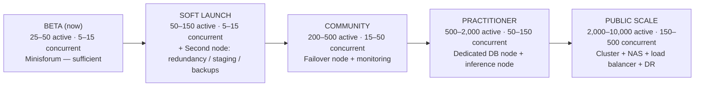

# MAIA — State, Scaling Roadmap & Thresholds (Team Briefing)

_2026-06-10. Governed by claim discipline (`docs/canon/MARKETING_CLAIM_DISCIPLINE.md`): every line below is tagged **Live** (running + verified), **Designed** (built/planned, not yet live), or **Vision** (intended direction). The rule: we do not tell tomorrow's story as if it were today's._

---

## 1. Current State — Live / Designed / Vision

| Component | Register | Honest status |
|---|---|---|
| **Infrastructure** — Minisforum, Docker + Caddy, self-hosted Postgres | **Live** | Running and stable at observed beta load (~5–15 concurrent). Empirical, not a ceiling. |
| **Session / Auth — onboarding session-mint fix** | **Live — acceptance pending** | Merged (PR #392 / `4f9a85c23`) → **deployed + verified 2026-06-10 20:22Z** (fresh image, `health=healthy`, external `/api/health` → 200). Real `maia_session` token + `auth_sessions` rows now issued. **Final gate still open: 24–48h coverage query = 0 sessionless new members.** Say **"deployed; acceptance pending,"** not "done." |
| **Stewardship ledger (token/cost tracking)** | **Designed — currently reverted** | Built + live-verified on prod, then **reverted** when a concurrent linkify deploy (PR #385) shipped over it. The **running container does not record usage.** `usage_events` table persists (1 anon row), no live writer. Needs a fresh re-land off current clean-main. **Not "now tracks."** |
| **AI layer** — Claude primary, local fallback | **Live** | Accurate. |
| **Zero-downtime deploy path** | **Designed** | Staged on a branch, not adopted. Standard `up -d --build` (≈1–2 min 502 window) still in use. Accurate. |
| **DM / Auth hardening** | **Designed (gated)** | Held until the session-coverage gate passes. Accurate. |
| **Capacity headroom to ~150 active** | **Designed** | Current beta load is empirically fine. Headroom *beyond* it is **projected** — the clean write + DM contention test is scoped but **not yet run** on prod. Don't state soft-launch capacity as measured. |

**The line that must be fixed before this goes to the team:** the **stewardship ledger is reverted, not live** — the running container does not record usage. Session-mint is now *deployed + verified*, but it's "**live, acceptance pending**" (24–48h coverage gate still open), not "done."

---

## 2. Future State — Vision

- **Hybrid sovereign architecture** — local core (identity, memory, continuity); cloud/burst for inference only when needed. Sovereignty boundary stays local.
- **Redundancy** — second node for uptime, staging, failover.
- **Scalable storage** — NAS for continuity data + voice.
- **Full observability** — CPU/mem/disk/latency, AI usage, auth/session errors.

_All legitimate forward planning. Aspiration is not inflation — the reach is sound; only the Section-1 claims needed tightening._

---

## 3. Hardware / Scaling Roadmap — Designed

**Load-bearing note:** the "second node" is **not about raw CPU** — it's continuity, failover, and operational resilience. Scaling is triggered by **real usage thresholds, not projected user counts.**

### Read this correctly — resilience-first, NOT horizontal load-scaling

The node additions are **not** classic horizontal scaling (replicating a stateless app behind a load balancer to absorb traffic). At Soft Launch / Community concurrency (5–50 simultaneous), the Minisforum is **not CPU-bound** — heavy AI inference is **offloaded to the Claude API**, so the local node's real constraints are Postgres, Whisper workers, and being a **single point of failure**. The progression:

- **Second node — Soft Launch (50–150 active):** failover + staging + off-box backups. Removes the single point of failure. **Not** "to handle more traffic."
- **Failover node + monitoring — Community (200–500 active / 15–50 concurrent):** resilience + observability, not load distribution.
- **Dedicated DB + inference nodes — Practitioner (500–2k):** *role specialization* (give the heaviest roles their own hardware), not app replication.
- **Cluster + load balancer — Public Scale (2k–10k):** only here does genuine horizontal load-balancing enter.

If anyone summarizes the second node as "distribute load / horizontal scaling," that's the misread to correct.

---

## 4. Threshold Metrics & Triggers — Designed

**Watch:** uptime / request-failure rate · MAIA response + voice-transcription latency · CPU / mem / disk · auth-session failure rate · email/payment webhook failures · cost per turn (Claude vs local) · concurrent active users.

**Trigger an upgrade when:** sustained CPU > 70% or mem > 75% · responses slower than baseline · queue buildup in voice/inference · failed deploys hitting users · payment/session failures · backup/restore unverified.

---

## 5. Operational Guidance — Live policy

- **Deploy only after** verifying session-mint + auth coverage.
- **DM/Auth hardening held** until post-deploy coverage confirms zero sessionless members.
- **Non-fatal session-mint degrade** must emit an observable metric (currently `console.error`-only) so silent recreation of sessionless members can't hide.
- **Scaling decisions** follow measured thresholds, not headcount forecasts.
