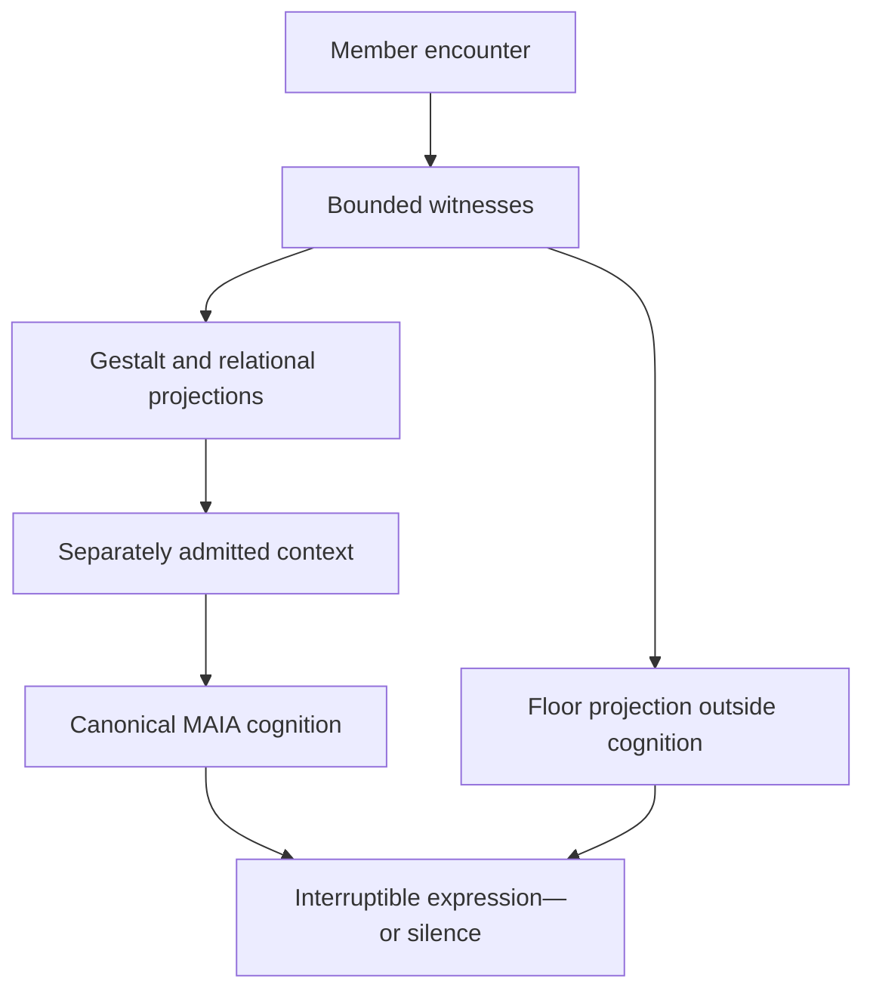

# Beyond the Turn

## Toward Conversational Intelligence That Preserves Human Sovereignty

**A Soullab / MAIA white paper**

**Version:** 1.0

**Date:** 2026-09-16

**Basis:** Derived from the completed CI-01 architecture research programme

**Evidence standing:** Design findings and a future evaluation framework; not a claim of deployed
performance or demonstrated member benefit

---

## Executive summary

Most conversational AI still treats conversation as a relay race:

> listen → detect an ending → generate an answer → speak

Human conversation is not organized this way. We pause without finishing. We discover what we
mean while saying it. We signal invitation and withdrawal indirectly. We return to earlier
threads. We sometimes need acknowledgment rather than explanation, silence rather than advice, or
a question rather than an answer.

Soullab's CI-01 research programme asked what it would take for MAIA to meet that fuller reality
without giving an AI model undue power over the person or the conversation.

The central finding is simple:

> **Conversational intelligence should integrate evidence, not authority.**

Acoustics, language, memory, timing, relationship, and expression can all contribute. None should
quietly become the master interpreter of the person. The result is not one giant conversational
model, but a coordinated ecology in which each faculty has a narrow purpose, visible provenance,
an expiry condition, and an explicit limit on what it may cause.

This paper explains that architecture in accessible terms. It also states the most important
limitation plainly: MAIA does not yet run this complete ecology. CI-01 produced a rigorous design
and a falsifiable benchmark for future work. It did not produce a live system or demonstrate
improved member outcomes.

## 1. Conversation is more than exchanging messages

A conventional assistant answers a message. A conversational intelligence must also participate
in an encounter.

That difference becomes visible in ordinary moments:

- a person pauses because they are searching inward, not because they are finished;
- a sentence is grammatically complete but emotionally unfinished;
- a question is spoken aloud while the person continues toward their own answer;
- a correction should reorganize the conversation immediately;
- an old thread returns with new meaning;
- an interpretation may be useful only if offered tentatively;
- the right response may be “mm,” a short mirror, an invitation, or silence.

These are not only language-generation problems. They involve timing, memory, permission,
relationship, meaning, and expression. Treating them as one model decision makes the system
powerful in the wrong way: it becomes difficult to see which evidence justified which action.

## 2. The four decisions hidden inside every response

CI-01 found that conversational systems often compress four different questions into one:

| Decision | The actual question |
|---|---|
| Floor | Is the person still speaking or still unfolding, and is an opportunity available? |
| Relational act | If participation is appropriate, what kind of response belongs here? |
| Cognition | What does MAIA understand, remember, reason, and mean? |
| Expression | How should that meaning be embodied—or should it remain unspoken? |

Keeping these separate changes the whole design.

If the floor appears available, MAIA has not yet decided to speak. If a mirror is appropriate,
MAIA has not yet decided what the mirror should say. If MAIA has formed an interpretation, she has
not yet earned the right to present it as fact. If a response has been composed, renewed member
speech can still require it to stop.

An intelligent system needs the capacity not only to act, but to refrain from converting one kind
of evidence into a different kind of permission.

## 3. One MAIA mind, many bounded witnesses

Earlier work with full-duplex voice systems, acoustic turn predictors, Care Mode, memory,
relational reasoning, Gestalt, and expressive voice revealed useful but different faculties.
CI-01's synthesis does not ask one of them to take over.

In the candidate architecture, each is assigned a bounded contribution:

- acoustic models may notice possible continuation;
- semantic systems may notice unfinished language;
- explicit speech may establish a hold, correction, invitation, or withdrawal;
- memory may make prior evidence available;
- Gestalt may propose the provisional shape of the unfolding encounter;
- relational intelligence may propose an appropriate kind of act;
- expression systems may shape cadence, brevity, pause, or prosody.

Canonical MAIA remains the one place where meaning is integrated and a response is understood.
Voice can change MAIA's ears and manner of presence. It does not secretly replace her mind.

## 4. A conversational field—not a conversation brain

The phrase *conversational field* names the coordinated state of the encounter. CI-01 originally
considered whether this should be represented as one shared snapshot. The research rejected that
shape.

One large object would combine things that do not have the same standing: direct member speech,
machine observation, model inference, remembered material, MAIA's prior language, and outcome
telemetry. Once blended, those differences become hard to recover.

The proposed field is therefore a governed view across separate records:



Every contribution must retain where it came from, when it was observed, what it supports, what
contradicts it, when it expires, and what it is allowed to influence.

This leads to a deeper design principle:

> A model is a witness. It is not a sovereign.

## 5. Human authority stays above model confidence

The architecture establishes a clear order:

```text
explicit member hold       > prediction of completion
present member speech      > MAIA's planned response
member correction          > stored or inferred interpretation
member-selected space      > aggressive automatic timing
present counterevidence    > historical pattern confidence
```

A model may be highly confident and still be wrong about what a person means or intends. A member
does not need a higher confidence score to correct it.

This is why provenance cannot be reduced to one number. The system must distinguish:

- who or what produced the evidence;
- whether it is observation, computation, inference, or direct member action;
- how reliable it appears to be;
- whether it is established, provisional, contested, or historical;
- what it is permitted to cause.

Human sovereignty is therefore not an instruction added to a prompt. It is an ordering encoded in
the architecture.

## 6. Gestalt without turning a person into a profile

Conversational continuity requires more than recent-message history. A good conversational partner
can feel that an earlier question remains open, that a disclosure has changed the direction of the
exchange, or that a familiar subject now carries a different meaning.

But long memory introduces a serious danger: the system may become increasingly certain that it
knows who the person is. The past can begin to overrule the present.

CI-01 adopts a different law:

> **The present encounter retains the power to reorganize the whole.**

A Gestalt is therefore a provisional orientation, not a durable verdict. It must preserve
supporting evidence and counterevidence. It must accept correction. It must expire and be
reconstructed. It must allow novelty to displace history.

The aspiration can be stated simply:

> The better MAIA knows someone, the more precisely she can meet what is present—and the less
> entitled she becomes to assume that yesterday's understanding defines who is here today.

## 7. Relational intelligence comes before eloquence

Language models are rewarded for producing fluent answers. Conversation often requires a prior
judgment: what kind of act belongs here?

Possible acts include:

- remain silent;
- acknowledge;
- mirror;
- inquire;
- illuminate;
- bridge;
- challenge;
- ask permission;
- invite;
- return to an unfinished thread;
- clarify or repair.

This does not become a rigid script. Care Mode's earlier
*Mirror → Illuminate → Permission → Invite* grammar contributes a vocabulary of relational
restraint, not a mandatory sequence.

The distinction matters because a technically correct answer may still be relationally wrong. It
may arrive too early, say too much, interpret without permission, or answer when the person needed
to be met rather than explained.

## 8. Shadow means no hidden influence

Future conversational intelligence must earn authority from zero.

CI-01 therefore defines shadow research more strictly than “the member cannot see the output.” A
shadow system must be causally absent. It cannot change prompts, timing, endpointing, response
generation, voice, memory, settings, or learning. Its failure or resource use must not alter the
live conversation either.

The research sequence compares four things:

1. what the live system actually did;
2. what each lawful witness observed;
3. what the shadow ecology would have projected;
4. what the member observably did next.

The outcome can judge a prior projection, but it cannot travel backward and become part of the
projection being evaluated.

This matters because an impressive retrospective explanation is not a prediction. A replay is not
a live latency result. A hidden observer that changes the system is not a shadow.

## 9. How conversational intelligence should be tested

CI-01 designed `MAIA-CONVERSATION-BENCH-01` around three separate suites:

| Suite | What it asks |
|---|---|
| Contract | Are provenance, expiry, correction, refusal, custody, and causal isolation actually enforced? |
| Ecology | Do bounded faculties make warranted judgments and coordinate without authority collapse? |
| Encounter | Does the member-facing conversation improve, according to observable behavior and direct member witness? |

The benchmark refuses one overall “conversational intelligence” score. Some failures must never be
averaged away: overriding an explicit hold, seizing the floor, ignoring a correction, presenting
an inference as member truth, leaking future outcomes into a prediction, or learning silently from
research observations.

It also defines synergy in practical terms. Adding more systems is valuable only if the combined
ecology improves a predeclared conversational consequence beyond the strongest simpler condition,
and an ablation can show what each part contributed. Richer internal descriptions are not evidence
of a better-held encounter.

## 10. What the research found

CI-01 produced the following architecture findings:

1. MAIA already has meaningful conversational organs, but they are only partially coordinated.
2. The missing center is governed encounter state, not a more powerful master model.
3. That state must remain differentiated by origin, standing, lifetime, reader, and authority.
4. Floor, relational act, cognition, expression, and learning must remain separate powers.
5. Gestalt must be provisional and revisable by the present.
6. A lawful input boundary is not enough; generated interpretations also need an honesty boundary.
7. Shadow research must prove temporal and causal isolation before member observation.
8. Synergy must appear in conversational consequences and ablations, not in system complexity.
9. Acoustic continuation evidence can contribute, but it cannot decide that the person is finished
   or make MAIA speak.
10. No benchmark result can promote itself into live authority.

## 11. What the research has not shown

CI-01 did not implement this complete ecology. It did not select or install a conversational model.
It did not alter MAIA's prompts, memory, turn timing, voice, or response behavior. It did not create
or run the wider conversation benchmark. It did not conduct human adjudication or a member shadow
walk.

Therefore this work does **not** yet show that:

- members experience fewer interruptions or better conversational fit;
- Gestalt projections improve continuity;
- relational-act proposals improve responses;
- the architecture can meet production latency or resource budgets;
- any acoustic model generalizes to real members;
- the proposed ecology is better than a simpler design.

Those are the next research questions, not conclusions hidden inside the architecture.

## 12. A disciplined path forward

The next implementation programme, if separately opened, should begin offline:

1. contract fixtures and refusal tests;
2. independent projector fixtures;
3. cross-domain adversarial cases;
4. sealed-input replay;
5. leakage, custody, and fault tests;
6. a one-way mirror with synthetic traffic;
7. proof that shadow-on and shadow-off are operationally equivalent;
8. only then, separately consented prospective shadow observation;
9. direct encounter evidence and member witness;
10. a bounded decision to reject, hold, continue research, or seek a new authorization.

At no point does passing a benchmark automatically grant permission to speak, learn, deploy, or
take the conversational floor.

## 13. Conclusion

The most promising conversational systems may not be those that make the most confident unified
judgment. They may be those that coordinate many partial forms of intelligence while preserving
the differences between them.

Acoustics may contribute evidence about the temporal body of conversation. Gestalt may help MAIA
remain oriented to the whole. Relational discernment may propose what kind of participation
belongs. Canonical cognition can determine what she actually understands and means. Expression
can give that meaning timing, cadence, brevity, and warmth.

Their synergy does not come from fusion. It comes from disciplined relationship.

The aim is not an AI that claims to know a person completely. It is an AI capable of deeper
attention, more honest uncertainty, more responsive presence, and greater restraint—while the
person remains the final authority on their own meaning.

---

## Companion research record

This white paper is derived from
[MAIA Conversational Intelligence Synthesis: Architecture Results, Negative Findings, and a Falsifiable Research Programme](./MAIA_CONVERSATIONAL_INTELLIGENCE_SYNTHESIS_RESULTS_2026-09-16.md),
which contains the evidence cut, immutable research refs, architecture decisions, limitations, and
primary programme records supporting the claims above.
