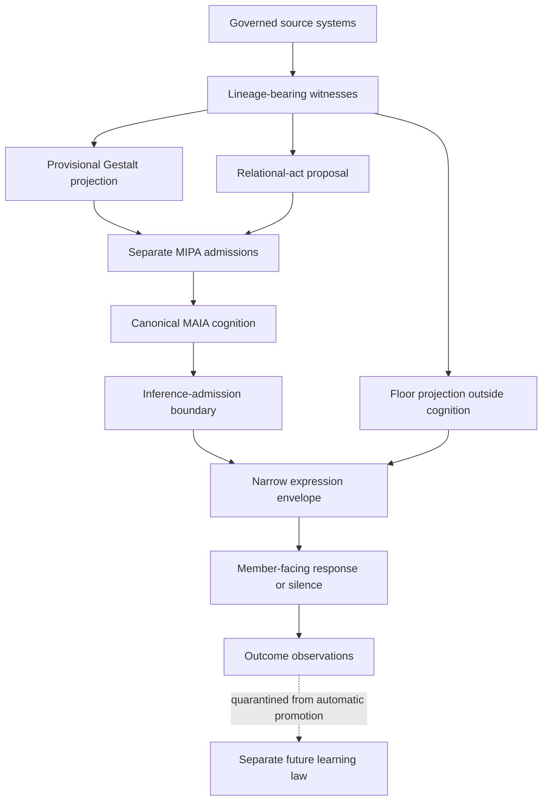

# MAIA Conversational Intelligence Synthesis

## Architecture Results, Negative Findings, and a Falsifiable Research Programme

**Programme:** CI-01 — Conversational Intelligence Synthesis

**Organisation:** Soullab / MAIA Research Programme

**Version:** 1.0

**Date:** 2026-09-16

**Document class:** Source-pinned architecture-results paper

**Primary evidence cut:** `c92963c7ccba567fec1dcb8dce7fada55a2595c4`

**Standing:** Research and architecture results only; not a runtime, deployment, benchmark-execution,
or member-outcome report

---

## Abstract

Conversational artificial intelligence is often treated as a sequence of speech recognition,
language generation, and speech synthesis. This framing obscures several different judgments that
human conversation coordinates continuously: whether a person is still speaking, whether an
intervention is invited, what the encounter means, what should be said, and how—if at all—it should
be expressed. It also allows specialized models to acquire powers their evidence does not warrant.

CI-01 investigated how MAIA's existing hearing, floor, memory, Gestalt, relational, cognitive,
expressive, and learning capabilities could inform one another without any subsystem silently
inheriting another subsystem's authority. The programme used a four-act, repository-grounded
method: a capability census; an architecture contract; a causally isolated shadow-synthesis
design; and a constitutional benchmark specification.

The principal result is that the appropriate integration center is not a master conversational
model or a monolithic context object. It is a governed ecology of lineage-bearing witnesses and
purpose-specific, expiring projections. Floor state, relational act, cognition, and expression
remain separate judgments. Canonical MAIA cognition remains the only meaning-making path, while
member authority, evidence provenance, uncertainty, correction, expiry, and counterevidence remain
structurally visible. The work also rejects a composite conversational-intelligence score and
defines synergy operationally: coordinated faculties must improve a predeclared conversational
consequence beyond the strongest lawful narrower configuration, survive ablation, and introduce
no constitutional regression.

These are architecture results, not efficacy results. CI-01 created no runtime field, model,
prompt change, benchmark corpus, benchmark runner, human adjudication, shadow member walk, or live
authority. Its contribution is to make a larger claim—better-held conversation through coordinated
faculties—precise, governable, and falsifiable before implementation.

**Keywords:** conversational intelligence, relational AI, turn-taking, human sovereignty,
provenance, Gestalt, shadow evaluation, evidence admission, conversational benchmarking

---

## 1. Research question

CI-01 asked:

> How should MAIA's existing hearing, turn, memory, Gestalt, relational, cognitive, and expressive
> capacities inform one another without any subsystem silently acquiring another subsystem's
> authority?

The programme was motivated by an increasingly clear mismatch between ordinary assistant
pipelines and lived conversation. A silence is not necessarily a yield. A yielded floor is not an
instruction to speak. An accurate memory is not a license to define the present. A plausible
interpretation is not member-authored truth. A fitting response act does not by itself determine
the response's content or manner.

The governing synthesis was therefore:

> **Integrate evidence, not authority.**

This principle constrained both the proposed architecture and the claims CI-01 was permitted to
make about it.

## 2. Result classes and claim boundary

The word *result* is used in four different ways in AI research. CI-01 separates them.

| Result class | CI-01 standing | What it supports |
|---|---|---|
| Repository finding | Complete for the bounded evidence corpus | Claims about what is live, partial, shadow, disconnected, research, or missing at the evidence cut |
| Architecture decision | Complete as a candidate contract | Claims about required boundaries, admissible topology, and explicit rejections |
| Evaluation design | Complete as a benchmark specification | Claims about how later runtime and encounter evidence must be produced and judged |
| Runtime or human outcome | Not produced | No claim of improved member experience, deployed behavior, model efficacy, or operational fitness |

Accordingly, this paper reports the first three classes and explicitly withholds the fourth.

## 3. Method

CI-01 proceeded through four bounded acts.

| Act | Method | Primary output |
|---|---|---|
| A1 — capability census | Trace current effect-bearing paths, governing contracts, shadow systems, disconnected implementations, and immutable R&D records | A truthful map of existing organs and missing seams |
| A2 — field contract | Test candidate integration shapes against provenance, authority, lifetime, correction, and cognition-boundary requirements | A differentiated witness-and-projection ecology; rejection of a monolithic snapshot |
| A3 — shadow synthesis | Specify how candidate projections could be compared without entering prompts, endpointing, response generation, expression, memory, or policy | A one-way, temporally sealed, causally absent observation architecture |
| A4 — benchmark constitution | Define claims, suites, hard gates, metrics, denominators, timing classes, ablations, and stop conditions before execution | `MAIA-CONVERSATION-BENCH-01`, specified but not run |

The method was deliberately non-interventional. No runtime, prompt, model, schema, route, memory,
endpointing, dispatch, TTS, or member-facing behavior was changed.

### 3.1 Evidence discipline

Current-tree claims were grounded in the effect-bearing repository and governing documents at the
primary evidence cut. Research branches were read only at immutable refs and were not promoted
into current capability merely because their findings were useful.

The core immutable research refs were:

| Research line | Immutable ref | Use in CI-01 |
|---|---:|---|
| JARVIS MAIA Free Synthesis A1–A7 | `bc4da828` | Prompt-diet, arc-retention, evidence-descent, question-discipline, and provisional Gestalt findings |
| Relational Gestalt Standing Acts 2–7 | `33eb5ee8` | Standing, correction, counterevidence, descent, freedom, and inference-admission findings |
| TURN-03 A3 asymmetric ownership | `897dfcc8c7067ac8d09d9221647f80a7dda0c012` | Bounded acoustic/floor evidence, continuation failures, and real-human timing debt |
| TURN-03 A4 instrumentation and founder admission | `296590d3b12fa19d22542b0d7454c11f981fd681` | Opt-in, explicit-floor ground truth, frozen-population, metadata-only, and unexecuted-witness precedent |

The distinction between *read as evidence* and *admitted as implementation* is essential throughout
this paper.

## 4. Baseline finding: MAIA already has conversational organs

A1 did not find an empty architecture. Typed and spoken input already converge into canonical MAIA
cognition. Member-selected conversational space and explicit floor controls constrain endpointing.
A shadow turn arbiter can combine semantic and acoustic-shaped evidence without acting. Memory,
continuity, relationship, elemental, and developmental signals can reach cognition. Voice and
response-shape systems influence expression. Canonical-turn custody governs evidence admission in
bounded paths.

The baseline problem is fragmentation and unequal standing, not total absence.

| Domain | Evidence-cut standing | Principal missing seam |
|---|---|---|
| HEARING | Live speech/text paths plus shadow and research evidence; heterogeneous coverage | A common lawful witness envelope with source windows, missingness, and discontinuity |
| FLOOR | Explicit member controls are live; predictive arbitration is shadow-only | A governed floor projection that cannot become a send command |
| GESTALT | Governing law and substantial research exist | First-class, disposable, counterevidence-preserving encounter projection |
| RELATIONSHIP | Strong principles, modes, handoffs, and prompt grammars exist | A governed pre-content relational-act proposal and inference boundary |
| COGNITION | One canonical MAIA cognition service is effect-bearing; canonical-turn admission is partial by path | A single closed crossing for any future conversational projections |
| EXPRESSION | Voice rendering, response shape, and interruption observations exist | A narrow post-cognition envelope that shapes form without changing meaning |
| LEARNING | Observations and some bounded adaptation exist | Consentful promotion, correction, expiry, rollback, and anti-profile law |

No admitted seam currently performs all of these functions while preserving source, authorship,
confidence, standing, expiry, correction, counterevidence, and authority. That is the missing
conversational-field seam.

## 5. Architecture result: a field is a governed view, not a new mind

A2 rejected `ConversationalFieldSnapshot` as the first implementation shape. A single object would
encourage signals with different origins, lifetimes, readers, and powers to travel as one opaque
participant. The resulting convenience would erase the distinctions the evidence-admission
boundary exists to preserve.

The architecture result is instead:

> **The conversational field is a governed view over differentiated witnesses and projections.
> It is not one object, one producer, one prompt block, one memory, or one mind.**

### 5.1 Six planes

The candidate contract separates six planes because adjacency must not transfer authority.

| Plane | Function | Prohibition |
|---|---|---|
| SOURCE | Produce lawful observations | Cannot gain authority because a downstream projector wants the data |
| WITNESS | Preserve origin, time, scope, lineage, uncertainty, correction, and expiry | Cannot synthesize the whole or issue an action |
| PROJECTION | Make one disposable, purpose-bounded judgment | Cannot become primary evidence, memory, or identity |
| ADMISSION | Decide which bounded outputs may reach cognition | Cannot admit an opaque whole-field block |
| RESPONSE | Produce canonical meaning and govern its expression | Cannot use MAIA's own wording as proof of its interpretation |
| OUTCOME | Observe what happened next | Cannot silently update policy, memory, thresholds, or profiles |

### 5.2 Four judgments remain separate

CI-01 found that conversational systems routinely collapse four questions that have distinct
evidence and authority requirements:

1. **Floor state:** Is the member's expression still unfolding, and is an opportunity available?
2. **Relational act:** If participation is appropriate, what kind of act is warranted or invited?
3. **Cognition:** What does canonical MAIA understand, reason, remember, and mean?
4. **Expression:** How should that meaning be rendered—or withheld?

`FLOOR_AVAILABLE` means only that an opportunity appears available. It never means *speak now*.
Likewise, a candidate backchannel is not simultaneously floor permission and expression authority.

### 5.3 Provenance has multiple axes

One confidence score cannot represent the standing of conversational evidence. The contract keeps
at least four axes distinct:

| Axis | Governing question |
|---|---|
| Origin | Who or what produced this observation? |
| Epistemic standing | Is it established, provisional, contested, unresolved, or historical? |
| Measurement confidence | How reliable is the observation or inference as measured? |
| Control authority | What, if anything, may it cause? |

A high-confidence acoustic inference remains a system inference. A direct member correction carries
authority because of its origin and act, not because it has a larger numeric score.

### 5.4 One cognition crossing

The complete conversational field does not cross into cognition. Only narrowly defined,
separately registered outputs may become candidates for MIPA, the existing pure seam that
adjudicates evidence participation, and `CanonicalTurn`. Mixed-origin projections must be
partitioned before that crossing. Canonical MAIA remains the one meaning-making voice.

The design also identifies a second boundary after cognition. Member-facing claims need standing:

- `GROUNDED` — descends to admitted evidence or relations;
- `CANDIDATE` — a new MAIA-origin interpretation held explicitly as provisional;
- `QUESTION` — an open inquiry without a smuggled premise.

The first boundary governs what cognition may receive. The second governs what generated cognition
may claim. Neither can substitute for the other.

## 6. Gestalt result: continuity must remain dynamically revisable

CI-01 found that Gestalt cannot be reduced to a larger memory summary. Memory supplies historical
evidence; the present encounter determines what that evidence means now. The governing law is:

> **The present encounter retains the power to reorganize the whole.**

A lawful Gestalt projection is therefore provisional, recomputable, expiring, evidence-descending,
and counterevidence-preserving. It may represent active movement, open or returned threads,
unresolved movement, novelty, contradiction, and established relations. It may not harden
recurrence into identity or present a prior interpretation as current truth.

This yields a concrete acceptance property: for substantially similar history, materially
different present evidence must be capable of producing materially different encounter
configurations. A system that cannot be surprised by a person it knows has failed into identity
capture.

## 7. Shadow result: observation must be causally absent

A3 established that “shadow-only” is not adequately defined by hiding output from the interface.
A shadow system is causally absent only when its outputs and operational behavior cannot change the
live decision envelope.

The candidate architecture therefore requires:

- a one-way source aperture from already-lawful observations;
- a sealed temporal cut before any outcome used for adjudication;
- independent projectors rather than one hidden conversational model;
- no prompt, endpointing, transcript, dispatch, TTS, memory, setting, or policy readers;
- no counterfactual second MAIA response;
- explicit missingness, refusal, expiry, and failure records;
- shadow-on versus shadow-off equivalence, kill, queue, fault, and resource evidence before any
  prospective member walk;
- outcome observations that cannot travel backward into the projection being evaluated.

The comparison record has four panels: what the live path did; what each witness observed; what the
shadow ecology projected; and what the member observably did next. Observation and adjudication
remain different acts.

## 8. Negative findings

CI-01 produced several useful rejections. These are results because they narrow the admissible
design space.

| Rejected assumption | Finding | Consequence |
|---|---|---|
| One sufficiently capable conversational model should coordinate the system | No surveyed model can truthfully own hearing, floor, relationship, memory, cognition, and expression | Decompose model capabilities into bounded witnesses and projections |
| A shared snapshot is the natural integration object | A single bag launders mixed origin, lifetime, standing, and authority | Treat the field as a governed view; admit outputs separately |
| More history or a better summary produces Gestalt | Historical fluency can suppress novelty and reify prior interpretations | Reconstruct a provisional whole from present evidence, history, and counterevidence |
| Evidence admission alone prevents interpretive overreach | A generative model can create unsupported claims after receiving lawful inputs | Add a post-cognition inference-admission boundary |
| A floor yield is a response command | Floor opportunity does not decide silence, acknowledgment, inquiry, or speech | Keep floor, relational act, and expression distinct |
| Internal agreement demonstrates synergy | More fields, richer descriptions, and projector agreement may have no member consequence | Require outcome change and ablation beyond the strongest simpler configuration |
| Acoustic completion predictions can own turn timing | TURN-03 research found important continuation failures in direct completion evidence; a bounded asymmetric rule remained only a shadow candidate with a known ceiling | Treat acoustic output as time-bounded evidence, never member intention or authority |
| Prompt composition can safely carry all coordination | Tier divergence and static prompt pressure obscure provenance and place too much architecture in prose | Establish typed structure and custody before prompt repair |
| Lack of correction is confirmation | Silence, topic change, continued use, or missing feedback does not establish adoption or fit | Preserve absence and non-response as absence |

## 9. Benchmark result: a constitution before a score

A4 specified `MAIA-CONVERSATION-BENCH-01`. The benchmark was not executed. Its result is a
measurement constitution capable of rejecting invalid claims before favorable averages make them
look persuasive.

### 9.1 Six claim layers

| Layer | Question |
|---|---|
| L0 — corpus validity | Is the case lawfully held, correctly labeled, and leakage-free? |
| L1 — isolation validity | Was shadow causally absent and operationally bounded? |
| L2 — domain judgment | Did one projector make the warranted bounded judgment? |
| L3 — ecology judgment | Did differentiated projections coordinate without authority collapse? |
| L4 — encounter outcome | What did the member observably do or explicitly report? |
| L5 — operational fitness | Was the observation machinery reliable and non-interfering? |

An invalid L0 or L1 case cannot support a promotion claim at a higher layer.

### 9.2 Three non-substitutable suites

| Suite | Purpose | Permitted claim |
|---|---|---|
| CONTRACT | Test lineage, expiry, correction, refusal, custody, isolation, and hidden-reader absence | Architecture or implementation conformance |
| ECOLOGY | Judge bounded projections and their lawful coordination on sealed cases | Domain and coordination quality |
| ENCOUNTER | Compare actual member-facing behavior with direct subsequent acts and member witness | Human outcome evidence under separate authorization |

Synthetic success cannot be represented as member evidence. Replay cannot be represented as
prospective latency or observer-effect evidence. Retrospective insight cannot be represented as
prediction.

### 9.3 Hard gates and non-aggregation

Fourteen named hard gates cover explicit authority, false floor seizure, temporal leakage, shadow
influence, operational coupling, lineage failure, origin laundering, correction blindness,
inference leakage, same-history capture, missingness laundering, custody breach, alternate
cognition, and unauthorized learning. Each applicable passing count is zero.

The benchmark rejects a composite `conversationalIntelligenceScore`. Reports must expose exact
numerators and denominators, exclusions, uncertainty, timing class, population, mandatory slices,
tail behavior, direct member outcomes, operational cost, and every constitutional failure by case.
A favorable average cannot cancel a violation of member authority.

### 9.4 Operational definition of synergy

Lawful coordination demonstrates candidate synergy only when all of the following hold:

1. it improves a predeclared outcome beyond both the baseline and strongest lawful narrower
   configuration;
2. an ablation identifies a differentiated contribution rather than a larger-context effect;
3. no constitutional hard gate worsens or becomes unmeasurable;
4. the gain survives mandatory adversarial slices;
5. operational cost remains within a threshold registered before execution.

If the ecology does not outperform the strongest simpler condition, the correct result is that no
synergistic benefit has been demonstrated. Complexity receives no presumption of value.

## 10. Relationship to acoustic turn projection

TURN-03 and CI-01 answer complementary questions.

TURN-03 asks whether a lawful, sovereign acoustic model can improve evidence that a person intends
to continue speaking. CI-01 asks how such evidence could coexist with semantic, temporal,
relational, and historical evidence without acquiring floor, cognitive, or expressive authority.

At the immutable TURN-03 refs read by CI-01, the acoustic line remained shadow-only. Its later
instrumentation had admitted but not executed a founder witness, and its human population remained
unopened. CI-01 selected or installed no model and imported no TURN-03 runtime. Future acoustic
output could enter only as a bounded HEARING witness under a separately adjudicated contract.

## 11. What CI-01 establishes—and what it does not

### Established within the evidence cut

- MAIA's conversational capabilities form a partially connected ecology rather than one faculty.
- Their present integration relies too heavily on prompt composition and path-specific behavior.
- A monolithic conversational-field object is unsafe as the first implementation shape.
- A differentiated, expiring witness-and-projection ecology is a coherent candidate architecture.
- Floor, relational act, cognition, expression, and learning require separate powers.
- Member authority and present counterevidence must remain structurally superior to model evidence.
- Shadow evaluation requires causal isolation and temporal sealing, not merely invisible output.
- Conversational benefit must be measured through consequences, hard gates, exact denominators,
  and ablations rather than internal richness or a composite score.

### Not established

- that the candidate ecology improves any member's conversation;
- that any proposed witness or projector is accurate enough for runtime use;
- that the architecture meets prospective latency or resource limits;
- that a particular acoustic, semantic, Gestalt, or relational model should be selected;
- that human adjudicators will agree on all open relational moments;
- that shadow observations are ready for member encounters;
- that any component should receive live floor, response, memory, learning, or expression authority.

## 12. Limitations

First, the evidence corpus is internal and repository-bounded. It establishes architectural truth
about MAIA and relates selected R&D; it is not a systematic review of the full external literature.

Second, CI-01's strongest conclusions are normative and structural. They are justified by existing
contracts, observed fragmentation, failure cases, and sovereignty requirements, but their practical
cost and effectiveness remain empirical questions.

Third, no benchmark corpus, runner, or adjudication process was created. The measurement design may
itself reveal defects when implemented and must remain falsifiable.

Fourth, direct member evidence is absent. No founder-only, synthetic, or replay result may be
generalized to a member population.

Fifth, an architecture that preserves authority can still produce poor conversation. Safety of
boundaries is necessary but not sufficient for timing, relational fit, insight, brevity, warmth, or
helpfulness.

## 13. Successor research

CI-01 is closed. A possible successor, `CI-02 — Conversational Field Runtime`, is not opened by
this paper. If separately authorized, the evidence order begins with offline contract fixtures,
projector refusals, cross-domain adversaries, sealed replay, hostile leakage tests, and synthetic
one-way mirroring. Live or consented member observation occurs only after custody and causal
isolation are proven.

TURN-03 remains an independent programme. Its acoustic evidence can meet the conversational
ecology only through an admitted witness contract; it does not acquire broader authority by being
useful.

## 14. Conclusion

CI-01 began with the intuition that MAIA's earlier conversational-model, Care, Gestalt, memory,
turn-taking, and voice research could become more powerful together. The synthesis supports that
architectural intuition, but changes the meaning of integration.

The goal is not to construct a giant conversation brain. It is to let specialized faculties
contribute what they can lawfully witness while preventing any one of them from impersonating the
whole. Hearing contributes observations. Floor intelligence contributes opportunity. Gestalt
contributes a provisional shape. Relational discernment proposes an act. Canonical MAIA owns
meaning. Expression embodies it. Outcomes remain evidence rather than automatic learning.

The final architecture result is therefore both enabling and restrictive:

> **Conversational intelligence is the disciplined coordination of differentiated faculties whose
> value appears in a better-held encounter—and whose authority remains answerable to the member at
> every boundary.**

CI-01 does not prove that this ecology works. It establishes what the claim would mean, what must
never be sacrificed to pursue it, and what evidence would be required to know.

---

## Evidence register

### Claim-to-source index

| Result in this paper | Primary source location |
|---|---|
| Existing capability map and missing coordination seam | A1 §§3–10 |
| Field as a governed view; monolithic snapshot rejected | A2 §§1–2, 5, 13, 20–23 |
| Origin, standing, confidence, and authority remain distinct | A2 §§7–8 |
| Floor, relational act, cognition, and expression remain separate | Charter CI-4; A2 §§10–14 |
| Gestalt remains provisional and present-revisable | Gestalt / Dynamic Intelligence Law §§1–9; A2 §11 |
| Shadow synthesis must be temporally sealed and causally absent | A3 §§2, 9–11, 18–24, 30–31 |
| Benchmark claim layers, suites, hard gates, non-aggregation, and ablation | A4 §§2–6, 20–23, 27–34 |
| TURN-03 contributes bounded research evidence without CI-01 authority | Charter “Relationship to TURN-03”; A4 §4 and §33 |

### Primary programme records

1. [CI-01 Charter](../programme/CI-01_CONVERSATIONAL_INTELLIGENCE_SYNTHESIS_CHARTER_2026-09-16.md)
2. [A1 — Conversational Intelligence Census](../programme/CI-01_ACT1_CONVERSATIONAL_INTELLIGENCE_CENSUS_2026-09-16.md)
3. [A2 — Conversational Field Projection Contract](../programme/CI-01_ACT2_CONVERSATIONAL_FIELD_CONTRACT_2026-09-16.md)
4. [A3 — Shadow Synthesis Architecture](../programme/CI-01_ACT3_SHADOW_SYNTHESIS_ARCHITECTURE_2026-09-16.md)
5. [A4 — MAIA-CONVERSATION-BENCH-01 Specification](../programme/CI-01_ACT4_MAIA_CONVERSATION_BENCH_01_SPEC_2026-09-16.md)

### Governing and adjacent records

6. [MAIA Temporal Relational Memory — Gestalt / Dynamic Intelligence Law](../architecture/MAIA_TEMPORAL_RELATIONAL_MEMORY_GESTALT_LAW_2026-09-16.md)
7. [MAIA-TURN-BENCH-01 — Turn-Taking Benchmark Spec](../programme/VOICE-2026/MAIA-TURN-BENCH-01_SPEC_2026-09-16.md)

All current-tree claims in this paper are bounded to evidence cut
`c92963c7ccba567fec1dcb8dce7fada55a2595c4`. Immutable research refs are listed in Section 3.1 and
retain the non-promotion dispositions recorded by CI-01.
