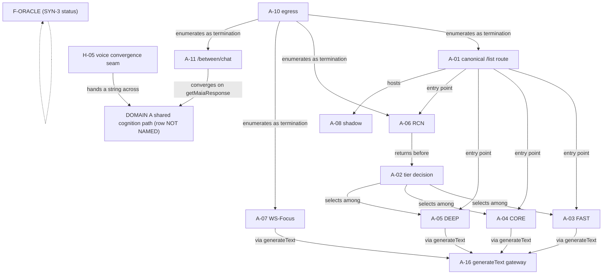

# P1-04 · MAP 1 — ORGANISM / PARTICIPATION TOPOLOGY

```text
STEP     PHASE-1-WHOLE-ORGANISM-CENSUS-01 · P1-04 · graph assembly
TYPE     RECORD ONLY — ⛔ no repair · no design · no adjudication · no verdict
INPUT    the three adjudicated ladder slices (04_ladder_A_B_C · 05_ladder_D_E_F · 06_ladder_G_H_I)
         + the three normalized registers (01 · 02 · 03)
BOUND BY P1-04 INSTRUMENT (SYN-1…SYN-4) · P1-03 AMENDMENT 3 (orthogonal axes) ·
         P1-04 AMENDMENT 4 (INF-7) · INF-1…INF-6 as the slices carry them
ROWS     221 — A 17 · B 31 · C 14 · D 46 · E 29 · F 36 · G 18 · H 18 · I 12
```

> ⭐⭐ **The graph represents the evidence density of the organism, not the coherence we wish the
> organism had.**

> ⛔ NO SOURCE CODE, GOVERNING DOCUMENT, TEST, RUNTIME WITNESS OR P1-02 RECORD WAS READ FOR THIS MAP.
> ⛔ Nothing adjudicated · ⛔ nothing merged · ⛔ nothing back-filled · ⛔ `ABSENT` never written ·
> ⛔ AUTH-EXPOSURE-01 neither cited, awaited nor answered.

---

## 1 · What a node carries · what an edge carries

```text
NODE    row id · named object · PARTICIPATION (as the slice recovered it) · SYN class ·
        COVERAGE (the cognition family the register named, or the register's own words for
        why it named none)
EDGE    source → target · relation · SYN class · the quoted text that establishes it
```

```text
SYN-1  OBSERVED         a quoted sentence in a slice or register establishes it
SYN-2  DERIVED          a relation BETWEEN two quoted observations (INF-7) — ⛔ never a merge of
                        the two axes, ⛔ never a verdict
SYN-3  CONTRADICTION    two records state incompatible things and the slice preserved both
SYN-4  UNKNOWN          the evidence does not establish it
```

⭐ **An edge exists only where a slice's or register's own quoted text establishes the relation.**
⛔ Two well-evidenced endpoints do not license an edge. ⛔ `SYN-4` edges are **omitted** — never
dotted, never *probable*. What was declined is named in §6 so the sparseness is auditable.

⚠️ **AUTHORITY IS NOT ON THIS MAP.** Participation and authority are orthogonal axes (Amendment 3
§2). MAP 1 carries participation and coverage only; the authority axis, `GOVERNED SCOPE`, and the
`EFFECT-WITHOUT-LOCATED-AUTHORIZATION` inventory are MAP 3's, and ⛔ are not previewed here.

---

## 2 · ⭐⭐ THE `PARTICIPATES` LAYER — A VOCABULARY-EVIDENCE GAP, NOT A FINDING

```text
no PARTICIPATES assignment        ≠        DOES NOT PARTICIPATE
```

```text
DOMAIN A   PARTICIPATES  UNKNOWN   SYN-4   ⛔ no P1-02 record used the rung
DOMAIN B   PARTICIPATES  UNKNOWN   SYN-4   ⛔ no P1-02 record used the rung
DOMAIN C   PARTICIPATES  UNKNOWN   SYN-4   ⛔ no P1-02 record used the rung
```

Basis, quoted from slice 04's own counts: *"`PARTICIPATES` 0 — ⭐ NO RECORD IN THIS SLICE USES OR
ESTABLISHES THIS RUNG"*, and its reading: *"**(1) `PARTICIPATES` is empty.** No record in A, B or C
uses that rung or establishes a fact this pass could read as it. ⛔ Recorded as a gap in the corpus,
not as a claim that nothing participates."*

⛔ **This layer is therefore rendered `UNKNOWN`, never as a negative, never as an absence, and never
as an empty layer implying that nothing in A, B or C participates.** Domain A alone carries twelve
rows at `CONTRIBUTES` and ten at `DECIDES`; a system that contributes and decides is not a system
shown not to participate. The gap is in the **vocabulary the records used**, not in the organism.

⚠️ **The same gap extends to D and E, and is stated so it is not read as a result either.** Slice 05
recovered `PARTICIPATES` on exactly two rows (`P3-F-07`, `P3-F-08`), both from one explicit sentence
in one record — *"authentication establishes `PARTICIPATES`, not `HAS AUTHORITY`"* (`F_symbolic.md`
§3.3). ⛔ No D record and no E record uses the rung, so:

```text
DOMAIN D   PARTICIPATES  UNKNOWN   SYN-4   ⛔ no D record used the rung
DOMAIN E   PARTICIPATES  UNKNOWN   SYN-4   ⛔ no E record used the rung
DOMAIN F   PARTICIPATES  2 rows    SYN-1   F-07 · F-08, both from F §3.3
```

⭐ **G · H · I are the only domains where the layer is populated — and it was populated by a reading
rule slice 06 DECLARED rather than inherited**: *"`PARTICIPATES` — the record traces a call path
reaching it, or from it into a reached path"*, adopted because *"The three P1-02 records never use
the ladder vocabulary. A reading rule is therefore unavoidable; ⛔ adopting one silently is what the
`E1/E2/E3/E4` episode cost."*

```text
DOMAIN G   PARTICIPATES  17 of 18  SYN-1   ⛔ not G-09
DOMAIN H   PARTICIPATES  15 of 18  SYN-1   ⛔ not H-13 · H-14 · H-15
DOMAIN I   PARTICIPATES   9 of 12  SYN-1   ⛔ not I-08 · I-09 · I-12
                                           (41 of 48 across the slice)
```

⛔⛔ **The 41 and the 0 are therefore NOT COMPARABLE, and must not be read as a density difference
between the halves of the organism.** One slice declared a reading rule for the rung and applied it;
the others did not have one to apply. ⛔ Do not report this as *"G/H/I participates more."*

---

## 3 · COGNITION-FAMILY NODES — three vocabularies, and ⛔ no record equates them

⭐ **The corpus contains three separate family vocabularies, each declared by the register that uses
it, each warning against exactly the generalization a reader would make.** They are kept apart.

### VOCAB-1 — the thirteen `F-*` labels (register 01, domains A · B · C)

Register 01's own warning, quoted: *"⚠️ The source records issued **no family labels of their own**.
The labels below are restatement handles … ⛔ they are not a new taxonomy and ⛔ they do not assert
that any two are the same mind."*

```text
NODE  F-LIST-FAST            /list · FAST tier                          SYN-1 (register 01 §labels)
      MEMBERS  A-01 (entry point) · A-02 (selects among) · A-03 (is) · A-09 (reached by
               MAIA_RUNTIME_PROMPT) · A-16 (reaches the generateText gateway) · A-17 (the /list lane)
               B-01 B-02 B-03 B-04 B-05 B-06 B-07 B-08 B-10 B-12 B-13 B-14 B-17
      ⚠️ B-02 · B-06 · B-07 are recorded "FAST ONLY", and B-02's exclusion is affirmative:
         "CORE and DEEP do not read meta.memoryContext at all"

NODE  F-LIST-CORE            /list · CORE tier                          SYN-1
      MEMBERS  A-01 · A-02 · A-04 (is) · A-09 · A-16 · A-17 (standing texts) ·
               B-03 B-04 B-05 B-08 B-10 B-12 B-13 B-14 B-17

NODE  F-LIST-DEEP-PRIMARY    /list · DEEP primary stage 1 (no prompt seam) SYN-1
      MEMBERS  A-01 · A-02 · A-05 (is)
      ⭐ Affirmative exclusions quoted at five B rows: "⛔ Not F-LIST-DEEP-PRIMARY" (B-03 B-04
        B-05 B-08 B-13 B-14), and at A-09: "⛔ F-LIST-DEEP-PRIMARY reaches none of them"

NODE  F-LIST-DEEP-CONSULT    /list · DEEP stage 2, Claude (env-gated off) SYN-1
      MEMBERS  A-01 · A-05 (is) · B-03 B-04 B-05 B-08 B-13 B-14
      ⛔ B-10 affirmatively excluded: "NOT named in S-5 (DEEP-consultation)"

NODE  F-LIST-DEEP-REPAIR     /list · DEEP repair                        SYN-1
      MEMBERS  A-01 · A-02 · A-05 (is) · A-09 · A-16 · A-17 · B-03 B-04 B-05 B-08 B-10 B-13 B-14

NODE  F-RCN                  RCN early-return cognition                 SYN-1
      MEMBERS  A-01 (entry point) · A-06 (is) · A-10 (enumerated termination)
      ⭐ "⛔ Not F-RCN (returns before the switch)" — A-02's own affirmative exclusion

NODE  F-WS-FOCUS             Writers-Studio canonical turn              SYN-1
      MEMBERS  A-07 (is) · A-16 · A-17 (canonical floor)
      ⭐ "⛔ not F-WS-FOCUS (bypasses the switch)" — A-02's affirmative exclusion

NODE  F-SHADOW               canonical-turn shadow, non-member-facing   SYN-1
      MEMBERS  A-01 (hosts) · A-08 (is) · A-17 (canonical floor)

NODE  F-BETWEEN              /api/between/chat                          SYN-1
      MEMBERS  A-10 (enumerated termination) · A-11 (is) · E-13 (the BETWEEN path, VOCAB-2)

NODE  F-MAIA-SIBLING         /api/sovereign/app/maia (dormant)          SYN-1
      MEMBERS  A-12 (is).  ⚠️ "Dormant here means unvisited, not closed"

NODE  F-ORACLE               /api/oracle/conversation (410 at POST)     ⭐ SYN-3 AT ITS STATUS
      MEMBERS  A-13 (is) · B-21 (output side) · B-24 ("F-ORACLE ONLY (S-6)") · C-03 (loader 1) ·
               C-04 (:2409)
      SYN-3 BASIS  A: "The 410 is the first executable statement of POST" ·
                   D: traces D-OBJ-9 / D-OBJ-10 through that route to the prompt ·
                   F C-F5: the anchor's "~zero live traffic", which F "expressly does not let
                   settle the question".  ⛔ Not derived across (X-DEF-2).
      ⚠️ ROWS WHOSE STATUS DEPENDS ON THIS NODE  D-09 · D-10 · E-05 · E-10 · E-11 · E-27 · F-24 ·
               B-24 · A-13

NODE  F-VOICE-STREAM         /api/voice/stream-conversation (orphaned)  SYN-1
      MEMBERS  A-14 (is) · A-10 (enumerated termination, "uninvoked") · B-21 (prompt side, :1236) ·
               D-11 ("the VOICE path, not the canonical text path", VOCAB-2)
      ⛔ "CONVERGENCE: NONE — zero references to getMaiaResponse, maiaService, buildMaiaWisePrompt
         or finalizeMemberFacingText"

NODE  F-PERIPHERAL           the 25 peripheral MAIA-claiming routes     SYN-1
      MEMBERS  A-15 (is, as a CLASS) · A-10 (enumerated terminations) · C-08 ("Domain A §A-15 names
               these among F-PERIPHERAL")
      ⛔ INF-5 carried: "the class position is not written onto any individual route; their
         individual statuses are NOT DETERMINED"
```

### VOCAB-2 — register 02's prose paths (domains D · E · F)

⛔ Register 02 names no family labels. It names **paths**, and its recurring undetermined value is
**tier**: *"The recurring gap is **tier coverage**: several canonical-lane rows name FAST/CORE/DEEP
explicitly (P3-D-01, P3-E-02, P3-E-03) while others reach `getMaiaResponse` at a line the record did
not attribute to a tier."*

```text
NODE  "canonical getMaiaResponse lane (/api/sovereign/app/maia/list)"       SYN-1
      TIER NAMED     D-01 (FAST :1534 + CORE :1962) · D-02 (same, via path b) ·
                     E-02 (CORE :1773 + DEEP :2198; "FAST: NOT DETERMINED") ·
                     E-03 (computed FAST/CORE/DEEP, ⭐ "SURFACED on CORE only")
      TIER NOT DETERMINED  D-03 · D-04 · D-05 · D-06 · D-33 · D-34 · E-12 · E-14 · E-15 · E-23 ·
                     E-25 · F-06 · F-14 · F-28 · F-31 · F-02 (via F-06)
      ⛔ "DEEP, oracle, voice, BETWEEN: NOT DETERMINED BY SOURCE RECORD" (D-01)

NODE  "the oracle conversation path"                                       SYN-3 (see F-ORACLE)
      MEMBERS  D-09 · D-10 · F-24
NODE  "the Living Field encounter/refine routes"                           SYN-1
      MEMBERS  E-06 · C-08 (register 01's words: "the living-field encounter and refine route
               prompts") · C-03 (loader 2)
NODE  "the VOICE path (/api/voice/stream-conversation)"                     SYN-1   MEMBER  D-11
NODE  "the BETWEEN path (/api/between/chat)"                                SYN-1   MEMBER  E-13
```

### VOCAB-3 — register 03's three descriptions (domains G · H · I)

Register 03's own warning, quoted: *"⛔ These are descriptions, not a ratified family list, and ⛔ no
row claims the set is complete. Per **INF-5**, a capability on one family is not organism-wide."*

```text
NODE  CONVERSATIONAL TEXT FAMILY   SYN-1
      MEMBERS  G-01 G-02 G-03 G-05 G-06 G-07 G-08 G-10(partly) G-14 (one call site)
      ⛔ G-01: "Does not cover the STRUCTURED-READING FAMILY … and ⛔ does not cover the 60
        direct-SDK files of P3-G-10"
NODE  STRUCTURED-READING FAMILY    SYN-1
      MEMBERS  G-04 (the five named callers) · G-15
      ⛔ G-15: "it does **not** cover getMaiaResponse, voice, or any conversational turn"
NODE  VOICE FAMILY                 SYN-1   (Amendment 1 §1: voice carries its OWN cognition family)
      MEMBERS  H-01 H-02 H-03 H-04 H-06 H-07 H-08 H-09 H-10 H-12
      ⛔ H-05 is the SEAM, not a member: "the seam **between** the VOICE FAMILY and the shared
        cognition path owned by domain A"
NODE  COVERAGE NONE / NOT APPLICABLE (register 03's own value)   SYN-1
      G-09 G-12 G-13 G-16 G-17 G-18 · H-13 H-14 H-15 H-16 H-17 H-18 · I-01…I-09 I-12
      ⚠️ For G's commit/deploy rows and for I-01…I-07 the register writes COVERAGE NOT APPLICABLE
        and slice 06 reads participation against the lane the record traces (commit · deploy ·
        member/practitioner visibility), ⛔ never as a claim about MAIA cognition.
```

---

## 4 · DOMAIN NODES

Format: `row · named object · PART <participation> · SYN · COV <coverage as the register wrote it>`.
⛔ Where a register wrote `NOT DETERMINED BY SOURCE RECORD`, the node says so — it is not filled.

### DOMAIN A — CANONICAL COGNITION / MAIA (17)

⚠️ Carried with every A row by register 01: **`CANONICAL COGNITION BOUNDARY = UNKNOWN`**.

```text
A-01  Canonical member chat turn — POST …/maia/list · PART CONTRIBUTES·DECIDES · SYN-1
      COV entry point F-LIST-FAST/CORE/DEEP-PRIMARY/DEEP-CONSULT/DEEP-REPAIR/F-RCN; hosts F-SHADOW
A-02  Processing-tier decision (chooseProcessingProfile) · PART DECIDES · SYN-1
      COV selects among FAST/CORE/DEEP-PRIMARY/DEEP-REPAIR; ⛔ not F-RCN · ⛔ not F-WS-FOCUS
A-03  FAST prompt assembly (fastPathResponse) · PART CONTRIBUTES · SYN-1 · COV F-LIST-FAST only
A-04  CORE prompt assembly (buildMaiaWisePrompt) · PART CONTRIBUTES · SYN-1
      COV F-LIST-CORE (+ the ADDENDA_SPECS registry it shares with F-LIST-DEEP-REPAIR)
A-05  DEEP — two prompt regimes, one seamless · PART CONTRIBUTES · SYN-1
      COV F-LIST-DEEP-REPAIR · F-LIST-DEEP-PRIMARY · F-LIST-DEEP-CONSULT (three statuses, ⛔ not
      collapsed)
A-06  RCN early-return cognition · PART CONTRIBUTES·DECIDES · SYN-1 · COV F-RCN
A-07  Writers-Studio canonical turn · PART CONTRIBUTES ⛔ explicitly NOT DECIDES · SYN-1
      COV F-WS-FOCUS only — "bypasses the FAST/CORE/DEEP switch entirely"
A-08  CMT-01 canonical-turn shadow · PART KNOWS ⛔ NOT CONTRIBUTES · SYN-1
      COV F-SHADOW; "MEMBER-FACING EFFECT: none — the legacy turn is unaffected by construction"
A-09  MAIA identity / system prompt (96 declaration sites) · PART CONTRIBUTES · SYN-1
      COV the ONE named source reaches FAST + CORE + DEEP-REPAIR; ⚠️ "The other 95 sources have
      independent standing; their family coverage is NOT DETERMINED BY SOURCE RECORD"
A-10  Egress — finalizeMemberFacingText · PART CONTRIBUTES·DECIDES · SYN-1
      COV "The getMaiaResponse family only"; ⭐ "EGRESS IS NOT SINGULAR — SEVERAL, ENUMERATED"
A-11  /api/between/chat live-secondary lane · PART CONTRIBUTES · SYN-1
      COV F-BETWEEN; ⚠️ "Reaches cognition WITHOUT buildMaiaRuntimeContext ever running for it"
A-12  /api/sovereign/app/maia — dormant predecessor · PART EXISTS · SYN-1 · COV F-MAIA-SIBLING
A-13  /api/oracle/conversation — blocked lane · PART EXISTS · SYN-1 · COV F-ORACLE ⚠️ SYN-3 status
A-14  /api/voice/stream-conversation — orphaned · PART EXISTS · SYN-1
      COV F-VOICE-STREAM; ⛔ "CONVERGENCE: NONE"
A-15  25 peripheral MAIA-claiming routes (as a class) · PART CONTRIBUTES · SYN-1
      COV F-PERIPHERAL; ⛔ "CONVERGENCE: NONE with getMaiaResponse"; ⛔ INF-5 on individuals
A-16  Model / provider dispatch — generateText gateway · PART CONTRIBUTES·DECIDES · SYN-1
      COV reached by F-LIST-FAST/CORE/DEEP-REPAIR + F-WS-FOCUS; ⚠️ NOT reached by F-VOICE-STREAM,
      six F-PERIPHERAL routes, F-ORACLE's MultiLLMProvider, or F-LIST-DEEP-PRIMARY
A-17  The eleven runtime governance instruments (as a SET) · PART UNKNOWN — NOT A PARTICIPATION
      QUESTION · SYN-4 · COV the canonical /list lane; ⛔ "A set does not occupy a rung"
```

### DOMAIN B — MEMORY / ANAMNESIS (31)

```text
B-01  TurnsStore + meta.conversationHistory · PART KNOWS·CONSIDERS · SYN-1
      COV recentThreadBlock → F-LIST-FAST; tier reach of meta.conversationHistory NOT DETERMINED
B-02  MemoryBundleService · PART KNOWS·CONSIDERS · SYN-1 · COV ⭐ F-LIST-FAST ONLY (affirmative)
B-03  loadMemberMemoryAtomsForPrompt · PART KNOWS·CONSIDERS · SYN-1
      COV FAST · CORE · DEEP-REPAIR · DEEP-CONSULT; ⛔ not DEEP-PRIMARY
B-04  loadPriorCrossSessionExchanges · PART KNOWS·CONSIDERS · SYN-1 · COV as B-03
B-05  loadRecentMarkedEpisodes · PART KNOWS·CONSIDERS · SYN-1 · COV as B-03
B-06  loadRecentDevelopmentalMemories → buildMemoryInfluencePlan · PART KNOWS·CONSIDERS · SYN-1
      COV F-LIST-FAST ONLY, against an in-comment prevalence of "CORE 72.8% / FAST 27.2%"
B-07  loadRecentThemeSignals · PART KNOWS·CONSIDERS · SYN-1 · COV F-LIST-FAST ONLY (inside B-06's
      block) ⚠️ SYN-3 against C-09 on the same table — see §5 E-31
B-08  is_breakthrough flag on atoms · PART UNKNOWN — AMBIGUOUS · SYN-4
      COV "Rides the atoms addendum" — FAST/CORE/DEEP-REPAIR/DEEP-CONSULT
B-09  MemoryWritebackService · PART DECIDES · SYN-1
      COV NOT APPLICABLE — write-only, no prompt seam; tier NOT DETERMINED
B-10  buildMemberLiveContext ("member web") · PART KNOWS·CONSIDERS · SYN-1
      COV FAST · CORE · DEEP-REPAIR; ⛔ NOT DEEP-CONSULT · ⛔ not DEEP-PRIMARY
B-11  RelationshipAnamnesisPostgres (essence) · PART UNKNOWN — SILENT · SYN-4
      COV NOT DETERMINED BY SOURCE RECORD
B-12  RelationshipMemoryService · PART KNOWS·CONSIDERS · SYN-1 · COV FAST + CORE only
B-13  Relational Context Bridge · PART KNOWS·CONSIDERS · SYN-1 · COV as B-03
B-14  loadRecentIChingReadings · PART KNOWS·CONSIDERS · SYN-1 · COV as B-03
B-15  ConsciousnessMemoryLattice — resonance recall · PART KNOWS ⛔ explicitly NOT CONSIDERS · SYN-1
      COV NOT APPLICABLE for the recall — "SURFACED WHERE: ⛔ NOWHERE"; write half NOT DETERMINED
B-16  spiralStatePersistence · PART UNKNOWN — SILENT · SYN-4 · COV NOT DETERMINED
B-17  Selflet temporal message · PART ⭐ CONSIDERS, ⛔ KNOWS not established · SYN-1
      COV F-LIST-FAST + F-LIST-CORE only
B-18  recordMemoryTransitions · PART UNKNOWN — NOT A PARTICIPATION QUESTION · SYN-4
      COV NOT APPLICABLE — observability; no prompt seam
B-19  ConversationMemoryUsesStore · PART UNKNOWN — NOT A PARTICIPATION QUESTION · SYN-4
      COV NOT APPLICABLE — observability; no prompt seam
B-20  buildMemoryHealth / recordRuntimeTurn · PART UNKNOWN — AMBIGUOUS · SYN-4
      COV NOT APPLICABLE — not a prompt block; "Conditions the §VI fallback"
B-21  memoryCanonGuard · PART CONTRIBUTES (prompt side only) · SYN-1
      COV prompt side "every tier that carries MAIA_RUNTIME_PROMPT" (⛔ which tiers NOT DETERMINED)
      + F-VOICE-STREAM :1236; output side the live list route + F-ORACLE
B-22  MemoryGate.resolveMemoryMode · PART DECIDES · SYN-1 · COV NOT APPLICABLE — a gate
B-23  TurnPosture / contentWritable (Sanctuary) · PART DECIDES · SYN-1
      COV NOT APPLICABLE — a write-boundary gate
B-24  MemoryPalaceOrchestrator + eight services · PART UNKNOWN — RECORDS DISAGREE · SYN-3
      COV "F-ORACLE ONLY (S-6). ⛔ NOT reached from …/maia/list — so no F-LIST-* family"
B-25  recurrenceDetector · PART EXISTS · SYN-1 · COV NOT APPLICABLE — no reachable caller
B-26  confidenceDecay.ts (TS helper) · PART EXISTS · SYN-1
      COV NOT APPLICABLE for the TS helper; ⚠️ the SQL function of near-identical name is A
      DIFFERENT OBJECT (C-11) applied inside B-02 — ⛔ "The two are not merged"
B-27  lib/anamnesis/* (five modules) · PART EXISTS · SYN-1 · COV NOT APPLICABLE — no traced entry
B-28  MemoryManager.ts · VaultSymbolIndex.ts · PART EXISTS · SYN-1 · COV NOT APPLICABLE
B-29  mem0.ts · beads-sync/ · PART EXISTS (beads-sync) · UNKNOWN — AMBIGUOUS (mem0) · SYN-1/SYN-4
      COV NOT DETERMINED for mem0 · NOT APPLICABLE for beads-sync
B-30  memory_contracts (table) · PART UNKNOWN — NOT A PARTICIPATION QUESTION · SYN-4 · COV N/A
B-31  five declared tables · PART UNKNOWN — NOT A PARTICIPATION QUESTION · SYN-4 · COV N/A
```

### DOMAIN C — DEVELOPMENTAL + RELATIONAL MEMORY (14)

```text
C-01  developmental_readings (WS2-07) · PART KNOWS · SYN-1
      COV NOT DETERMINED — "⛔ no MAIA-cognition prompt seam traced"
C-02  developmental_observation_standing_events · PART KNOWS · SYN-1 · COV as C-01
C-03  member_spiral_state (Bridge D) · PART KNOWS·CONSIDERS · SYN-1
      COV ⚠️ THREE INDEPENDENT LOADERS — F-ORACLE (guarded) · the living-field encounter/refine
      prompt · MemberLiveContext (tier reach NOT DETERMINED; "domain B carries the member web as
      P3-B-10")
C-04  member_relationships + entries + field_state · PART KNOWS·CONSIDERS · SYN-1
      COV the live list-route prompt (:916) + F-ORACLE (:2409); tier NOT DETERMINED ("domain B
      carries the relational-context addendum as P3-B-13")
C-05  member_relational_signals · PART KNOWS ⛔ NOT CONSIDERS (traced negative) · SYN-1
      COV NOT APPLICABLE for MAIA cognition — TRACED NEGATIVE FINDING
C-06  member_patterns · PART KNOWS·DECIDES · SYN-1 · COV NOT DETERMINED — practitioner + member APIs
C-07  pattern_ledger · PART KNOWS · SYN-1 · COV NOT DETERMINED — member-facing patterns endpoint
C-08  living_field_affinities · PART KNOWS·CONSIDERS·DECIDES · SYN-1
      COV the living-field encounter + refine route prompts; "Domain A §A-15 names these among
      F-PERIPHERAL"; ⛔ no F-LIST-* tier family traced; ⛔ NOT member-to-member
C-09  member_theme_signals · PART UNKNOWN — RECORDS DISAGREE · SYN-3
      COV NOT DETERMINED BY THIS SOURCE RECORD (write path only) ⚠️ against B-07
C-10  episodic_memories · PART KNOWS · SYN-1
      COV NOT DETERMINED — retrieval/decay "noted and not re-censused"; B-05 carries it
C-11  Confidence decay — TS + SQL pair · PART UNKNOWN — AMBIGUOUS · SYN-4
      COV NOT DETERMINED; ⚠️ the SQL function is applied inside B-02 (F-LIST-FAST only)
C-12  trust_observations · PART EXISTS · SYN-1 · COV NOT APPLICABLE — no callers
C-13  lib/relationship/scope.ts · PART EXISTS · SYN-1 · COV NOT APPLICABLE — zero non-test callers
C-14  lib/coachField/practitionerProjection.ts · PART EXISTS · SYN-1 · COV NOT APPLICABLE
```

### DOMAIN D — FIELD INTELLIGENCE (46)

```text
D-01  D-OBJ-1 FieldContext seam · PART CONTRIBUTES (explicit) · SYN-1 · COV canonical lane FAST+CORE
D-02  D-OBJ-2 PFI mind state · PART CONTRIBUTES (criterion, path b only) · SYN-1 · COV as D-01 via (b)
D-03  D-OBJ-3 ResonanceFieldGenerator · PART CONTRIBUTES · SYN-1 · COV inside D-01 where depth ≥ 3
D-04  D-OBJ-4 UnifiedElementalFieldCalculator · PART CONTRIBUTES · SYN-1 · COV inside D-01, depth ≥ 4
D-05  D-OBJ-5 routePanconsciousField · PART UNKNOWN — AMBIGUOUS · SYN-4 · COV canonical lane, tier ND
D-06  D-OBJ-6 enforceFieldSafety · PART DECIDES (explicit) · SYN-1 · COV canonical lane, tier ND
D-07  D-OBJ-7 analyzeFieldIntelligence · PART UNKNOWN — RECORDS DISAGREE (X-DEF-1) · SYN-3
      COV canonical lane Talk-Mode assembly; ⚠️ E records the same block as never appended
D-08  D-OBJ-8 field orchestrator telemetry · PART UNKNOWN — SILENT · SYN-4
      COV write on canonical FAST+CORE; read surface admin only, ⛔ not member-facing
D-09  D-OBJ-9 vault-backed field context adapter · PART UNKNOWN — RECORDS DISAGREE (X-DEF-2) · SYN-3
D-10  D-OBJ-10 coherenceFieldService · PART UNKNOWN — RECORDS DISAGREE ×2 · SYN-3
D-11  D-OBJ-11 fireAndForgetFieldMonitor · PART UNKNOWN — SILENT · SYN-4 · COV the VOICE path
D-12…D-28 (excl. D-14 · D-27) — the dormant/orphaned field cluster · PART EXISTS · SYN-1
      COV NOT APPLICABLE — "no reachable entry point on any MAIA-claiming cognition family"
      D-12 D-13 D-15 D-16 D-17 D-18 D-19 D-20 D-21 D-22 D-23 D-24 D-25 D-26 D-28
D-14  D-OBJ-14 MAIAFieldInterface · PART UNKNOWN — AMBIGUOUS · SYN-4 · COV NOT DETERMINED
D-27  D-OBJ-27 FieldRecordsService/Repo · PART UNKNOWN — AMBIGUOUS (two statuses) · SYN-4
D-29  "Fields" workspace · PART UNKNOWN — NOT A PARTICIPATION QUESTION · SYN-4 · COV N/A
D-30  "Living Field" · PART UNKNOWN — SILENT · SYN-4 · COV N/A as a field-intelligence quantity
D-31  "Field Lab" · PART UNKNOWN — SILENT · SYN-4 · COV N/A — member surface, displays no field value
D-32  /field/* · PART UNKNOWN — NOT A PARTICIPATION QUESTION (naming collision) · SYN-4
D-33  "Practice Field" · PART UNKNOWN — record expressly defers · SYN-4
      COV an addendum read at maiaService.ts:1367 on the canonical lane; scope + tiers NOT DETERMINED
D-34  "Wisdom Field" + WISDOM_FIELD_MOVES · PART UNKNOWN · SYN-4
      COV canonical-lane Talk-Mode assembly "via D-OBJ-7's selection of a move" ⚠️ inside X-DEF-1
D-35  Field Coherence Index dashboard · PART UNKNOWN — SILENT · SYN-4 · COV N/A — lab-gated
D-36  /labtools/coherence · PART UNKNOWN — SILENT · SYN-4 · COV N/A — lab-gated
D-37  rhythmCoherence overlay · PART UNKNOWN — record expressly withholds · SYN-4
      COV NOT APPLICABLE — a member-surface UI overlay, not a cognition-family capability
D-38  /labtools/relational-field · PART UNKNOWN — SILENT · SYN-4 · COV N/A — lab-gated
D-39  /api/maia/field · PART EXISTS · SYN-1 · COV NOT APPLICABLE — no in-repo caller
D-40  ResonanceEngine + hysteresis · PART UNKNOWN (status word withheld) · SYN-4 · COV NOT DETERMINED
D-41  RFI · D-42 UFI · D-43 FIS Primitive · D-44 COLLECTIVE_FIELD_SERVICE_URL · D-45 maia-mcp
      PART UNKNOWN — NOT A PARTICIPATION QUESTION (no code object / artifact absent) · SYN-4
D-46  table field_state_snapshots · PART EXISTS · SYN-1 · COV NOT APPLICABLE
```

### DOMAIN E — SPIRALOGIC / ELEMENTAL (29)

⚠️ Carried from slice 05: **E assigns no ladder position anywhere**; every E position is
criterion-based or an `EXISTS` drawn from E's own explicit non-participation determination.

```text
E-01  SPIRALOGIC_REFERENCE constant · PART EXISTS · SYN-1 · COV NOT APPLICABLE — never surfaced
E-02  ConversationElementalTracker → context.summary → system prompt · PART CONTRIBUTES · SYN-1
      COV canonical lane CORE (:1773) + DEEP (:2198), every turn; FAST NOT DETERMINED
E-03  ElementalOracleBridge → [Field Intelligence] · PART CONTRIBUTES · SYN-1
      COV computed FAST/CORE/DEEP; ⭐ SURFACED on CORE only
E-04  Talk-mode fieldAwareness block · PART UNKNOWN — RECORDS DISAGREE (X-DEF-1) · SYN-3
      COV canonical lane Talk Mode; ⛔ E records zero prompt coverage
E-05  member_spiral_state substrate + upsertSpiralState · PART UNKNOWN (split row, half disputed) ·
      SYN-3 · COV N/A for the write path; read coverage carried by E-06…E-09
E-06  reader 1 — Living Field encounter/refine context · PART CONTRIBUTES · SYN-1
      COV the Living Field encounter/refine routes; ⛔ NOT the canonical getMaiaResponse lane
E-07  reader 2 — MemberLiveContext.spiralState · PART EXISTS · SYN-1
      COV loaded, ⛔ zero prompt coverage — "loaded, not rendered"
E-08  reader 3 — GET /api/members/spiral-state · PART UNKNOWN · SYN-4 · COV N/A — a disclosure route
E-09  reader 4 — research metric aggregates · PART UNKNOWN — SILENT · SYN-4 · COV N/A
E-10  admitPersistedStateForShaping (R16) · PART UNKNOWN — RECORDS DISAGREE (X-DEF-2) · SYN-3
      COV response-shaping subsystems only
E-11  lib/voice/conductor.ts hysteresis · PART UNKNOWN (rests on the disputed 410) · SYN-3
E-12  Corpus Callosum trace · PART EXISTS · SYN-1
      COV reached from getMaiaResponse on all tiers; ⛔ zero read-back — "NOT participating in
      cognition"
E-13  second Corpus Callosum lane (maiaOrchestrator) · PART UNKNOWN — SILENT · SYN-4
      COV the BETWEEN path only
E-14  canonical route's own logAgentRun · PART UNKNOWN — SILENT · SYN-4
      COV canonical /list lane; ⛔ carries no elemental content
E-15  VoiceDistinctionScorer · PART EXISTS · SYN-1 · COV canonical lane after the answer exists;
      ⛔ zero influence by its own declaration
E-16  FRAMEWORK_REGISTRY + chooseFrameworksForCell · PART EXISTS · SYN-1
      COV NOT APPLICABLE — "no applied modality can ever be selected"; ⚠️ inertness is not a ruling
      that it is safe
E-17  spiralConstellationService · PART UNKNOWN (runtime outcome unknown) · SYN-4
E-18  CrossSpiralPatternRecognizer + TriadicPhaseDetector · PART EXISTS · SYN-1 · COV N/A
E-19  PhaseDetector / SpiralogicPhase · PART UNKNOWN (canonical-lane absence only) · SYN-4
E-20  lib/spiralogic/ zero-importer mass (~110 KB) · PART EXISTS · SYN-1 · COV N/A
E-21  spiralogic-engine.ts + core/spiralProcess.ts · PART UNKNOWN — SILENT · SYN-4
E-22  lib/elemental-agents/{fire,water,earth,air,aether} · PART EXISTS · SYN-1 · COV N/A
E-23  lib/elemental-alchemy/ practices · PART UNKNOWN (import traced, surfacing not stated) · SYN-4
      COV canonical lane import at maiaService.ts:113; tier + surfacing NOT DETERMINED
E-24  lib/aether-facets.ts + blueprint-integration · PART EXISTS · SYN-1 · COV N/A
E-25  bead_events.spiralogic_element → getConsciousnessPolicy · PART UNKNOWN — AMBIGUOUS · SYN-4
      COV canonical lane, 30-day aggregate "carried into awareness-level guidance"; tier ND
E-26  Prisma ElementalState / ElementalEvolution · PART UNKNOWN (record declines) · SYN-4
E-27  member_spiral_state.facet_id / facet_movement · PART UNKNOWN (depends on X-DEF-2) · SYN-3
E-28  the S-16 12-phase document vocabulary · PART UNKNOWN — NOT A PARTICIPATION QUESTION · SYN-4
E-29  lib/spiralogic/registration/ · PART UNKNOWN · SYN-4 · COV NOT DETERMINED
      ⭐ Amendment 3 §2's third coherent state sits here (participation UNKNOWN beside a located
      governing source) — the authority half is MAP 3's, ⛔ not read onto this axis
```

### DOMAIN F — SYMBOLIC SYSTEMS (36)

⛔ `KNOW` / `SAY` / `CONCLUDE` are **not** ladder positions (Amendment 3 §3). Where F established
only an F-power, participation is `UNKNOWN` and the F-power stays in slice 05's F-POWER section.

```text
F-01  lib/iching/ · PART UNKNOWN — F-POWER ONLY · SYN-4 · COV N/A — consumed by F-07/F-08
F-02  lib/divination/iching/ · PART UNKNOWN — F-POWER ONLY · SYN-4
      COV reaches the canonical /list lane ONLY through F-06's copy-at-write-time
F-03  lib/divination/tarot/ · PART UNKNOWN — F-POWER ONLY · SYN-4 · COV N/A — reached from F-11
F-04  lib/divination/runes/ · PART UNKNOWN — F-POWER ONLY · SYN-4 · COV N/A — reached from F-12
F-05  divination/core/oracle-engine.ts · PART UNKNOWN — SILENT · SYN-4 · COV NOT DETERMINED
F-06  divinationRecallLoader · PART CONTRIBUTES · SYN-1
      COV canonical getMaiaResponse lane (…/maia/list:1103); other families NOT DETERMINED
      ⚠️ INF-1 held: "a complete path is traced, and the witness says the block produced nothing"
F-07  POST /api/changes/[id]/interpret · PART ⭐ PARTICIPATES (explicit) · SYN-1
      COV NOT APPLICABLE — a member-authenticated NON-TURN route, not a cognition family
F-08  POST /api/studio/changes/[id]/interpret · PART PARTICIPATES (explicit) · SYN-1 · COV N/A
F-09  studio changes mentor (+ /chat) · PART UNKNOWN — F-POWER ONLY · SYN-4
      COV N/A — "non-turn route on the same substrate as P3-F-07/08"
F-10  app/api/oracle/iching · PART UNKNOWN — SILENT · SYN-4
      COV N/A — non-turn; "its written readings are what P3-F-06 later recalls"
F-11  POST /api/oracle/tarot — UNAUTHENTICATED · PART UNKNOWN — F-POWER ONLY · SYN-4 · COV N/A
F-12  POST /api/oracle/runes — UNAUTHENTICATED · PART UNKNOWN (⚠️ F's two lists disagree) · SYN-3
F-13  iching cast/search/hexagram routes · PART UNKNOWN — SILENT · SYN-4 · COV N/A — non-turn
F-14  maiaAstrologyContextService in the live member turn · PART CONTRIBUTES · SYN-1
      COV ⭐ the canonical lane (…/maia/list:695 → :1419), ~3,250 chars per turn; tiers NOT DETERMINED
F-15  lib/astrology/ · PART UNKNOWN (SAY/CONCLUDE is a property of each consumer) · SYN-4
      COV reaches the canonical lane only through F-14
F-16  archetypalNarrativeService · PART UNKNOWN — F-POWER ONLY · SYN-4 · COV N/A — non-turn route
F-17  archetypeVoices / archetypeLibrary · PART UNKNOWN — SILENT · SYN-4 · COV NOT DETERMINED
F-18  MayaArchetypes + ArchetypeResponseModifier · PART EXISTS · SYN-1 · COV N/A — no importer
F-19  archetypeEvolutionEngine · PART EXISTS · SYN-1 · COV N/A — called by nothing
F-20  lib/symbolic/ (12 files) · PART EXISTS · SYN-1 · COV N/A — no production importer
F-21  lib/stellium/ · PART UNKNOWN — flagged as a POSSIBLE second symbolic entry, ⛔ NOT traced ·
      SYN-4 · COV NOT DETERMINED
F-22  holoflower/facets-interpretation · PART EXISTS · SYN-1 · COV N/A
F-23  lib/knowledge/ (24 loaders) · PART EXISTS · SYN-1 · COV N/A — consumer unreached from app/
F-24  lib/wisdom/sacredTexts/ + SacredEncounterService · PART DECIDES · SYN-1
      COV the oracle conversation path + a rendered component ⚠️ X-DEF-2 bears on the same route
F-25  lib/wisdom/ · PART UNKNOWN — SILENT · SYN-4 · COV NOT DETERMINED
F-26  lib/library/ · PART UNKNOWN — SILENT · SYN-4 · COV NOT DETERMINED
F-27  chineseAstrology / daYun / vedic / BaZi · PART UNKNOWN — SILENT · SYN-4 · COV NOT DETERMINED
F-28  mayanAstrology · PART CONTRIBUTES · SYN-1 · COV canonical lane, INSIDE F-14's addendum
F-29  lib/soulPortrait/generator/ · PART UNKNOWN — F-POWER ONLY · SYN-4 · COV ND — no turn path traced
F-30  wuxing-enhanced-casting · PART UNKNOWN — SILENT · SYN-4
      COV NOT DETERMINED; ":186 persistReading is one of the writers behind the readings F-06 recalls"
F-31  SYMBOLIC_LENS_BOUNDARY (the wrapper itself) · PART CONTRIBUTES · SYN-1
      COV ⭐ two call sites on the canonical /list lane; ⛔ "does not reach the I Ching or Tarot that
      Invariant 13 names, nor archetypes or cycles" — declared scope exceeds its wiring
F-32  safe_for_retrieval · PART UNKNOWN — NOT A PARTICIPATION QUESTION (no code object) · SYN-4
F-33  facetToHexagram seed map · PART UNKNOWN — NOT A PARTICIPATION QUESTION · SYN-4
F-34  Invariant 13 Tier-2 refusal · PART UNKNOWN — NOT A PARTICIPATION QUESTION · SYN-4
F-35  "Symbolic Guidance Layer Doctrine" · PART UNKNOWN — artifact not located · SYN-4
F-36  nigredo / albedo / rubedo vocabulary · PART UNKNOWN — record expressly declined · SYN-4
```

### DOMAIN G — MODEL / PROVIDER / ORCHESTRATION (18)

⭐ Every G · H · I row carries `EXISTS` on a **slice-level** basis (see MAP 2 §3). Below, `EXISTS`
is therefore not repeated per row; the rungs shown are those above it.

```text
G-01  generateText — the declared "main gateway for ALL text generation" · PART PARTICIPATES·DECIDES
      SYN-1 · COV CONVERSATIONAL TEXT FAMILY; ⛔ not STRUCTURED-READING; ⛔ not the 60 direct-SDK files
G-02  generateTextWithSovereignty / DEGRADED_TEXT · PART PARTICIPATES·CONTRIBUTES·DECIDES · SYN-1
      COV CONVERSATIONAL TEXT FAMILY only; VOICE FAMILY coverage NOT DETERMINED
      ⛔ PERSISTENCE UNKNOWN — "the emitting seam makes a persistence claim it does not discharge"
G-03  generateWithClaude / selectClaudeModel · PART PARTICIPATES·KNOWS·DECIDES · SYN-1
      ⛔⛔ CONSIDERS EXPLICITLY NOT ASSIGNED — see MAP 2 §5
G-04  runStructured + EXTERNAL_AUTHORIZED — REFUSING · PART PARTICIPATES·DECIDES · SYN-1
      COV STRUCTURED-READING FAMILY only — the five named callers; ⛔ explicitly not conversational
G-05  isLocalHealthy / callLocalInference · PART PARTICIPATES · SYN-1 · ⛔ DECIDES UNKNOWN
G-06  localModelClient (Ollama / template-engine) · PART PARTICIPATES·CONTRIBUTES · SYN-1
      ⭐ "a fourth answer-producing path that is not a model at all"
G-07  kimiClient + its two triggers · PART PARTICIPATES · SYN-1 · ⛔ DECIDES NOT ASSIGNED
G-08  generateWithMultipleEngines · PART PARTICIPATES·CONTRIBUTES · SYN-1 · ⛔ DECIDES UNKNOWN
G-09  MODEL_REGISTRY / minimumBloomLevel · PART EXISTS only · SYN-1
      COV NONE — no importer; ⭐⭐ "a declared gate that decides nothing is EXISTS and nothing above it"
G-10  anthropic-import-allowlist.json + its 60 files · PART PARTICIPATES·DECIDES · SYN-1
      COV 57 grandfathered surfaces incl. 7 member-facing handlers; ⛔ which families NOT DETERMINED
G-11  the OpenAI SDK surface (30 files) · PART PARTICIPATES · SYN-1 · ⛔ DECIDES UNKNOWN
      COV NOT DETERMINED — the record enumerates files, not families
G-12  check-provider-governance.ts + provider-policy.json · PART PARTICIPATES·DECIDES (commit/CI lane)
      SYN-1 · COV NOT APPLICABLE — "BUILD-TIME, NOT RUNTIME … no effect on a running container"
G-13  check-no-direct-anthropic.ts · PART PARTICIPATES·DECIDES (commit lane) · SYN-1 · COV N/A
G-14  emitDriftEvent / DriftEventType · PART PARTICIPATES·CONTRIBUTES (operator/practitioner) · SYN-1
      ⛔⛔ CONTRIBUTES-TO-MEMBER EXPLICITLY NOT ASSIGNED — "Nothing in this path reaches a member surface"
G-15  ReaderProvenance / readerIdentity · PART PARTICIPATES·KNOWS·CONTRIBUTES (stored record) · SYN-1
      COV STRUCTURED-READING FAMILY only
G-16  deploy-lock.sh / acquire_deploy_lock() · PART PARTICIPATES·DECIDES (deploy lane) · SYN-1 · COV N/A
G-17  Dockerfile deploy-lane tripwire + materialize/verify · PART PARTICIPATES·DECIDES (deploy) · SYN-1
G-18  run_migrations_or_abort / cmd_migrate · PART PARTICIPATES·DECIDES (deploy lane) · SYN-1
      ⭐ "It applies whatever migration files are present, in bulk"
```

### DOMAIN H — SENSORY / VOICE (18)

```text
H-01  selectVoiceTransport(facts) · PART PARTICIPATES·KNOWS·DECIDES · SYN-1 · COV VOICE FAMILY only
      ⚠️ "CONSUMED … (LOGGED, not dispatched on)" — carried verbatim, ⛔ not reconciled
H-02  transcribe-simple / transcribe routes · PART PARTICIPATES·CONTRIBUTES·DECIDES · SYN-1
      COV VOICE FAMILY only (ear side, two of four transports)
H-03  webkitSpeechRecognition + Capacitor speech · PART PARTICIPATES·CONTRIBUTES·DECIDES · SYN-1
      COV VOICE FAMILY only — ⭐ "the **default** ear for ordinary Chrome and Safari members"
H-04  handleVoiceTranscript guard set N1–N12 · PART PARTICIPATES·KNOWS·CONTRIBUTES·DECIDES · SYN-1
      COV VOICE FAMILY only; ⛔ "the typed path does not pass them"
H-05  await handleTextMessage(cleanedText) — the sole canonical cognition call · PART PARTICIPATES·
      CONTRIBUTES · SYN-1 · ⛔ DECIDES NOT ASSIGNED
      COV ⭐ THE SEAM between the VOICE FAMILY and the shared cognition path owned by domain A
H-06  commitOracleTurn(reason) · PART PARTICIPATES·CONTRIBUTES·DECIDES · SYN-1
      COV VOICE FAMILY **and** the chat path in the same canonical response block
H-07  maiaSpeak / openai-tts / ttsRouter / cloudVoicePolicy / voiceArchetypes
      PART PARTICIPATES·KNOWS·CONTRIBUTES·DECIDES · SYN-1 · COV VOICE FAMILY only (mouth side)
H-08  lastSendWasVoiceRef + restartAuthority · PART PARTICIPATES·KNOWS·DECIDES · SYN-1 · COV VOICE only
H-09  the eleven Class C `await maiaSpeak(` sites · PART PARTICIPATES·CONTRIBUTES · SYN-1
      COV VOICE FAMILY, "voice-local utterance authority rather than model cognition"; ⛔ NO MODEL
      IN THE PATH; ⭐ they "bypass canonical egress finalization entirely"
H-10  the four saveConversationMemory call sites · PART PARTICIPATES·CONTRIBUTES (stored record) · SYN-1
      COV VOICE FAMILY **and** the typed path alike — "MODALITY-SYMMETRIC"
H-11  sendStreamingMessage / useStreamingVoice · PART PARTICIPATES · SYN-1
      COV ⭐ "a **second cognition family** carrying its own Claude service — ⛔ unreachable from the
      voice handler at the subject"; its coverage of any current MAIA-claiming path NOT DETERMINED
H-12  X1…X6 pre-cognition / failure paths · PART PARTICIPATES·CONTRIBUTES (member-facing) · SYN-1
      COV VOICE FAMILY and the typed path; ⛔ "no model authored X1–X3's words"
H-13  BetaMinimalMirror handleTranscript · PART EXISTS only · SYN-1 · COV NONE — no mount found
H-14  app/oracle/page.broken.tsx · PART EXISTS only · SYN-1 · COV NONE — not a Next route
H-15  MaiaRealtimeWebRTC / RealtimeSpiralogicBraid / RealtimeVoiceService (.DISABLED)
      PART EXISTS only · SYN-1 · COV NONE at the subject
      ⚠️ "lib/voice/ holds 119 entries … Reachability of the remainder was not traced" — UNKNOWN
H-16  VoiceWithNotes · PART PARTICIPATES·CONTRIBUTES (stored record) · SYN-1
      COV NONE — "Never reaches cognition — a capture surface, not a conversation"
H-17  MorningDreamCaptureInterface onTranscript · PART PARTICIPATES · SYN-1 · COV NONE — fills a field
H-18  labtools scribe onTranscript · PART PARTICIPATES · SYN-1 · COV NONE — separate surface
```

### DOMAIN I — MEMBER / PRACTITIONER (12)

⚠️ Register 03 records `COVERAGE: NOT APPLICABLE — no MAIA cognition on this path` for I-01…I-07.
Their positions are read against the **member/practitioner visibility path**, ⛔ never as claims
about MAIA's cognition. Only **I-10** and **I-11** reach a MAIA prompt, and for both the register
records that *which* MAIA-claiming family consumes them is `NOT DETERMINED BY SOURCE RECORD`.

```text
I-01  /studio/fields/<memberId> + can_be_shown_to_practitioner
      PART PARTICIPATES·KNOWS·CONTRIBUTES·DECIDES · SYN-1 · COV N/A — no MAIA cognition
I-02  /api/supervision/sessions + transcript/list (+9 siblings) · PART PARTICIPATES·KNOWS·CONTRIBUTES
      SYN-1 · ⛔ DECIDES NOT ASSIGNED — "nothing can fail closed on identity, because identity is
      never established"; ⚠️ "the remaining seven were not individually read"
I-03  /api/caseload/* (9 routes) · PART PARTICIPATES·KNOWS·CONTRIBUTES·DECIDES · SYN-1 · COV N/A
I-04  POST /api/practitioners/create · PART PARTICIPATES·CONTRIBUTES (stored record)·DECIDES · SYN-1
I-05  practitioner/clients/[clientId]/{messages,digest,prep,emergency,policy,spiralogic-report}
      PART PARTICIPATES·KNOWS·CONTRIBUTES·DECIDES · SYN-1 · COV N/A
I-06  app/api/studio/** (≈76 routes) · PART PARTICIPATES·KNOWS·CONTRIBUTES·DECIDES · SYN-1
      ⚠️ "most of the ≈76 Studio routes were classified by their shared authorization import rather
      than read individually"
I-07  the eight derived-visibility channels D-1…D-8 · PART PARTICIPATES·KNOWS·CONTRIBUTES·DECIDES
      SYN-1 · COV N/A for D-1…D-6 and D-8; D-7 concerns the cognition served by …/maia/list — "the
      record names the **route**, ⛔ not a family"
I-08  lib/relationship/scope.ts · PART EXISTS only · SYN-1
      COV NONE — ⭐⭐ "all notional; it governs no live read"
I-09  lib/coachField/{identity,practitionerProjection,bringForward,invitation} · PART EXISTS only
      SYN-1 · COV NONE — ⭐⭐ "The member gesture the coach-field model is built around has no surface"
I-10  member_memory_atoms.source_type='practitioner_observation' · PART PARTICIPATES (read side)·
      CONTRIBUTES (MAIA prompt)·DECIDES · SYN-1
      COV projected into a MAIA prompt section; ⛔ which family consumes it NOT DETERMINED
      ⛔ CRITICAL LIMIT: "NO WRITER WAS LOCATED" — whether any row exists to traverse it is UNKNOWN
I-11  relationship_spaces · PART PARTICIPATES·KNOWS·CONTRIBUTES (MAIA prompt)·DECIDES · SYN-1
      COV the cognition served by …/maia/list — the route is named, ⛔ not a family
I-12  app/api/_backend/** · PART EXISTS only · SYN-1 · COV NONE — not routable by the App Router
      ⚠️ "whether any deployment does so is UNKNOWN"
```

---

## 5 · EDGE LIST — ⭐ every edge carries its SYN class and the text that establishes it

```text
#    SOURCE → TARGET                     RELATION                SYN    BASIS (quoted)
E-01 A-01 → F-LIST-FAST/CORE/DEEP-PRIMARY/DEEP-CONSULT/DEEP-REPAIR/F-RCN  ENTRY POINT FOR  SYN-1
     "Entry point for F-LIST-FAST · F-LIST-CORE · F-LIST-DEEP-PRIMARY · F-LIST-DEEP-CONSULT ·
      F-LIST-DEEP-REPAIR · F-RCN" (register 01, P3-A-01 COVERAGE)
E-02 A-01 → F-SHADOW                     HOSTS                   SYN-1  "; also hosts F-SHADOW"
E-03 A-02 → A-03 · A-04 · A-05           SELECTS AMONG           SYN-1
     "Selects among F-LIST-FAST · F-LIST-CORE · F-LIST-DEEP-PRIMARY · F-LIST-DEEP-REPAIR"
E-04 A-06 → A-02                         RETURNS BEFORE          SYN-1
     "if used && confidence >= 0.7 && completedNormally → … **returns before the tier switch** (:3241)"
E-05 A-09 → A-03 · A-04 · A-05(repair)   REACHES                 SYN-1
     "MAIA_RUNTIME_PROMPT.ts reaches FAST via maiaService.ts:1070 and CORE/DEEP-repair via
      maiaVoice.ts:585. DEEP-primary stage 1 reaches **none of them**."
E-06 A-10 → the getMaiaResponse family   GOVERNS                 SYN-1
     "finalizeMemberFacingText governs only the getMaiaResponse family"
E-07 A-10 → A-01 · A-06 · A-07 · A-11 · A-14 · A-15   ENUMERATES AS MEMBER-FACING TERMINATION  SYN-1
     "⭐ EGRESS IS NOT SINGULAR — enumerated member-facing terminations producing MAIA-claiming
      text: list/route.ts:1966 · maiaService.ts:3241 (F-RCN) · between/chat :776 · writers-studio/
      focus · the 25 routes of F-PERIPHERAL · voice/stream-conversation SSE (uninvoked)"
E-08 A-11 → the getMaiaResponse convergence   CONVERGES ON       SYN-1
     "→ lib/consciousness/maiaOrchestrator.ts:251 → **converges on getMaiaResponse** at :506"
E-09 A-03 · A-04 · A-05 · A-07 → A-16    REACHES THE GATEWAY     SYN-1
     "Reached by F-LIST-FAST · F-LIST-CORE · F-LIST-DEEP-REPAIR · F-WS-FOCUS (via generateText)"
E-10 B-22 → B-02                         GATES WHETHER IT RUNS   SYN-1
     "MemoryGate.resolveMemoryMode gates whether it runs, not what it selects"
E-11 B-23 → B-09 · B-02                  REFUSES / SKIPS         SYN-1
     "MemoryWritebackService is skipped (route :1697); MemoryBundle is skipped (:541)"
E-12 B-08 → B-03                         RIDES                   SYN-1
     "Rides the atoms addendum — F-LIST-FAST · F-LIST-CORE · F-LIST-DEEP-REPAIR · F-LIST-DEEP-CONSULT"
     ⛔ Slice 04: "No position written from 'it rides the atoms addendum'" — the edge is a carriage
     relation, ⛔ not a participation position for B-08.
E-13 B-07 → B-06                         INSIDE ITS BLOCK        SYN-1
     "F-LIST-FAST ONLY (inside B-06's block)"
E-14 B-06 → B-07                         LOADS IN PARALLEL WITH  SYN-1
     "route :945-948 — loadRecentDevelopmentalMemories(userId, 3) and loadRecentThemeSignals(userId,
      10), in parallel"
E-15 C-03 → B-10                         NAMED CROSS-REFERENCE   SYN-1
     "MemberLiveContext (loader 3 … domain B carries the member web as P3-B-10)"
E-16 C-04 → B-13                         NAMED CROSS-REFERENCE   SYN-1
     "domain B carries the relational-context addendum as P3-B-13"
E-17 C-10 → B-05                         DEFERS RETRIEVAL TO     SYN-1
     "explicitly defers retrieval/decay to domain B ('noted and not re-censused'), where P3-B-05
      carries it"
E-18 C-11(SQL half) → B-02               APPLIED INSIDE          SYN-1
     "The SQL function is applied inside P3-B-02 (F-LIST-FAST only)"
E-19 C-03 → F-ORACLE                     LOADER 1, GUARDED BY E-10-of-domain-E   SYN-1
     "F-ORACLE (loader 1, guarded by admitPersistedStateForShaping)"   [the guard is row E-10]
E-20 E-10 → C-03(loader 1)               GUARDS                  SYN-1   same sentence as E-19
E-21 C-08 → F-PERIPHERAL                 IS NAMED AMONG          SYN-1
     "Domain A §A-15 names these among F-PERIPHERAL"
E-22 D-02 → D-01                         ENTERS ITS FieldContext SYN-1
     "Into D-OBJ-1's FieldContext.pfi { element, coherence, fieldWorkSafe, realm,
      deepWorkRecommended } → prompt"
E-23 D-03 → D-01                         ENTERS ITS FieldContext SYN-1
     "FieldContext.resonance → '[Field Intelligence]' prompt JSON"; "inside D-OBJ-1 where depth ≥ 3"
E-24 D-04 → D-01                         ENTERS ITS FieldContext SYN-1
     "FieldContext.unified → prompt JSON (D-OBJ-1:44-49)"; "inside D-OBJ-1 where depth ≥ 4"
E-25 D-34 → D-07                         CONSUMED INSIDE         SYN-1
     "canonical lane Talk Mode assembly (maiaService.ts:1083,1091), via D-OBJ-7's selection of a move"
     ⚠️ Both endpoints are UNKNOWN on the participation axis (X-DEF-1). The edge is a containment
     relation the register states; ⛔ it transmits no position.
E-26 E-05 → E-06 · E-07 · E-08 · E-09    READ BY                 SYN-1
     "read coverage is carried by P3-E-06…09 — ⭐ stored rows are still read, and one reader renders
      them into a prompt"
E-27 E-11 → E-05                         WRITE TARGET            SYN-1
     "its write target (P3-E-05) has no reachable caller"   ⚠️ the reachability half is X-DEF-2
E-28 F-02 → F-06                         REACHES THE LANE ONLY VIA   SYN-1
     "its house text reaches the canonical /list lane only through P3-F-06's copy-at-write-time"
E-29 F-10 → F-06                         WRITES WHAT IT RECALLS  SYN-1
     "its written readings are what P3-F-06 later recalls"
E-30 F-30 → F-06                         WRITES WHAT IT RECALLS  SYN-1
     ":186 persistReading is one of the writers behind the readings F-06 recalls"
E-31 F-03 → F-11                         REACHED FROM            SYN-1
     "reached from the unauthenticated tarot route (P3-F-11)"
E-32 F-04 → F-12                         REACHED FROM            SYN-1
     "reached from the unauthenticated runes route (P3-F-12)"
E-33 F-01 → F-07 · F-08                  CORPUS CONSUMED BY      SYN-1
     "corpus consumed by non-turn routes (P3-F-07/08)"
E-34 F-09 → F-07 · F-08                  SAME SUBSTRATE          SYN-1
     "non-turn route on the same substrate as P3-F-07/08"
E-35 F-31 → F-14                         PREPENDED INTO          SYN-1
     "→ :732 astrologyAddendum = SYMBOLIC_LENS_BOUNDARY + '\n\n' + contextHeader + detail → :1419
      passed into generation"
E-36 F-28 → F-14                         CARRIED IN THE SAME ADDENDUM   SYN-1
     "computed inside maiaAstrologyContextService and carried in the same addendum at route.ts:732"
E-37 F-15 → F-14                         REACHES THE LANE ONLY VIA   SYN-1
     "reaches the canonical lane only through P3-F-14"
E-38 G-01 → G-02                         BRANCHES TO             SYN-1
     "modelService.ts:83-85 → generateTextWithSovereignty(req, MAIA_INFERENCE_MODE, t0)"
E-39 G-01 → G-06                         TERMINAL BRANCH         SYN-1
     "modelService.ts:187 — the unconditional terminal branch of the legacy path"
E-40 G-01 → G-07                         BRANCHES TO             SYN-1
     "modelService.ts:127-151. Two independent triggers: TEXT_MODEL_PROVIDER === 'moonshot' or
      req.meta?.useKimi"
E-41 G-01 → G-08                         BRANCHES TO             SYN-1
     "modelService.ts:94-123, gated by ENABLE_MULTI_ENGINE … AND (TEXT_MODEL_PROVIDER ===
      'multi_engine' OR req.meta?.useMultiEngine)"
E-42 G-02 → G-05                         SELECTS                 SYN-1
     "maia-local-inference | … | Selected at sovereignRouter.ts:80,120"
E-43 G-02 → G-14                         EMITS AT :105           SYN-1
     "CALL SITES | sovereignRouter.ts:105 (provider)"
E-44 D-09 → G-14                         CALLS (cross-domain)    SYN-2
     G: "call sites lib/ai/sovereignRouter.ts:105 and **lib/maia/fieldContextAdapter.ts:101,118,127**
      (field — a different domain)"; D-09 ARTIFACT: "lib/maia/fieldContextAdapter.ts:1-40,100-128".
     ⭐ SYN-2 because the relation is quoted while the identification of the file with row P3-D-09
     rests on both registers' own ARTIFACT lines naming the same path and overlapping range.
     ⛔ Neither record names the other's row.
E-45 G-13 → G-10                         IS THE GATE OVER        SYN-1
     G-10: "GOVERNANCE GATE | Build/commit-time only (G-13). NONE FOUND at runtime"
E-46 G-16 → G-17                         MAKES SATISFIABLE       SYN-1
     "It also exports DEPLOY_LANE_TOKEN='deploy-lane' (:185) — the single mechanism that makes the
      Dockerfile tripwire (G-17) satisfiable"
E-47 G-16 → G-18                         IS TAKEN BY             SYN-1
     "ENTRY POINTS THAT TAKE IT | deploy-production.sh deploy (:452), update (:555), migrate (:640),
      rollback (:746); pre-deploy-gate.sh deploy-maia (:234)"
E-48 G-17 → G-18                         ORDERED WITHIN ONE SEQUENCE   SYN-1
     "ORDER, AS READ | deploy (:448-546): lock → materialize → build → swap → provenance verify →
      migrate (:538) → success (:540) → smoke (:546)"
E-49 H-05 → DOMAIN A shared cognition path   HANDS THE STRING ACROSS   SYN-1
     "the seam **between** the VOICE FAMILY and the shared cognition path owned by domain A. ⛔
      Domain H does not re-census what lies below it" · "it hands a string across"
     ⛔ The specific A row is NOT NAMED by the source record; the edge terminates at the boundary.
E-50 H-04 → H-05                         CONTAINS                SYN-1
     H-05 named object: "the sole canonical cognition call **inside handleVoiceTranscript**" —
     the function whose guard set is H-04
E-51 H-06 → the member surface            APPENDS THE TURN        SYN-1
     "EFFECT setMessages(prev => appendMessageCapped(prev, oracleMessage)) :6375 … + voice-mode
      saveConversationMemory(…) rides the same seam :6380-:6395"
E-52 H-06 → H-10                         RIDES THE SAME SEAM     SYN-1   same sentence as E-51
E-53 H-08 → the microphone                RE-ARMS / WITHHOLDS     SYN-1
     "Read as the gate on seven restart sites: :2678 :2781 :2850 :2998 :5758 :6580 :6597"
E-54 I-04 → I-01                         UPSTREAM OF ITS GATE    SYN-1
     "the row created is exactly the row read by getCurrentPractitioner() … and by CAP-I-01's inline
      gate … This capability is **upstream of CAP-I-01's only check**"
E-55 I-08 → I-01                         KNOWS ABOUT (one-way)   SYN-1
     "':350 names can_be_shown_to_practitioner as the existing flag that holds this line' — so the
      module knows about CAP-I-01's column, and **CAP-I-01 does not know about the module**"
E-56 I-11 → A-01                         INJECTS INTO ITS PROMPT SYN-1
     "MAIA's prompt for that member gains the practitioner's practice-field snapshot, gated on
      status='active' AND consent_status='accepted' and suppressed in Sanctuary (maia/list/
      route.ts:801,806)"; register: "the cognition served by app/api/sovereign/app/maia/list — the
      record names the **route**, ⛔ not a family"
E-57 I-07(D-7) → A-01                    CONCERNS THE COGNITION OF   SYN-1
     "D-7 concerns the cognition served by app/api/sovereign/app/maia/list — the record names the
      **route**, ⛔ not a family"
E-58 B-07 ⟷ C-09                         SAME TABLE, OPPOSITE FINDINGS   SYN-3
     B: "Theme signals **are** loaded on the live route (route :947) and **do** reach the FAST
      prompt" · C: "WIRED-BUT-UNOBSERVED (write path only; no member-facing read located)".
     ⛔ Both stand; ⛔ not derived across; ⛔ the two rows are not merged.
E-59 D-07 ⟷ E-04                         SAME MODULE, OPPOSITE SURFACING (X-DEF-1)   SYN-3
     D: "SURFACED WHERE ⭐ INTO THE PROMPT as a labelled block: maiaService.ts:1094-1110" ·
     E: "SURFACED WHERE ⛔ NOWHERE. … :1198 // Note: fieldAwareness intentionally NOT appended"
E-60 B-24 ⟷ A-13                         SAME ROUTE, OPPOSITE REACHABILITY   SYN-3
     B: "app/api/oracle/conversation/route.ts:902 retrieveMemoryContext → :2787 … interpolated into
      the prompt template" · A: "The 410 is the first executable statement of POST"
E-61 D-09 · D-10 · E-05 · E-10 · E-11 · E-27 · F-24 → F-ORACLE   STATUS DEPENDS ON (X-DEF-2)  SYN-3
     "D_field.md §3 … traces D-OBJ-9 / D-OBJ-10 through that route to the prompt" vs
     "E §1 Q2 — that route carries an unconditional HTTP 410 at :446-453, in a block the file itself
      labels // Unreachable below (:455)" vs "F C-F5 — a third statement … the anchor's ~zero live
      traffic, which F expressly does not let settle the question"
```

**EDGE TOTALS — 61 edges.** `SYN-1` **56** · `SYN-2` **1** (E-44) · `SYN-3` **4** (E-58 · E-59 ·
E-60 · E-61) · `SYN-4` **0** — ⛔ unknown edges are omitted, never drawn.

### 5a · Diagram — ⛔ carries no edge the text above does not



⛔ The `F-ORACLE` node is drawn self-referentially only to carry its `SYN-3` status label; ⛔ no
dependency edge from it is drawn here that §5 does not carry (see E-61).

---

## 6 · Edges NOT drawn — relations that looked natural but had no quoted basis

⭐ This section is the evidence that the sparse rule was **applied**, not merely stated.

```text
N-01  VOCAB-1 (F-LIST-*) ≡ VOCAB-3 (CONVERSATIONAL TEXT FAMILY)
      ⛔ NOT DRAWN. Both vocabularies describe /list cognition and ⛔ no record equates them.
      Register 01: "⛔ they do not assert that any two are the same mind." Register 03: "⛔ These
      are descriptions, not a ratified family list." ⭐ Equating them would create the organism-wide
      family the census's own INF-5 forbids.
N-02  D/E/F "FAST" · "CORE" · "DEEP" ≡ F-LIST-FAST · F-LIST-CORE · F-LIST-DEEP-*
      ⛔ NOT DRAWN. Register 02 names tiers in prose on "the canonical getMaiaResponse lane"; only
      register 01 declares the F-* handles. ⛔ No record performs the identification.
N-03  H-02 · H-03 → H-04    (capture → the guard set)
      ⛔ NOT DRAWN. Both capture rows terminate at "onTranscript"; H-04 is the guard set inside
      "handleVoiceTranscript". ⛔ No quoted text binds the two identifiers.
N-04  H-01 → H-02 · H-03    (transport selection → the transport that runs)
      ⛔⛔ NOT DRAWN, AND THE RECORD IS THE REASON: "CONSUMED ContinuousConversation.tsx:3401
      (LOGGED, not dispatched on — the dispatch condition is (info.isDesktop ||
      !hasSpeechRecognitionAPI()) && canRecordAudio at :3408)". ⭐ Drawing it would assert exactly
      what the record refuses.
N-05  D-05 → D-06           (classifier → enforcement)
      ⛔ NOT DRAWN. The records pair them in one block ("D_field.md §2 D-OBJ-5+6 (joint block)") and
      ⛔ trace no data flow between them; D-OBJ-5's output is "attached to (meta as any).fieldRouting".
N-06  D-01 ≡ D-09           (the two objects both called "field context")
      ⛔ NOT DRAWN. Register 02: "D's Q-D2 states plainly: 'Is this one capability with two
      implementations, or two capabilities that share a name? ⛔ A worker may not choose.'"
N-07  B-26 ≡ C-11(SQL half) (confidenceDecay TS ≡ calculate_decayed_confidence SQL)
      ⛔ NOT DRAWN. Register 01: "A DIFFERENT object … ⛔ The two are not merged."
N-08  B-16 ≡ C-03           (spiralStatePersistence ≡ member_spiral_state)
      ⛔ NOT DRAWN. Slice 04: "Domain C's three-loader trace for the same TABLE (P3-C-03) is NOT
      imported onto this row. The two rows were deliberately not merged."
N-09  C-03(loader 2) ≡ E-06 (the same living-field renderer, both records quoting :196-198)
      ⛔ NOT DRAWN. The coordinates match; ⛔ neither record names the other's row, and declaring
      one node would be a merge P1-03 withheld.
N-10  E-06 → F-PERIPHERAL
      ⛔ NOT DRAWN. Only register 01, at C-08, maps the living-field encounter/refine routes into
      F-PERIPHERAL. ⛔ Register 02 does not, and carrying it across would be a derivation.
N-11  I-10 → B-03           (both over member_memory_atoms)
      ⛔ NOT DRAWN. ⛔ Neither record names the other; register 03 additionally records that "which
      MAIA-claiming cognition family consumes memoryAtomsLoader is NOT DETERMINED BY SOURCE RECORD".
N-12  I-04 → I-06           (create-practitioner → the Studio surfaces reading getCurrentPractitioner)
      ⛔ NOT DRAWN. I-04's quote names the FUNCTION ("exactly the row read by getCurrentPractitioner()")
      and names CAP-I-01 explicitly — ⛔ it does not name CAP-I-06. ⭐ Two endpoints sharing a
      function name do not license an edge; E-54, which the record states outright, does.
N-13  I-01 → I-08           (the reverse of E-55)
      ⛔⛔ NOT DRAWN, AND EXPLICITLY REFUSED BY THE RECORD: "CAP-I-01 does not know about the module."
N-14  I-09 → any member surface
      ⛔ NOT DRAWN. "No member-facing route reaches it. The member gesture the coach-field model is
      built around has no surface."
N-15  A-13/F-ORACLE → B-24 · C-03 · C-04 · D-09 · D-10 · F-24   (as a live prompt path)
      ⛔ NOT DRAWN as participation. The dependency is drawn once, as SYN-3, at E-61. ⛔ Drawing it
      as a live path would resolve X-DEF-2, which is P1-05's.
N-16  A-09's other 95 identity-declaration sites → any family
      ⛔ NOT DRAWN. "their family coverage is NOT DETERMINED BY SOURCE RECORD".
N-17  A-15's 25 peripheral routes, individually → anything
      ⛔ NOT DRAWN. INF-5, quoted at the row: "the class position is not written onto any individual
      route; their individual statuses are NOT DETERMINED."
N-18  I-02's seven unread supervision siblings → anything
      ⛔ NOT DRAWN. "the remaining seven were not individually read; their status is UNKNOWN, not
      'the same'."
N-19  H-15's untraced remainder of lib/voice/ (119 entries) → any family
      ⛔ NOT DRAWN. "Reachability of the remainder … was not traced."
N-20  I-10 → any live practitioner-observation row
      ⛔ NOT DRAWN. "⛔ NO WRITER WAS LOCATED … whether any row exists to traverse it is UNKNOWN."
N-21  G-12 → G-11           (the provider guard over the OpenAI surface)
      ⛔ NOT DRAWN. C-2 places the policy file and the 30-file surface in contradiction; ⛔ no quoted
      sentence states that the guard runs over that specific enumerated surface, and G-12's own
      scope is "BUILD-TIME, NOT RUNTIME".
N-22  E-25 → any prompt or member surface
      ⛔ NOT DRAWN. "carried into awareness-level guidance" names neither a prompt nor a member
      surface — the slice's own reason for holding the row AMBIGUOUS.
```

---

## 7 · Layers that are empty, and why — ⭐ a vocabulary gap is not a finding

```text
LAYER                  STATE                  WHY, AND WHICH KIND OF EMPTY IT IS
PARTICIPATES (A·B·C)   UNKNOWN · SYN-4        ⭐⭐ VOCABULARY-EVIDENCE GAP. "⭐ NO RECORD IN THIS
                                              SLICE USES OR ESTABLISHES THIS RUNG." ⛔ NOT a
                                              finding that nothing in A, B or C participates.
PARTICIPATES (D·E)     UNKNOWN · SYN-4        ⭐ SAME GAP, stated so it is not read as a result.
                                              Slice 05 recovered the rung only from one explicit
                                              sentence in one F record.
PARTICIPATES (F)       2 rows · SYN-1         F-07 · F-08 — the only two rows in 147 (A…F) where a
                                              P1-02 record used the word.
PARTICIPATES (G·H·I)   41 rows · SYN-1        ⚠️ Recovered under a reading rule slice 06 DECLARED
                                              ("⛔ adopting one silently is what the E1/E2/E3/E4
                                              episode cost"). ⛔ NOT comparable with the 0 above.
KNOWS (D·E·F)          0 · SYN-4              "⭐ KNOWS and CONSIDERS were recovered zero times — no
                                              record in this slice ever established either."
                                              ⛔ A gap in what D/E/F traced, ⛔ not a claim that no
                                              field, elemental or symbolic object holds a fact.
CONSIDERS (D·E·F)      0 · SYN-4              Same sentence, same status.
CONSIDERS (G·H·I)      0 · ⭐ SYN-1 in part   ⭐⭐ SEE MAP 2 §5. This zero is NOT only a gap: the one
                                              place the question is squarely posed is answered in
                                              the NEGATIVE and quoted.
CONTRIBUTES (G·H·I …)  populated              24 rows; ⛔ the family each contributes to is
                                              NOT DETERMINED on I-10, and named only as a ROUTE on
                                              I-07(D-7) and I-11.
COVERAGE, tier         largely UNKNOWN        Register 02's own summary: "The recurring gap is
                                              **tier coverage**." 16 canonical-lane rows in D·E·F
                                              reach getMaiaResponse at a line no record attributed
                                              to a tier.
COVERAGE, family       UNKNOWN on I-10        "⛔ which MAIA-claiming cognition family consumes
                                              memoryAtomsLoader is NOT DETERMINED BY SOURCE RECORD."
UNKNOWN rows (D·E·F)   65 of 111              ⭐ 35 SILENT · 8 AMBIGUOUS · 10 RECORDS DISAGREE ·
                                              12 NOT A PARTICIPATION QUESTION. ⛔ The last group is
                                              "not 'unknown because nobody looked' — there is no
                                              object to place on a participation axis."
UNKNOWN rows (G·H·I)   0 whole rows           ⚠️ But 17 rows withhold a position on a NAMED
                                              sub-question; ⛔ zero whole-row UNKNOWNs is not zero
                                              unknowns.
```

⭐⭐ **The single most important reading of this map**: the three halves of the corpus are not
describable in one vocabulary, and the census did not force them into one. A `PARTICIPATES` column
that is empty in six domains and full in three is a record of **three different reading rules**, and
⛔ rendering it as a topology of the organism would report on the census rather than on MAIA.

```text
P1-04 · MAP 1 · PARTICIPATION TOPOLOGY · COMPLETE
221 nodes · 16 family nodes · 61 edges (SYN-1 56 · SYN-2 1 · SYN-3 4 · SYN-4 0) · 22 edges declined
⛔ NO SOURCE READ · ⛔ NOTHING ADJUDICATED · ⛔ NOTHING BACK-FILLED · ⛔ NO ABSENT · ⛔ NO VERDICT
⛔ AUTHORITY, GOVERNED SCOPE AND THE INF-6 INVENTORY ARE MAP 3'S AND ARE NOT PREVIEWED HERE
```
