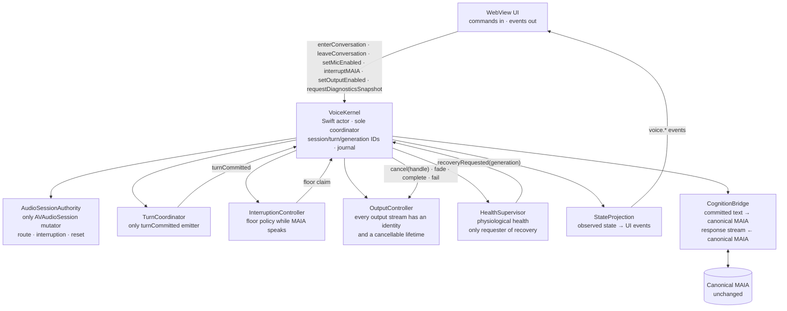

# Target Authority Graph — RATIFIED

**Act:** ARCH-01 · artifact 2 · 2026-09-11 · **Status:** **RATIFIED** with ARCH-01 (founder act, `00_README.md` §2b).

The census (§2) drew the *actual* authority graph and found overlapping authority at every node. This artifact draws the *target* graph so that each of the four authority questions has exactly one answer. Components are named as in the research (§5); the graph is about **who may**, not about code structure.

---

## 0. The answer to the synthesis question (founder, 2026-09-11)

> *What is the smallest sovereign conversational runtime that can own one continuous human–MAIA encounter while allowing hearing, turn understanding, cognition and speaking technologies to change independently?*

```text
                    ┌────────────────────────────┐
                    │      Canonical MAIA         │
                    │ memory · cognition · field  │
                    └──────────────┬─────────────┘
                                   │
                           CognitionBridge
                                   │
                    ┌──────────────▼─────────────┐
                    │       VOICE KERNEL          │
                    │                             │
                    │ SessionAuthority            │
                    │ AudioGraph                  │
                    │ Capture                     │
                    │ TurnCoordinator             │
                    │ OutputController            │
                    │ Route/Interruption Recovery │
                    │ Observable State            │
                    └──────┬───────────┬─────────┘
                           │           │
                     STT adapters   TTS adapters
                           │           │
                       VAD / turn models
```

**The kernel owns the encounter. Models interpret it.**

Two rules follow and govern every section below: **adapters possess evidence, never authority**; and **the realtime path has no committee** — ONE VoiceKernel · ONE SessionAuthority · ONE TurnCoordinator · ONE OutputController (VOICE-20). JARVIS, the collaboration and inquiry orchestration that designed this graph, sits above the kernel and never inside it.

## 1. The four questions, answered once each

| Question | Today (census §2) | Target — the only lawful answer |
|---|---|---|
| Who can cause physical audio state to change? | plugin · gatekeeper · WebKit · voice-recorder | **`AudioSessionAuthority`**, acting only on a `VoiceKernel` decision |
| Who can terminate another subsystem's work? | 11 restart requesters · stale task callback · OC's `isSpeaking` · OC's guards · web inactivity guard · watchdog | **`VoiceKernel`** — through `HealthSupervisor` (recovery) and `OutputController` on an `InterruptionController` decision (output cancel); nothing else may stop, restart or reconfigure anything it does not own |
| Who can decide a human turn is finished? | 4 armed closers · 7 deciders · OC veto | **`TurnCoordinator`**, and only by emitting `turnCommitted` |
| Who can declare recovery? | 10 drivers, each by starting | **`HealthSupervisor`** requests; **`VoiceKernel`** executes; success is declared by *observed flow*, never by *started* |

## 2. Control plane



**Authority rules on the control plane**

1. `VoiceKernel` owns authority and no model logic. It is the only component that turns an observation into a state transition (state model §2).
2. `AudioSessionAuthority` is the only code that mutates `AVAudioSession` (category · mode · options · active · preferred rates · route policy · voice-processing · interruption and media-services-reset recovery). A source gate enforces this (VOICE-01).
3. `TurnCoordinator` is the only emitter of `turnCommitted`. Everything else is *evidence* to it: VAD, STT partials/finals, an acoustic/semantic turn model, elapsed pause, member gestures, current floor state, later selected prosody (VOICE-09, -14).
4. `InterruptionController` owns floor transfer while MAIA speaks. A VAD start is an `overlapCandidate`, not an interruption, until its policy says so (VOICE-13). Its decision is executed by `OutputController`, never by itself.
4a. `OutputController` owns every emitted audio stream: `TTS synthesis → output stream identity → runtime-controlled renderer → cancel / fade / complete / fail` (VOICE-10, ruled F3). A synthesizer yields PCM and never renders; `play()` without a durable handle does not exist. Cancel is reachable from barge-in, `leaveConversation`, `setOutputEnabled(false)`, route failure, emergency teardown and recovery — all through the same identity.
5. `HealthSupervisor` is the only component that may *request* automatic recovery, and it does so from physiological observations (input cadence · frame counts · RMS/peak · route identity · output frames rendered · recognizer heartbeat · transport heartbeat · inference progress · audio-unit errors · interruption/reset state) — never from a component's own "started" (VOICE-06, -08).
6. `StateProjection` is the only source of UI voice state; the UI never manufactures state (VOICE-07).
7. **Capture custody is granted, never acquired** (VOICE-19, ruled F2). Any feature that needs audio — the composer, a journal sheet, a lab — requests a bounded capture grant from `VoiceKernel` and receives a stream; it never opens its own engine, recorder or session regime. A grant has an id, a purpose and a lifetime, and appears in the journal.
8. `CognitionBridge` is the only path between the kernel and canonical MAIA. It carries committed member text out and the response stream in. It has no authority over audio, turns, or recovery, and canonical MAIA has none over the kernel.

## 3. Data plane

Carries PCM input frames · audio-feature frames · transcript hypotheses · committed member text · MAIA response text/tokens · synthesized PCM output · model timing metadata.

**No data-plane lifecycle event grants control-plane authority** (research §5.2):

| Data-plane event | Does NOT |
|---|---|
| STT final hypothesis | commit a turn |
| VAD stop | commit a turn |
| TTS end-of-stream | start a recognizer |
| transport reconnect | reconfigure the audio session |
| recognizer error / task end | stop the engine, deactivate the session, or close a turn |

Each of those five is a witnessed legacy coupling (census §3). The list is the graph's negative space and is pinned by the KERNEL gates.

## 4. Adapters (replaceable, non-authoritative)

```text
SpeechRecognizer   start(stream) · hypotheses → AsyncSequence<TranscriptHypothesis> · stopAnalysis()
TurnInference      assess(context) → incomplete | complete | uncertain
SpeechSynthesizer  synthesize(textStream) → AsyncSequence<AudioChunk> · cancel(requestID)
RealtimeTransport  connect() · sendAudio()/receiveAudio() · sendEvents()/receiveEvents()
```

An adapter consumes or produces streams. **It possesses evidence, never authority** (founder, 2026-09-11; ratified ADAPT refinement): a recognizer's final, a VAD's stop, a turn model's "complete", a synthesizer's end-of-stream are inputs to a kernel decision and never decisions. It never imports `AudioSessionAuthority`, never starts or stops the engine, never emits `turnCommitted`, never renders to the output itself (a synthesizer yields PCM; `OutputController` renders it — research §3.4). A candidate that needs more than this to work fails VOICE-11 regardless of its benchmark. This is what keeps the present architecture from being recreated with newer technology.

## 5. The WebView boundary (supersedes charter §3 / E21 command set)

**Commands (UI → kernel), intentions only**

```text
enterConversation() · leaveConversation() · setMicEnabled(bool) · interruptMAIA() · setOutputEnabled(bool) · requestDiagnosticsSnapshot()
```

**Events (kernel → UI), observations only**

```text
voice.sessionState · voice.routeState · voice.inputHealth · voice.outputHealth · voice.userActivity · voice.turnState
voice.transcriptPartial · voice.transcriptCommitted · voice.maiaOutputState · voice.recoveryState · voice.error
```

The UI renders what the kernel says is true. `setMicEnabled(false)` is a request the kernel honours by policy; it does not itself flip any state the UI displays.

## 6. The CognitionBridge contract (the KEEP boundary)

```text
turnCommitted { sessionId, turnId, text, evidence[], startedAt, committedAt }
      → CognitionBridge → the canonical MAIA route (convergence at handleTextMessage; commitOracleTurn seam unchanged)
      ← response stream (text/tokens) → SpeechSynthesizer adapter → `OutputController` (stream identity, cancellable)
```

Voice keeps a different capture path and the same mind (Deep-Intelligence Gate). The bridge carries committed text and declared interaction-control features only (VOICE-18); it carries no raw audio into cognition and no cognition into audio authority.

## 7. Deployment profiles under the same graph (research §12)

| Profile | Hardware authority | Where STT / turn / TTS run | Standing |
|---|---|---|---|
| Local-first cascade | native kernel | on device | production candidate for light components |
| Native + sovereign server | native kernel | owned infrastructure over `RealtimeTransport` | production candidate for heavy STT/TTS |
| Duplex research adapter | native kernel | duplex model behind the same adapters | research only (D7) |

The graph does not change between profiles. That is the test of the graph: *models can change monthly; the authority graph should not* (research, executive synthesis).
