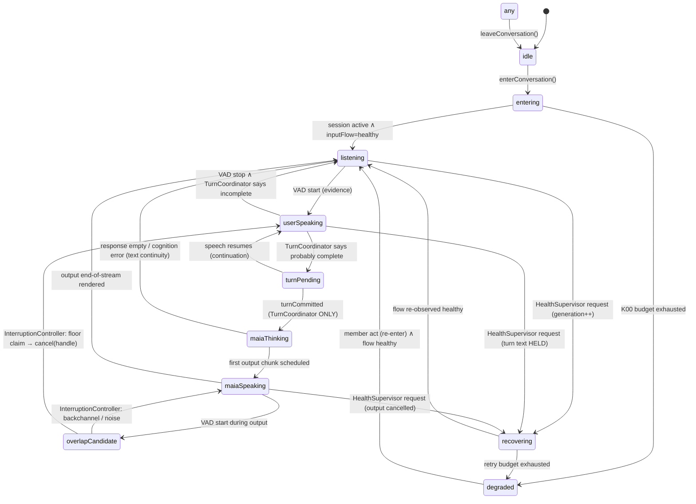

# Orthogonal State Model — RATIFIED

**Act:** ARCH-01 · artifact 3 · 2026-09-11 · **Status:** **RATIFIED** with ARCH-01 (founder act, `00_README.md` §2b). Turn custody (§1, §3) is bound by the amended VOICE-18 retention rule: partials and segments are ephemeral; the human turn survives them.

The legacy runtime compressed several truths into booleans and refs — `isListening`, `isRecording`, `micState`, `nativeStatusRef`, `isMuted`, `isSpeaking`, four in-flight latches, three mode flags (census P4 §4a) — and no single place knew the whole state. Voice 2026 keeps **four orthogonal dimensions** — physical, conversational, turn, output (founder, 2026-09-11) — plus one **generation counter**, each with one writer. Two rules bind the whole model: **there is no giant `isListening` boolean**, and **no model event may masquerade as system state** — a recognizer final, a VAD stop, a synthesizer EOF are evidence records, never state transitions.

---

## 1. Dimensions

| Dimension | Writer | Values |
|---|---|---|
| **Floor** (conversational state) | `VoiceKernel` on `TurnCoordinator` / `InterruptionController` / bridge events | `idle · entering · listening · userSpeaking · turnPending · maiaThinking · maiaSpeaking · overlapCandidate · recovering · degraded` |
| **Turn** (custody of the member's words) | `TurnCoordinator` only | `none · capturing(turnId, heldText) · pending(turnId, heldText, evidence[]) · committed(turnId) · abandoned(turnId, cause)` — held text survives recovery and re-segmentation; a discard is a journalled `abandoned` with a policy cause (VOICE-03, -09) |
| **Output** (every emitted stream, ruled F3) | `OutputController` only | per stream `{ streamId, source(turnId), state: scheduled · rendering · fading · cancelled · complete · failed, framesScheduled, framesRendered }` — no stream exists without an id; `maiaSpeaking` on the floor is derived from *some stream rendering*, never the reverse |
| **Health** (physical) | `HealthSupervisor` from observations | `inputFlow: unknown/healthy/suspect/dead` · `outputFlow: idle/rendering/stalled/failed` · `route: builtIn/receiver/HFP/A2DP/other` · `audioSession: inactive/active/interrupted/resetting` · `stt: unavailable/ready/analyzing/failed` · `tts: unavailable/ready/synthesizing/failed` · `transport: local/connected/reconnecting/unavailable` |
| **Recovery generation** | `VoiceKernel` on a `HealthSupervisor` request | monotonic integer per session; every callback carries the generation that created it |

A health degradation never rewrites the floor by itself; it produces an observation that the kernel may turn into `recovering`. A floor change never rewrites health. Turn custody is never rewritten by a floor or output change (a recovery mid-utterance keeps `capturing(heldText)`). Output state is never inferred from floor state. That separation is what lets *engine started* and *input dead* coexist as two true statements instead of one false "listening", and lets *MAIA still has a stream rendering* be known to the cancel path as a fact rather than a flag.

## 2. Floor state machine

**Transition law (each row names the only authority that may fire it)**

| From → To | Trigger | Authority | Evidence carried in the event |
|---|---|---|---|
| idle → entering | `enterConversation()` | kernel on UI command | command id |
| entering → listening | session `active` **and** `inputFlow = healthy` | kernel on `HealthSupervisor` observation | first N input callbacks with non-zero energy |
| listening → userSpeaking | speech activity begins | kernel on VAD evidence | VAD score, frame ids |
| userSpeaking → turnPending | turn probably complete | **`TurnCoordinator`** | evidence list (≥ 2 kinds, VOICE-14) |
| turnPending → userSpeaking | speech resumes within the continuation window | `TurnCoordinator` | continuation evidence; held text preserved |
| turnPending → maiaThinking | `turnCommitted` | **`TurnCoordinator` only** (VOICE-09) | committed text, evidence, turn id |
| maiaThinking → maiaSpeaking | `OutputController` reports a stream `rendering` | kernel on output observation | streamId (VOICE-10) |
| maiaSpeaking → overlapCandidate | speech activity during output | kernel on VAD evidence | never cancels output by itself (VOICE-13) |
| overlapCandidate → userSpeaking | floor claim | **`InterruptionController`** decides; **`OutputController`** executes `cancel(streamId)` / fade | streamId, framesRendered at cancel (so the unheard tail can be truncated from the record where appropriate) |
| overlapCandidate → maiaSpeaking | backchannel / incidental | `InterruptionController` | classification |
| maiaSpeaking → listening | the stream reaches `complete` (frames rendered = frames scheduled), not the synthesizer's EOF | kernel on `OutputController` observation | streamId, frame counts |
| * → recovering | `recoveryRequested(generation)` | **`HealthSupervisor` only** (VOICE-06) | the observation that caused it (VOICE-16) |
| recovering → listening | flow re-observed | kernel on `HealthSupervisor` | generation id |
| recovering → degraded | budget exhausted | kernel | budget, attempts, last cause — member-visible (VOICE-15) |
| * → idle | `leaveConversation()` | kernel on UI command | outputs cancelled, session released |

**What is deliberately absent.** No transition is fired by: a recognizer `stopped`/final/error; a TTS end-of-stream *scheduled* (only *rendered*); a silence timer alone; a transport reconnect; a UI boolean. Each absence corresponds to a witnessed legacy coupling (authority graph §3).

## 3. Turn text custody

Member text captured in `userSpeaking`/`turnPending` is **held by the kernel** until `TurnCoordinator` commits it or the member abandons it by an explicit act (`leaveConversation`, `setMicEnabled(false)` with a discard confirmation policy, or a policy-defined abandonment). A recovery during `userSpeaking` holds the text across the generation. The legacy 22 discard authorities collapse to **one**: `TurnCoordinator` acting on declared policy, and every discard is journalled with its cause (VOICE-03, -09, -16). This is Repair Two's principle carried as law, without its implementation.

## 4. Half-duplex policy v0 (conservative, on duplex hardware)

The physical graph is duplex from KERNEL-00 (input exists while output renders; voice processing prevents self-transcription). Policy v0:

- `overlapCandidate` is **advisory**: `InterruptionController` v0 classifies everything as "not a floor claim" except an explicit `interruptMAIA()` command. MAIA does not stop for speech alone.
- Barge-in by voice (TURN-02) is enabled by changing the controller's policy, not the state machine or the hardware.
- Progression (research §18): stable half-duplex → explicit barge-in → backchannel-aware interruption → selected overlap → experimental duplex adapter. Each step is a policy or adapter change under the same states.

## 5. Recovery generations

- Every automatic recovery increments `recoveryGeneration`. Every engine, task, transport session and callback created under a generation carries it.
- A callback whose generation ≠ current is **journalled and dropped**; it may not stop, start, reconfigure or commit anything (eliminates the E16.5 stale-task mechanism, P1 #9).
- Each generation has a retry budget and a backoff schedule declared in `06_…`; exhaustion → `degraded`, member-visible, with text continuity where cognition still works.
- Recovery is judged successful only by re-observed flow (`inputFlow = healthy`, `outputFlow` responsive), never by "started".

## 6. Projection rules (kernel → UI)

1. The UI holds a **reducer over `voice.*` events** and nothing else. There is no local `setListening`.
2. Every displayed voice state names its source event and session id; a stale session's event is ignored.
3. "Listening" is displayed only when floor ∈ {listening, userSpeaking, turnPending} **and** `inputFlow = healthy`. Floor alone is not enough (VOICE-07, -08).
4. `degraded` is always displayed, with its cause in member language, and with the text channel visibly available.
5. `requestDiagnosticsSnapshot()` returns the full three-dimension state plus generation; it is the only diagnostic surface and it is read-only.

## 7. Flight recorder (VOICE-16)

Every transition above is one journal record: `{ session, turn, generation, time_monotonic_ms, component, event, from, to, cause, evidence }`. Trace families: session lifecycle · route/session mutations · input callback cadence · VAD transitions · transcript hypotheses · turn decisions with evidence · cognition dispatch/receipt · TTS generation/chunks · output render/cancel · interruption decisions · recovery generations · UI commands and projected state. The acceptance test for the recorder is replay: a KERNEL-00 trace fed back into the state machine reproduces the same states with no orphan transition.
