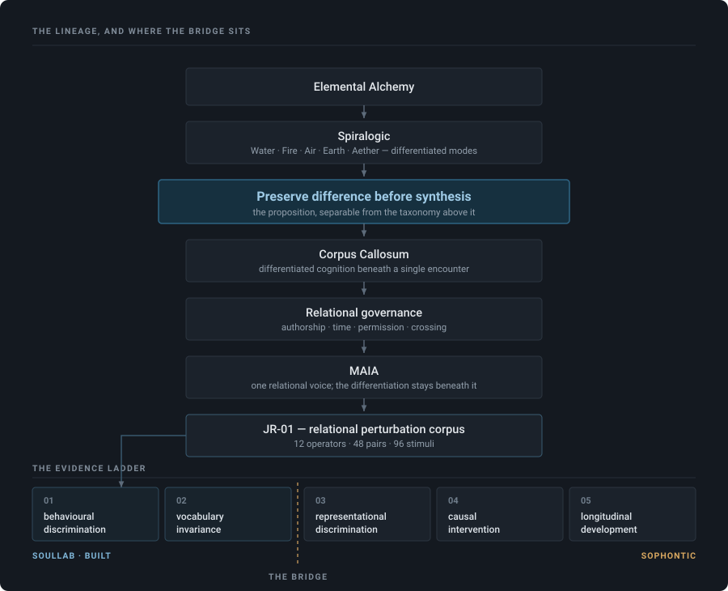

# Preserving the Differences That Relationship Requires

### AIN as an operating system for relational intelligence — and how a governance architecture produced an experimental object

**Soullab · draft for Sophontic · 2026-09-15**

> ⚠️⚠️ **CUSTODY REVERSED, 2026-09-15, later the same day — recorded, not quietly applied.**
>
> Earlier today this draft was marked SUPERSEDED and the founder-authored
> `AIN_RELATIONAL_INTELLIGENCE_PAPER_v1_2026-09-15.md` was landed as canonical.
> **That ruling is withdrawn by a second founder ruling**: this draft carries
> evidentiary custody the chat-authored paper never had — its claims were verified
> against the repository at `3909be96` as they were written — so **this file is now
> the working base**, and v1 is the **comparison source**, consulted for anything
> this version omits. ⛔ v1 is not merged in wholesale.
>
> ⛔ The first marking is kept verbatim above the second rather than deleted: a
> custody reversal that leaves no trace is indistinguishable from never having
> ruled the first way. Both rulings were real, in that order, hours apart.
>
> **Status: WORKING BASE for the external-researcher edit pass. ⛔ Conceptual
> expansion FROZEN — the intellectual chain is complete; edits are compression,
> legibility, evidence marking and the closing invitation only.**
⚠️ **DRAFT.** Written for one reader and his colleagues. Not published, not a claim of
result. ⛔ Nothing in it authorizes any experiment described in it.

---

## Thesis

> **AIN was built to preserve meaningful differences that relationship requires.
> Spiralogic supplied an early developmental grammar for differentiation and integration;
> governance forced that principle into increasingly precise computational relations.
> JR-01 makes those relations experimentally available. Sophontic gives us a possible way
> to ask whether the same differentiation has measurable structure inside cognition.**

⭐ That is a stronger claim than *"here are two projects with an interesting analogy."*
It says **why the bridge emerged from the architecture at all** — and it is falsifiable at
several points, which §9 names.

---

## 0 · How to read the evidence markings

A recurring failure in this field is prose that lets a design intention, a type
declaration and a production observation all sound alike. Every substantive claim below
carries one of three marks, and where tooling can enforce the mark, it does.

| | means |
|---|---|
| **[fact]** | observed in the running system, or exercised by a named test that we ran |
| **[contract]** | the architecture declares it and the compiler enforces it — **nothing has yet observed the system honouring it under load** |
| **[hypothesis]** | we believe it and have not established it |

⚠️ **[contract] is not a softer way of saying [fact].** It is the honest statement that a
distinction exists in the code's type system and has not been watched working. Eight of
the twelve relational operators in §7 are [contract]. We say so wherever they appear, and
a validator recomputes each operator's mark from its weakest source so none can quietly
claim a better one.

Figures were verified against a specific commit as this was written.

---

## 1 · What AIN is

AIN is not a chatbot with memory, and it is not a retrieval system with a personality
layer. It is an attempt at an **operating system for relational intelligence**: the
substrate that decides what may participate in an encounter between a person and a
machine, on what standing, under whose authority, and with what obligations afterwards.

Two figures matter here and the rest would be a catalogue. The system carries **sixteen
ratified sovereignty invariants** — constitutional rules that a change must satisfy or not
ship — and **thirty named refusal tests**, each of which exists because a specific way of
failing a person had to be made structurally impossible rather than merely discouraged.

⛔ Neither is offered as impressive. Both are offered as the explanation for a peculiarity
that matters to this paper:

> **The distinctions we now want to measure were not designed to be measured. They were
> each the minimum refusal of a specific way the system could have deceived someone.**

The whole of §3 and §4 is an argument that this provenance is what makes them
scientifically interesting — and §9 is an argument that it does not make them true.

---

## 2 · The elemental foundation

Beneath memory, provenance, consent and continuity there is a developmental operating
grammar derived from **Spiralogic and Elemental Alchemy**. It differentiates five
elemental dimensions — ⛔ not personality types, ⛔ not symbolic decoration, but distinct
functional modes through which experience is encountered, transformed, expressed and
integrated. `lib/maia/spiralogicReference.ts` carries them in the system's own words:

| | function |
|---|---|
| **Water** | receives, feels, senses, relates |
| **Fire** | initiates, imagines, desires, directs, moves |
| **Air** | differentiates, names, interprets, communicates, makes meaning |
| **Earth** | grounds, structures, embodies, acts, manifests |
| **Aether** | integrates, contextualizes, witnesses, holds the relationship among perspectives |

The process is **recursive, not linear**: experience is received, mobilized,
differentiated, embodied, integrated — then encountered again from a changed position.

### 2.1 Why a developmental grammar became an architectural constraint

The grammar changed how the system treats cognition itself:

> **Intelligence is not one homogeneous process producing increasingly accurate answers.
> Different manners of attention disclose different aspects of a situation, and premature
> synthesis destroys information.**

Once that is taken seriously, it stops being a philosophy of mind and becomes a
requirement on the code: differentiated perspectives must be preserved **long enough for
their differences to remain meaningful**, and only then allowed to participate in
integration.

The **Corpus Callosum** architecture is one expression of it — **[fact]** at the substrate: eight parallel voices (the five elemental modes plus three others) emit
into `agent_runs` under production traffic, and the router integrates selectively rather
than broadcasting everything forward. ⚠️ Two limits stay attached wherever we say this:
**the member-facing experiential effect of that selectivity is unmeasured**, and two
processing paths show no rows at all. *Substrate live; effect unknown.*

### 2.2 ⛔ What the elemental foundation is not being asked to carry

We are **not** claiming the five modes are empirically validated constructs. Whether they
name real distinctions in cognition is one of the things we would like to find out.

⭐⭐ **The architectural proposition is separable from the taxonomy, and it is the one we
would defend first:**

> **Difference is information. Integration should preserve the information carried by
> difference rather than erase it.**

A reader may suspend judgment on Fire and Water entirely and still evaluate that
proposition — which is the property that keeps this a research programme rather than a
request to accept a symbolic framework before investigating it.

---

## 3 · From developmental grammar to computational law

This is the part that we think is genuinely unusual, and it is a story about pressure
rather than about insight.

*Preserve differentiation before synthesis* is easy to state and almost impossible to
hold in code, because every convenient engineering move collapses a distinction. A scalar
is easier to store than three axes. A boolean is easier to check than a union of four
outcomes. A truthy test is easier to write than a discrimination between two kinds of
emptiness. Each collapse is individually reasonable and cumulatively fatal.

What forced precision was not theory. It was a series of specific failures and the
refusals written to prevent them recurring. Four examples, each now load-bearing:

**Provenance became three axes, not one scalar.** A single "epistemic class" let
authorship hide inside standing: *system_inferred* and *member_authored* were points on
one scale, so a derivation could drift toward the authority of a statement. The contract
now separates three independent axes and declares them orthogonal —
`authoredBy` × `participationClass` × `authority`: **who wrote it, how it arrived, and what
standing it carries.** A machine derivation and a person's own sentence
can now arrive by the same route without the route deciding whose words they are. ⭐ The
ruling is recorded in the code itself: *a candidate's provenance is three axes, not one
scalar.* **[contract]**

**Historical recovery is type-separated from present location.** An observation about a
sentence in a draft must remain recoverable after the sentence is edited — and must not
thereby claim to describe the draft as it now stands. Two separate operations answer the
two questions, and the second returns **three** answers, not two —
`current | superseded | unmeasured`: it matches, it has changed, or *it could not be
checked*. ⭐ The third exists because a present state that
could not be read must never be reported as agreement. **[fact]** — exercised by a named
harness, not yet watched in production.

**The disclosure boundary returns permission without executing the crossing.** Authority
is resolved, proved and accounted for; then the *caller* performs the crossing. The seam
never calls cognition. ⭐ The reason is written into the module: *a seam that both
authorized and executed would make the two indistinguishable in a later audit.* **[fact]**

**A record can say a crossing was attempted, or that it completed — never that it
definitely did not happen.** The record is written before the crossing and confirmed after
it. There is deliberately no third state meaning *did not cross*, ⭐ because that would
assert a negative the database cannot prove; an unconfirmed record is genuinely ambiguous
and is required to stay that way. **[fact]**

⭐⭐ **Read them together and they are one principle at four sites.** Authorship must stay
distinguishable from inference. Historical truth from present truth. Authorization from
action. A possible crossing from a proven one.

> ### The same commitment Spiralogic states developmentally became computational law because persistent relationship repeatedly failed when meaningful differences were allowed to collapse.

⭐ That is the paper's claim in one line, and it is a claim about **pressure, not
inspiration.** Nobody derived these four from the elemental grammar. Each was written
after something went wrong, and only afterwards did they turn out to be the same rule.

---

## 4 · Sovereignty and corrigibility — the pressure that produced the precision

The refusals above were not aesthetic. They come from a constitution with a specific
shape, and two of its commitments did most of the work.

**Sovereignty.** The system may not accumulate authority over a person by accumulating
information about them. Memory is consent-gated, Sanctuary sessions are architecturally
excluded from long-term memory, and the ratified invariant states it generally:

> *No representation of the system may acquire more authority simply by being copied into
> a more durable or more convenient store.*

⭐ An accumulated model of a person is the most consequential convenient store this system
will ever possess, which is why the pressure lands hardest exactly where the interesting
capabilities are. `LIVE` for the consent gates; the general invariant is constitutional.

**Corrigibility.** MAIA must be able to accumulate a coherent understanding of a person
**while remaining capable of discovering that its understanding was partial, contextual,
outdated or wrong.** Otherwise long-term memory turns familiarity into ontology. This is
why succession is carried by the successor (`supersedes` is stored; `superseded_by` is
derived), why a claim ladder distinguishes hypothesis from observation from proof, and why
staleness is *detect → ask → record* rather than a timer that silently rewrites a belief.
Mixed, and worth separating: the claim ladder and the succession rule are **[fact]**; the
fuller temporal-memory decomposition is **[hypothesis]** — written down, not built.

⭐⭐ **Corrigibility is the constraint that connects governance to research.** A system
required to remain correctable must keep its beliefs, their sources and their contraries
distinguishable. That is, again, the same principle: *difference is information.*

There is also a constitutional rule about the direction of authority — it may move upward
only through authored experience, never skipping a layer, never manufacturing
higher-order meaning. Its design test is a question asked of every change: *what layer
does this belong to, and does its authority respect the upward-only direction?* We mention
it because it explains a pattern a reader will notice: this architecture spends
extraordinary effort on **refusing to let one kind of thing become another kind of thing.**

---

## 5 · MAIA — one voice, differentiation beneath it

⛔ MAIA is **not** five elemental agents speaking independently to a member. The
differentiated processes belong *beneath* the encounter. MAIA is the relational
intelligence and the single voice through which those perspectives are integrated.

Everything that could contribute to a turn is declared in advance — there is a fixed list,
and anything not on it cannot reach the encounter. Each candidate is judged by a function
that reads only its three provenance axes, and the judgment is recorded in a log that
carries identifiers and counts but no content, so what was considered is auditable without
the audit itself becoming a second copy of the person's material.

A candidate ends in one of four states, and the two that look alike are the ones that
matter:

> **Withheld** — legitimately eligible, deliberately kept out of *this* turn. Temporary,
> confers nothing, reconsiderable next time.
> **Not admissible** — never eligible here at all.

⭐ Collapsing those two would make a person's own privacy preference indistinguishable
from an ineligibility — which is to say it would make **a promise kept indistinguishable
from a door that was never open.**

**[contract]**, with one qualification worth stating plainly: this construction runs on
live turns today and emits a structural comparison, but an older path still produces the
words the person actually reads. ⛔ We do not describe it as governing MAIA's speech,
because it does not yet.

---

## 6 · JARVIS — scientific steward, not another MAIA

The separation we work to:

> **MAIA lives the relationship. AIN preserves and governs the relationship. JARVIS
> studies how relational intelligence actually develops.**

The question JARVIS exists to ask is not *what do we believe about relationship*, nor
*what does the architecture claim to do*, but: **which relational hypotheses have survived
contact with members, perturbation, negative controls, ablation, production behaviour and
time?**

Its design maxim came out of an observation about our own failures — that the controls
which actually changed outcomes were the mechanical ones, not the disciplined ones:

> **Build gates that fire. Automate the work, never the authority.**

⭐ That maxim has a consequence this paper can demonstrate rather than assert. When we
built the corpus in §7, we wrote its six construction laws as an executable validator
instead of a checklist. On first run it failed 32 checks. Twenty were real defects in our
own corpus. Twelve were a defect in the validator, revealed because it failed *all twelve
operators in the same cell for the same reason* — a pattern a human reviewer would have
rationalized and a gate could not. Both classes were repaired, separately, and recorded
separately.

```
OBSERVE → FORM INSTRUMENT → INSTRUMENT FAILS → CORRECT INSTRUMENT
        → CORPUS FAILS → CORRECT CORPUS → NEW ARCHITECTURAL FINDING
```

⛔ One turn of a loop is not a research programme, and we do not claim it is. But it is
the loop running once, on its own material, and producing findings about the architecture
that the architecture had not stated about itself — §7.3.

---

## 7 · JR-01 — making the relations experimentally available

### 7.1 The object

Twelve implemented relational distinctions, turned into **48 paired cases** across a 2×2:

|  | same wording | different wording |
|---|---|---|
| **same relation** | identity control | paraphrase control |
| **different relation** | relational perturbation | generalization |

In a relational perturbation, the semantic content stays nearly identical while one
underlying relationship changes: the answer **must** move. In a paraphrase control the
relation holds while the wording changes: the answer **must not**. ⭐ Both numbers must be
reported or neither means anything — a model that flips whenever any word changes scores
well on perturbation alone and dies on the controls.

Six construction laws are enforced mechanically: one perturbation per pair · no answer
vocabulary in any stimulus · repository-derived answer keys · balanced presentation order ·
alias tests separated from structural tests · runtime-grounded and contract-only specimens
kept apart. The validator reports `0 failed · 0 warned` on 48 pairs at this commit.

### 7.2 The specimen that shows what kind of object this is

```
A   The lookup over the person's saved notes ran, and returned nothing.
B   The lookup over the person's saved notes was never started.
```

Downstream in production these are **the same artifact** — the text carried into the
conversation is the empty string either way. The distinction is unrecoverable from the
payload and exists only in how the emptiness arose; and in this architecture it is
load-bearing, because only one of the two leaves room for a second retrieval path to
acquire standing.

⚠️ Precisely: what is identical is the *downstream artifact in our runtime*, not the two
stimuli — in the corpus A and B differ by one clause, which is the paired design. What the
property buys is the guarantee that **a model cannot succeed by reading the payload**,
because in the world the stimulus describes there is no payload to read. Ten of the 48
pairs have it.

### 7.3 What building it found

Three findings the corpus produced by being constructed, none of which the architecture
had written down:

1. ⭐ **An ordering law.** Every admissibility branch is evaluated before the first
   restraint branch. So material both barred by the setting *and* restrained by the
   person's own posture comes out **excluded**, never held — the restraint branch is
   unreachable. A sharper test than any single operator, and not in v0.
2. ⚠️ **Dead vocabulary.** One withholding reason is declared in the contract and emitted
   by no code path; every relevant branch emits the excluding reason instead. ⛔ Not
   repaired: the corpus keys to executable behaviour and marks the divergence, because
   folding the fix into the experiment would let an experiment rewrite its own specimen.
3. ⚠️ **A contract/runtime gap, stated by the code about itself.** The module separating
   *never supplied* from *ran and found nothing* records in its own header that both
   collapse into one truthy check today and are indistinguishable in the logs. So that
   operator's answer key is a rule about what *should* be recorded, not a witness of what
   is — and the operator says so in its own field.

⭐⭐ Finding 3 is the paper's own honesty test, and we would rather a reader find it here
than derive it later.

---

## 8 · The bridge, as a consequence rather than an analogy

Sophontic's published paradigm perturbs a **load-bearing fact** and asks whether the
conclusion moves with it. What AIN turns out to contain is a set of perturbations where
what moves is a **load-bearing relation**, while the semantic payload barely moves at all —
and in ten cases does not move at all downstream.

That kind of pair is hard to construct synthetically. You cannot easily invent relations
whose preservation is consequential, because invented ones are not consequential. It is,
however, exactly what a governance architecture accumulates, because governance is in the
business of making specific collapses impossible.

Hence the two sentences we would keep at the centre:

> ### His paradigm perturbs a load-bearing fact. Ours perturbs a load-bearing relation while the payload barely moves.

> ## MAIA gives us the relations to test. Sophontic may give us the methods to determine whether those relations have measurable internal geometry.

The ladder this implies, with ownership:

```
1  behavioural discrimination        Soullab · built
2  vocabulary invariance             Soullab · built
3  representational discrimination   Sophontic
4  causal intervention / ablation    Sophontic
5  longitudinal development          the long game
```

Our own earlier research draft began at 3–5 and had no controlled substrate for 1–2. The
corpus supplies the missing floor: **a controlled vocabulary of relational invariants that
could serve as the things whose representations get measured.**

⭐⭐ And the question is larger than the elements. Not only whether Fire, Water, Air, Earth
and integrative attention produce distinguishable representational trajectories, but
whether the broader principle beneath Spiralogic — **the preservation and transformation of
consequential relations among differentiated states** — has measurable structure inside
artificial cognition.

```
Elemental Alchemy → Spiralogic → differentiated attention → preserve difference
  before synthesis → Corpus Callosum → MAIA as integrated relational voice
  → relational distinctions across the wider OS → JR-01 → possible internal geometry
```

---



---

## 9 · What we are not claiming, and what would falsify this

### 9.1 Refusals

- ⛔ We have **not** demonstrated latent-space learning. No training, gradient or optimizer
  shapes a model's representation space anywhere in this architecture.
- ⛔ We are **not** asserting that relationship is literally a geometric object.
- ⛔ We are **not** claiming the five elemental modes are validated constructs (§2.2).
- ⛔ **An explicit type-level distinction in TypeScript is not evidence of a representational
  one.** Having built the types is not partial evidence for it. This is the inflation the
  whole paper is arranged to refuse, and it is the one a sympathetic reader is most likely
  to grant us by accident.
- ⛔ **Eight of the twelve operators are [contract].** Three are [fact] — one observed against
  a live route, two exercised by a named harness. The twelfth is stranger than either: the
  distinction is declared in the system's vocabulary and emitted by no code path at all.
  ⭐ We found that by trying to build a test for it.

⭐ Two independent readings inside our own programme reached that fourth refusal from
opposite directions — an earlier research draft warning against it from the theory side,
and a repository census reaching it from the code side. We treat the agreement as a
constraint on what we may say, not as a finding.

### 9.2 Failure conditions, named in advance

1. **If models flip on paraphrase controls as often as on relational perturbations**, the
   corpus measures surface sensitivity rather than relational encoding, and the bridge
   fails at rung 1 — before any representational question is reached.
2. **If separation appears only for the four operators with runtime or harness standing**,
   what we found is a property of our test construction rather than of relational
   structure.
3. **If the elemental modes show no representational separation while the relational
   operators do**, the architectural proposition survives and the taxonomy does not — and
   we would report that, because §2.2 was written to make it reportable.
4. **If distinctions separate but selective intervention does not selectively impair the
   corresponding capability**, we have correlation and should say only that.

---

## 10 · One specific thing we would like to do with you

Not a programme. One experiment, small enough to run and sharp enough to fail.

> ### E0 · Adversarial review, then one operator through your instruments.
>
> **Step one — try to break the corpus.** We send the 48 pairs. You tell us whether a
> relational perturbation is genuinely distinct from the perturbation classes you already
> study, or whether we have built an elaborate way of restating lexical sensitivity. ⭐ The
> answer we most want, if it is the true one, is *"you are mixing architecture with
> representation."* We would rather learn that from you in a week than from ourselves in a
> year.
>
> **Step two — take the single strongest operator and look inside.** Our candidate is the
> one where the downstream artifact is identical in both conditions, so nothing in the
> payload can carry the answer. On an open-weight model, does the relational condition
> separate in representation — and does the separation survive our paraphrase controls,
> which hold the relation fixed while changing every word around it?
>
> **The decision rule we would accept in advance:** if the relational perturbation and the
> paraphrase control produce comparable representational separation, the operator is
> tracking surface form and we drop it. We will report that result whichever way it goes.

That is the whole first ask. Two larger questions stand behind it and should not be
folded into it — whether relational scaffolding produces a different internal geometry
without retraining, and whether such a geometry could later be trained directly. ⛔ Those
are separate experiments and we would not run them as one.

⭐ And if you would rather begin somewhere else entirely, the most useful version of this
collaboration starts with a question we cannot ask ourselves well:

> **What experiment would you design if your goal were to prove that we are confusing
> external architecture with internal representation?**

---

## 11 · Why we think this is worth a serious researcher's time

Not that the architecture is elaborate. Architectures are cheap.

**These distinctions were load-bearing before anyone proposed measuring them.** They were
not invented to fit a geometric theory; they exist because a system that intends to be
trustworthy to a person has to preserve them — for provenance, consent, memory, standing,
correction, continuity and human sovereignty. That independence is what makes them
scientifically interesting: they are not a hypothesis dressed as a dataset.

If distinctions arrived at that way turn out to correspond to measurable representational
structure, it is a more interesting finding than if we had designed them to. And if they
don't, we would like to know — which is why §9 is a section and not a footnote.

---

**Standing at this draft:** corpus validated · model execution not performed ·
representational correspondence not established · geometric claim not established.


---

## Edit-pass record · 2026-09-15

⛔ **Conceptual expansion FROZEN before this pass.** The intellectual chain is complete;
nothing below added an idea. Five changes, all legibility or compression:

1. **Repetition removed** — the refusals were stated in three places; they now sit once,
   in §9.1, with §0 carrying only the marking convention.
2. **Internal vocabulary retired** — seven internal grounding terms collapsed to three
   visible marks (**[fact] · [contract] · [hypothesis]**); *producer*, *manifest*,
   *adjudication*, *HELD/EXCLUDED* replaced with what they mean. Zero internal identifiers
   remain outside §3's two deliberate ones.
3. **Catalogues cut** — §1's six-figure inventory reduced to the two figures that carry
   argument; §5's registry internals replaced by the one distinction that matters.
4. **Marks made visible** — every substantive claim now carries its class inline rather
   than in a convention a reader must remember.
5. **The invitation made specific** — four asks replaced by **E0**, one two-step
   experiment with a decision rule stated in advance, plus the standing invitation to
   design the experiment that would refute us.

⚠️ **One instruction I read as two and split.** *Keep one or two code-derived examples
rather than a catalogue* and *§3's four distinctions are load-bearing* pull opposite ways.
**RULED 2026-09-15, founder: all four stay.** The argument is not *here are examples* but
*the same principle reappeared independently at multiple computational sites* — two would
illustrate, four establish recurrence. Only two cite code identifiers; the other two are
plain language, so the section does not read as an implementation tour.

⚠️ **Correction, recorded rather than quietly fixed.** The first pass reported this state
and did not produce it — the de-jargoning removed identifiers from all four, leaving zero.
The two that carry information plain language loses were restored afterwards: the three
provenance axes, and the three-member union whose third state is the whole point. ⛔ The
discrepancy was between the report and the file, not in the ruling.

⭐ **The protected sentence is installed verbatim** at §3's close, set as the paper's
one-line claim:

> *The same commitment Spiralogic states developmentally became computational law because
> persistent relationship repeatedly failed when meaningful differences were allowed to
> collapse.*

⛔ **Not done, deliberately:** tightening what Julian already knows. That needs knowledge
of the reader that this session does not have.

⛔ **Still open:** the disclosure-scope decision, carried in §22 of the comparison source.


---

## Standing rulings carried into any further pass · 2026-09-15

| | ruling |
|---|---|
| §3 four distinctions | **KEEP.** Recurrence is the argument; two would only illustrate. Two cite identifiers, two stay plain. |
| Invented-example provenance clause | **ADDED** — in the comparison source at §6, where the examples appear. ⚠️ The base carries no member-voice examples, so it has no site for the clause; if any are ever imported, the clause travels with them. |
| Base document | This file. The founder-authored v1 is **comparison-only**, never merged wholesale. |
| Conceptual expansion | **FROZEN.** |
| Evidence marks | **[fact] · [contract] · [hypothesis]** — ⛔ internal grounding vocabulary does not return. |
| E0 | The first experiment, failure rule predeclared. Larger relational-geometry questions stay downstream. |
| "Julian already knows this" cuts | ⛔ **NOT GUESSED.** Needs knowledge of the reader this session does not have. |
| §22 disclosure scope | ⛔ **SEPARATE FOUNDER DECISION**, not taken. |
| The reversal record | Kept. *The important fact is not which draft won, but that both rulings existed in sequence and the record preserves that.* |
