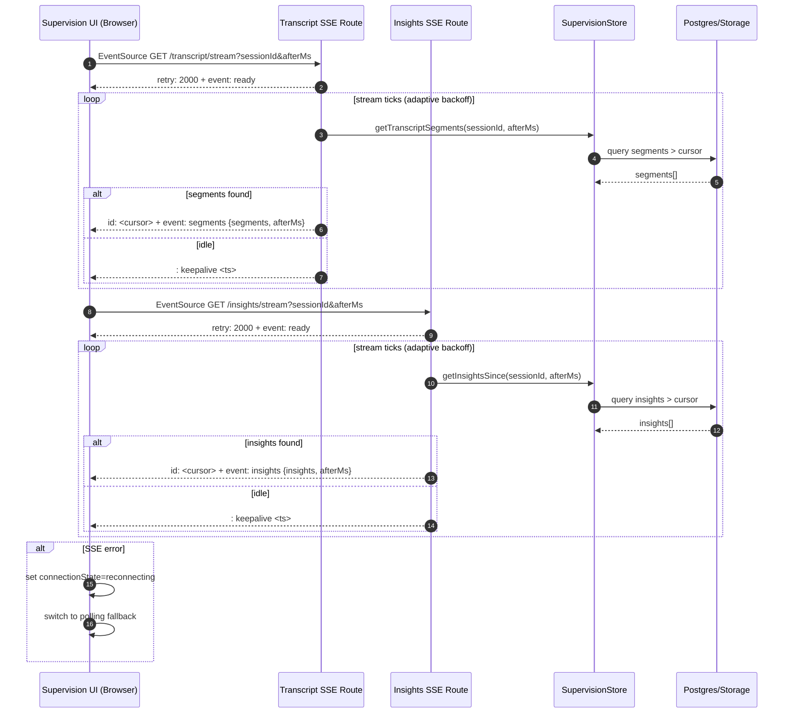

# Supervision System Architecture

## Sequence Diagram (Mermaid)

---

## Component Overview

### Frontend Components

| Component | Purpose |
|-----------|---------|
| `TranscriptViewer` | Displays live/historical transcript with SSE streaming, polling fallback, speaker grouping, and jump-to-segment |
| `InsightsViewer` | Displays live insights with SSE streaming, polling fallback, and click-to-select |
| `InsightPanel` | Displays historical insights (static mode) |
| `SupervisionRecorder` | Audio capture and session management |

### API Routes

| Route | Method | Purpose |
|-------|--------|---------|
| `/api/supervision/transcript` | GET | Fetch transcript segments (polling) |
| `/api/supervision/transcript/stream` | GET | SSE stream for live transcript |
| `/api/supervision/insights` | GET | Fetch insights (polling) |
| `/api/supervision/insights/stream` | GET | SSE stream for live insights |
| `/api/supervision/sessions` | GET | List past sessions |

### Data Store

| Function | Purpose |
|----------|---------|
| `getTranscriptSegments()` | Query segments after cursor |
| `getInsightsSince()` | Query insights after timestamp |
| `saveTranscriptSegment()` | Persist new segment |
| `saveInsight()` | Persist new insight |

---

## Event Contract

### SSE Events

| Event | Payload |
|-------|---------|
| `ready` | `{ sessionId, afterMs }` |
| `segments` | `{ segments: TranscriptSegment[], afterMs }` |
| `insights` | `{ insights: InsightLike[], afterMs }` |
| `error` | `{ message }` |

### SSE Meta

* `retry: 2000` — reconnect hint
* `id: <cursor>` — for `Last-Event-ID` resume
* `: keepalive <ts>` — proxy-friendly comment

---

## Connection States

| State | Indicator | Meaning |
|-------|-----------|---------|
| `sse` | Green | Live streaming active |
| `polling` | Amber | Fallback mode active |
| `reconnecting` | Red | Attempting to restore connection |
| `idle` | Neutral | Waiting to start |
